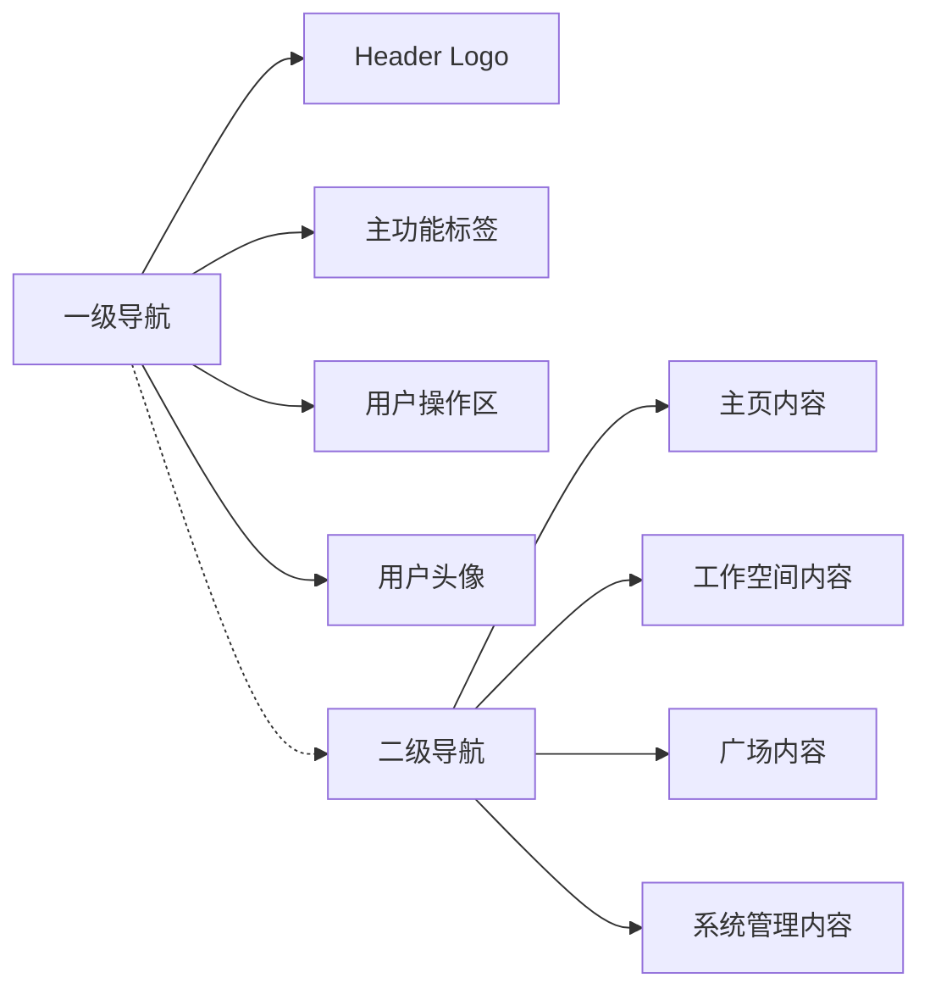
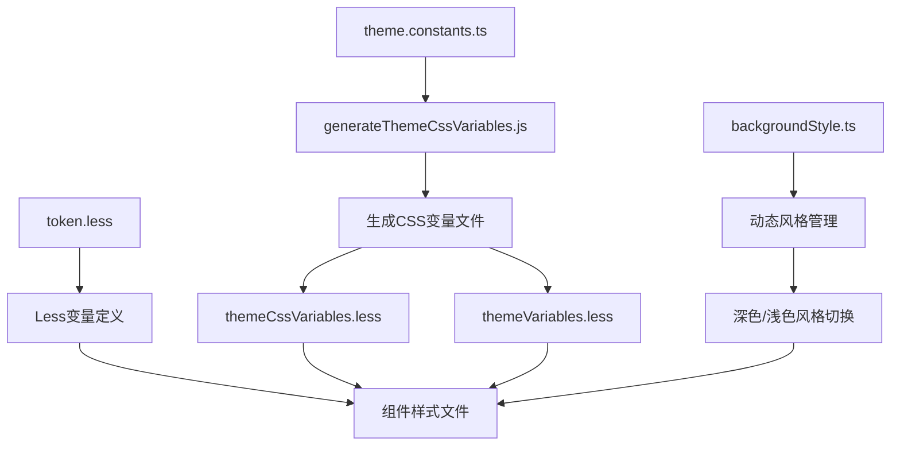
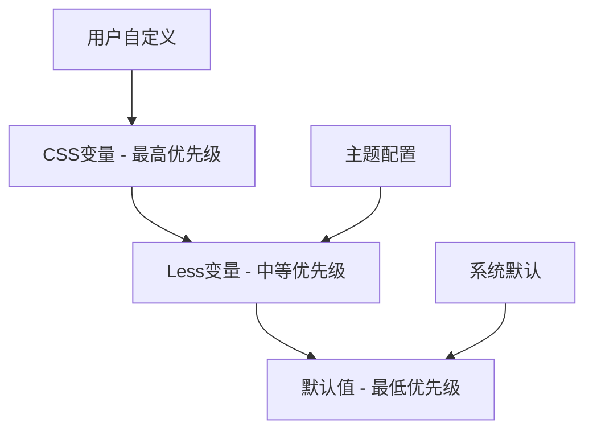

# 导航样式组织设计文档

## 概述

本文档旨在梳理和组织智能体平台前端项目中的导航相关 CSS Token，为导航组件的样式管理提供统一的规范和接入方案。通过标准化的 Token 系统，实现导航样式的一致性和可维护性。

## 技术架构

### 当前导航架构

项目采用两级导航架构：

- **一级导航**：左侧垂直菜单栏，包含主要功能模块入口
- **二级导航**：一级导航右侧的详细内容区域



### Token 系统设计原则

1. **语义化命名**：Token 名称清晰表达用途和层级关系
2. **分层管理**：区分一级导航和二级导航的样式配置
3. **风格适配**：支持深色和浅色两种风格主题
4. **响应式设计**：支持不同屏幕尺寸的适配
5. **状态支持**：包含常规、悬停、激活等交互状态

## 导航 Token 规范定义

### 整体布局 Token

| Token 名称 | 作用 | 默认值 | 说明 |
| --- | --- | --- | --- |
| `--xagi-nav-background-image` | 导航背景图片 | `none` | 整体页面的背景图片，支持动态切换 |

### 一级导航 Token

#### 尺寸相关

| Token 名称 | 作用 | 默认值 | 说明 |
| --- | --- | --- | --- |
| `--xagi-nav-first-menu-width` | 一级导航宽度（风格 1） | `60px` | 风格 1 无文字导航的宽度 |
| `--xagi-nav-first-menu-width-style2` | 一级导航宽度（风格 2） | `88px` | 风格 2 有文字导航的宽度 |
| `--xagi-nav-first-menu-font-size` | 一级导航字体大小 | `14px` | 风格 2 中一级导航文字的字体大小（风格 1 无文字显示） |

#### 颜色 Token - 深色风格

| Token 名称 | 作用 | 默认值 | 说明 |
| --- | --- | --- | --- |
| `--xagi-nav-first-menu-color-bg` | 一级导航背景色 | `rgba(255,255,255,0.95)` | 一级导航的背景颜色 |
| `--xagi-nav-first-menu-color-text` | 一级导航主文字色 | `rgba(255,255,255,1)` | 深色风格下的主要文字颜色 |
| `--xagi-nav-first-menu-color-text-secondary` | 一级导航次要文字色 | `rgba(255,255,255,0.8)` | 深色风格下的次要文字颜色 |
| `--xagi-nav-first-menu-color-text-tertiary` | 一级导航三级文字色 | `rgba(255,255,255,0.55)` | 深色风格下的三级文字颜色 |

#### 交互状态 Token

| Token 名称 | 作用 | 默认值 | 说明 |
| --- | --- | --- | --- |
| `--xagi-nav-item-hover-bg` | 导航项悬停背景色 | `rgba(81,71,255,0.1)` | 鼠标悬停时的背景色 |
| `--xagi-nav-item-active-bg` | 导航项激活背景色 | `rgba(81,71,255,0.15)` | 点击激活时的背景色 |
| `--xagi-nav-item-selected-bg` | 导航项选中背景色 | `rgba(81,71,255,0.2)` | 选中状态的背景色 |

### 二级导航 Token

#### 尺寸和颜色

| Token 名称 | 作用 | 默认值 | 说明 |
| --- | --- | --- | --- |
| `--xagi-nav-second-menu-color-bg` | 二级导航背景色 | `rgba(255,255,255,0.85)` | 二级导航的背景颜色 |
| `--xagi-nav-second-menu-color-text` | 二级导航主文字色 | `rgba(255,255,255,1)` | 深色风格下的主要文字颜色 |
| `--xagi-nav-second-menu-color-text-secondary` | 二级导航次要文字色 | `rgba(255,255,255,0.8)` | 深色风格下的次要文字颜色 |
| `--xagi-nav-second-menu-color-text-tertiary` | 二级导航三级文字色 | `rgba(255,255,255,0.55)` | 深色风格下的三级文字颜色 |

### 阴影和边框 Token

| Token 名称 | 作用 | 默认值 | 说明 |
| --- | --- | --- | --- |
| `--xagi-nav-shadow` | 导航阴影 | `rgba(0,0,0,0.1)` | 通用导航阴影效果 |
| `--xagi-nav-first-menu-shadow` | 一级导航阴影 | `2px 0 8px rgba(0,0,0,0.1)` | 一级导航专用阴影 |
| `--xagi-nav-second-menu-shadow` | 二级导航阴影 | `0 2px 8px rgba(0,0,0,0.1)` | 二级导航专用阴影 |
| `--xagi-nav-border-color` | 导航边框色 | `rgba(0,0,0,0.15)` | 导航边框颜色 |
| `--xagi-nav-divider-color` | 导航分割线色 | `rgba(0,0,0,0.1)` | 导航分割线颜色 |

## 导航样式风格体系

### 双风格适配机制

导航系统支持深色和浅色两种风格，并且根据导航栏文字显示状态分为两种布局风格：

#### 风格模式定义

**风格 1：无文字导航模式（当前默认状态）**

- 一级导航宽度：60px
- 导航栏不显示文字，仅显示图标（字体大小 Token 不生效）
- 页面容器：有外边距和圆角
- 二级导航背景：透明
- 页面容器背景：有颜色

**风格 2：有文字导航模式**

- 一级导航宽度：88px
- 导航栏显示图标和文字（字体大小 Token 生效）
- 页面容器：无外边距和圆角，充满整个可用区域
- 二级导航背景：与页面容器背景颜色一致
- 页面容器背景：与二级导航背景保持一致

### 颜色风格适配机制

导航系统在不同布局风格基础上，还支持深色和浅色两种颜色风格，通过 CSS 变量的动态切换实现：

#### 深色风格变量映射

```css
.xagi-dark-style {
  --xagi-nav-first-menu-color-text: rgba(255, 255, 255, 1);
  --xagi-nav-first-menu-color-text-secondary: rgba(255, 255, 255, 0.8);
  --xagi-nav-first-menu-color-text-tertiary: rgba(255, 255, 255, 0.55);
  --xagi-nav-second-menu-color-text: rgba(255, 255, 255, 1);
  --xagi-nav-second-menu-color-text-secondary: rgba(255, 255, 255, 0.8);
  --xagi-nav-second-menu-color-text-tertiary: rgba(255, 255, 255, 0.55);
}
```

#### 浅色风格变量映射

```css
.xagi-light-style {
  --xagi-nav-first-menu-color-text: rgba(0, 0, 0, 1);
  --xagi-nav-first-menu-color-text-secondary: rgba(0, 0, 0, 0.8);
  --xagi-nav-first-menu-color-text-tertiary: rgba(0, 0, 0, 0.55);
  --xagi-nav-second-menu-color-text: rgba(0, 0, 0, 1);
  --xagi-nav-second-menu-color-text-secondary: rgba(0, 0, 0, 0.8);
  --xagi-nav-second-menu-color-text-tertiary: rgba(0, 0, 0, 0.55);
}
```

### 导航状态设计

#### 三种交互状态层次

1. **常规状态**：默认显示状态
2. **悬停状态**：鼠标悬停时的反馈
3. **激活/选中状态**：当前激活或已选中的状态

每种状态都有对应的颜色变化，形成清晰的视觉层次。

## 组件接入方案

### Less 变量接入方式

在 Less 文件中通过预定义变量使用：

```less
// 引入导航Token变量
@import '~@/styles/token.less';

.custom-navigation {
  // 使用一级导航相关变量
  width: @navFirstMenuWidth;
  background-color: @navFirstMenuBg;
  color: @navFirstMenuText;

  // 文字样式（仅在风格2中显示文字时使用）
  .nav-text {
    font-size: @navFirstMenuFontSize;
  }

  // 悬停效果
  &:hover {
    background-color: @navItemHoverBg;
  }

  // 激活状态
  &.active {
    background-color: @navItemActiveBg;
    color: @navFirstMenuText;
  }
}

.custom-second-nav {
  background-color: @navSecondMenuBg;
  color: @navSecondMenuTextSecondary;

  .nav-item {
    color: @navSecondMenuTextSecondarySecondary;

    &.tertiary {
      color: @navSecondMenuTextSecondaryTertiary;
    }
  }
}
```

### CSS 变量直接使用方式

在 CSS 文件中直接使用 CSS 变量：

```css
.navigation-container {
  background-image: var(--xagi-nav-background-image);
  min-height: 100vh;
}

.first-navigation {
  width: var(--xagi-nav-first-menu-width);
  background-color: var(--xagi-nav-first-menu-color-bg);
  color: var(--xagi-nav-first-menu-color-text);
  box-shadow: var(--xagi-nav-first-menu-shadow);

  /* 文字样式（仅在风格2中显示文字时使用） */
  .nav-text {
    font-size: var(--xagi-nav-first-menu-font-size);
  }
}

.second-navigation {
  background-color: var(--xagi-nav-second-menu-color-bg);
  color: var(--xagi-nav-second-menu-color-text);
}
```

### React 组件集成示例

```tsx
import React from 'react';
import { useGlobalSettings } from '@/hooks/useGlobalSettings';
import './NavigationComponent.less';

const NavigationComponent: React.FC = () => {
  const { isDarkMode } = useGlobalSettings();

  return (
    <div
      className={`navigation-wrapper ${
        isDarkMode ? 'xagi-dark-style' : 'xagi-light-style'
      }`}
    >
      <div className="first-menu">{/* 一级导航内容 */}</div>
      <div className="second-menu">{/* 二级导航内容 */}</div>
    </div>
  );
};
```

### 风格切换集成示例

#### 导航风格切换组件

```tsx
import React, { useState } from 'react';
import { Switch, Space, Typography } from 'antd';
import { useGlobalSettings } from '@/hooks/useGlobalSettings';
import './NavigationStyleToggle.less';

const { Text } = Typography;

interface NavigationStyleToggleProps {
  onChange?: (mode: 'style1' | 'style2') => void;
}

const NavigationStyleToggle: React.FC<NavigationStyleToggleProps> = ({
  onChange,
}) => {
  const [navMode, setNavMode] = useState<'style1' | 'style2'>('style1');
  const { isDarkMode } = useGlobalSettings();

  const handleModeChange = (checked: boolean) => {
    const newMode = checked ? 'style2' : 'style1';
    setNavMode(newMode);

    // 更新CSS变量
    document.documentElement.style.setProperty(
      '--xagi-nav-style-mode',
      newMode,
    );

    // 应用对应的样式类
    document.body.className =
      document.body.className.replace(/xagi-nav-(style1|style2)/g, '').trim() +
      ` xagi-nav-${newMode}`;

    onChange?.(newMode);
  };

  return (
    <div className={`nav-style-toggle ${isDarkMode ? 'dark' : 'light'}`}>
      <Space>
        <Text>风格1（紧凑）</Text>
        <Switch
          checked={navMode === 'style2'}
          onChange={handleModeChange}
          size="small"
        />
        <Text>风格2（展开）</Text>
      </Space>
    </div>
  );
};

export default NavigationStyleToggle;
```

#### 页面容器样式适配

```less
// NavigationStyleToggle.less
.page-container {
  // 默认风格1：紧凑模式
  margin: var(--xagi-page-container-margin);
  border-radius: var(--xagi-page-container-border-radius);
  background-color: var(--xagi-page-container-color-bg);
  transition: all 0.3s ease;

  // 风格2：展开模式适配
  .xagi-nav-style2 & {
    margin: var(--xagi-page-container-margin-style2);
    border-radius: var(--xagi-page-container-border-radius-style2);
    background-color: var(--xagi-page-container-color-bg-style2);
  }
}

.second-navigation {
  // 默认风格1：透明背景
  background-color: var(--xagi-nav-second-menu-color-bg-transparent);
  transition: all 0.3s ease;

  // 风格2：实体背景
  .xagi-nav-style2 & {
    background-color: var(--xagi-nav-second-menu-color-bg-solid);
  }
}

.first-navigation {
  // 默认风格1宽度
  width: var(--xagi-nav-first-menu-width);
  transition: width 0.3s ease;

  // 风格2宽度
  .xagi-nav-style2 & {
    width: var(--xagi-nav-first-menu-width-style2);
  }

  // 文字显示隐藏控制
  .nav-text {
    opacity: 0;
    transform: translateX(-10px);
    transition: all 0.3s ease;
    font-size: var(--xagi-nav-first-menu-font-size); // 只在风格2中显示时生效

    .xagi-nav-style2 & {
      opacity: 1;
      transform: translateX(0);
    }
  }
}
```

### 页面容器统一管理组件

```tsx
import React from 'react';
import { useGlobalSettings } from '@/hooks/useGlobalSettings';
import './PageContainer.less';

interface PageContainerProps {
  children: React.ReactNode;
  className?: string;
  style?: React.CSSProperties;
  navMode?: 'style1' | 'style2';
}

const PageContainer: React.FC<PageContainerProps> = ({
  children,
  className = '',
  style = {},
  navMode = 'style1',
}) => {
  const { isDarkMode } = useGlobalSettings();

  return (
    <div
      className={`
        page-container 
        ${isDarkMode ? 'xagi-dark-style' : 'xagi-light-style'}
        xagi-nav-${navMode}
        ${className}
      `.trim()}
      style={style}
    >
      {children}
    </div>
  );
};

export default PageContainer;
```

### 响应式适配示例

```less
.responsive-navigation {
  width: @navFirstMenuWidth;

  // 平板适配
  @media (max-width: 768px) {
    width: @navFirstMenuWidthStyle2; // 风格2适应更小屏幕
  }

  // 手机适配
  @media (max-width: 480px) {
    position: fixed;
    top: 0;
    left: 0;
    width: 100%;
    height: 100%;
    z-index: 999;

    .second-menu {
      display: none; // 移动端隐藏二级导航
    }
  }
}
```

## 实现架构

### Token 管理流程



### 关键文件说明

| 文件路径 | 作用 | 说明 |
| --- | --- | --- |
| `src/styles/token.less` | Token 变量定义 | 包含所有导航相关的 Less 变量定义 |
| `src/utils/backgroundStyle.ts` | 风格管理器 | 负责深色/浅色风格的动态切换 |
| `src/layouts/layout.constants.ts` | 布局常量 | 定义导航尺寸等基础常量 |
| `scripts/generateThemeCssVariables.js` | CSS 变量生成脚本 | 自动生成 CSS 变量文件 |

### 变量优先级层次



## 使用规范

### 命名约定

1. **前缀规范**：所有导航 Token 以`xagi-nav-`开头
2. **层级命名**：`first-menu`表示一级导航，`second-menu`表示二级导航
3. **属性命名**：`color-text`表示文字颜色，`color-bg`表示背景色
4. **状态命名**：`secondary`、`tertiary`表示不同层级的文字状态

### 最佳实践

1. **优先使用 Less 变量**：在 Less 文件中优先使用预定义的 Less 变量
2. **保持一致性**：同类型的导航元素使用相同的 Token 系统
3. **响应式考虑**：确保在不同屏幕尺寸下的 Token 适配
4. **性能优化**：避免频繁切换 CSS 变量，使用缓存机制

### 扩展指南

添加新的导航 Token 时需要：

1. 在`src/styles/token.less`中定义新的 Less 变量
2. 在`src/utils/backgroundStyle.ts`中添加对应的深浅色风格变量
3. 更新`scripts/generateThemeCssVariables.js`脚本以生成 CSS 变量
4. 在组件中按照约定使用新的 Token

## 维护和更新

### 版本控制

- Token 的修改需要遵循语义化版本控制
- 新增 Token 为 minor 版本更新
- 修改现有 Token 为 major 版本更新
- Bug 修复为 patch 版本更新

### 向后兼容

- 保持已有 Token 的向后兼容性
- 废弃 Token 需要提供迁移指南
- 新 Token 需要提供默认值降级方案
