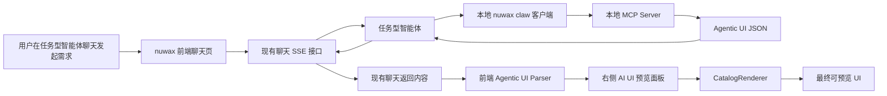

# nuwax 纯 AI 驱动实时构建 UI 第一版落地方案

## 1. 背景与目标

用户希望在 nuwax 中先落地一套基础的“纯 AI 驱动实时构建 UI”能力，用于评估方案可行性。第一版不追求完整低代码平台，也不立即做项目导出，而是先打通最小闭环：

```text
任务型智能体聊天
  -> 本地 nuwax claw 客户端配置 MCP Server
  -> 智能体调用 MCP 并返回结构化 UI JSON
  -> 聊天会话通过现有链路返回 MCP 内容
  -> 前端识别 Agentic UI schema
  -> 右侧自动打开 AI UI 预览面板
  -> 前端 catalog 渲染最终 UI
```

第一版目标是验证：

- 不修改现有后端接口的前提下，是否能通过 MCP 返回内容驱动前端实时 UI。
- nuwax 普通聊天，特别是任务型智能体聊天，是否能承载 AI 生成 UI 的预览体验。
- UI JSON schema + 前端 catalog 的模式是否足够稳定、安全，并具备后续导出项目的演进空间。

## 2. 方案结论

该方案可行。

可行的前提是：

1. 本地 nuwax claw 客户端能够配置并启动 MCP Server。
2. 任务型智能体聊天能够调用该 MCP Server。
3. MCP tool 的返回内容能够进入现有聊天会话返回数据中。
4. 前端能够从现有 SSE 消息、tool result、processing result 或最终消息中识别出约定的 UI JSON。
5. 前端新增 Agentic UI 解析器、右侧预览状态和 catalog renderer。

重要边界：

- 后端接口路径可以不改。
- 后端是否需要配置 MCP 能力取决于当前任务型智能体已有能力。
- 前端必须改造，因为浏览器不会自动把 MCP 返回 JSON 渲染成 UI。
- 第一版不执行任意 HTML、JS、CSS，只渲染前端白名单 catalog 组件。

## 3. 整体架构



## 4. 第一版范围

### 4.1 第一版要做

- 支持本地 MCP Server 返回 `nuwax.agentic-ui.v1` JSON。
- 前端从聊天返回内容中识别 UI JSON。
- 自动打开右侧 Agentic UI 预览面板。
- 使用 catalog 渲染基础 UI 组件。
- 聊天消息内显示轻量提示，例如“已生成 AI UI 预览”。
- 非法 JSON 或未知组件安全降级展示。

### 4.2 第一版暂不做

- 不做项目导出。
- 不做保存为页面。
- 不做完整 CopilotKit Runtime 接入。
- 不做完整 A2UI 协议。
- 不做复杂增量 patch。
- 不执行任意 HTML、JS、CSS。
- 不支持动态 npm 组件。
- 不做多页面应用生成。
- 不强制支持刷新后的历史恢复。

## 5. MCP Server 设计

建议在 `nuwax` 同级目录创建一个独立 MCP Server 项目：

```text
/Users/xiedaokun/Desktop/AGENT/GitHub/
├── nuwax/
└── nuwax-agentic-ui-mcp/
```

第一版建议采用“自研轻量 MCP Server + 参考 CopilotKit 协议思想”的路线，而不是直接使用 CopilotKit 官方 MCP Apps。

原因：

- 第一版目标是打通 nuwax 自己的链路：MCP 返回 UI JSON，nuwax 前端识别后在右侧预览中渲染。
- nuwax 当前聊天体系不是 CopilotKit Runtime 原生驱动，直接接 CopilotKit 官方 MCP Apps 会引入额外运行时和协议适配成本。
- 官方 MCP Apps 更偏向 MCP tool 返回 UI resource，并由 CopilotKit 生态进行 iframe/sandbox 渲染；这与 nuwax 希望复用自身 Ant Design/nuwax 组件体系的目标不完全一致。
- 后续希望支持保存为页面和导出项目，自研 JSON schema + catalog 更容易转换成项目源码。
- 第一版需要足够薄、足够可控，适合验证可行性。

MCP Server 第一版职责：

- 接收任务型智能体调用。
- 根据用户需求生成结构化 UI JSON。
- 返回严格符合 `nuwax.agentic-ui.v1` 的 schema。
- 不返回 React 源码。
- 不返回任意 HTML/JS/CSS。

建议第一版提供一个核心 tool：

```text
nuwax_render_ui
```

tool 返回示例：

```json
{
  "schemaVersion": "nuwax.agentic-ui.v1",
  "surfaceId": "demo-task-ui",
  "status": "ready",
  "mode": "replace",
  "root": {
    "type": "Page",
    "props": {
      "title": "AI 生成任务面板"
    },
    "children": [
      {
        "type": "Card",
        "props": {
          "title": "执行概览"
        },
        "children": [
          {
            "type": "Statistic",
            "props": {
              "label": "完成任务",
              "value": 8
            }
          },
          {
            "type": "Alert",
            "props": {
              "type": "success",
              "message": "任务执行完成"
            }
          }
        ]
      }
    ]
  }
}
```

## 6. 与 CopilotKit 官方方案的关系

CopilotKit 可以作为重要参考，但第一版不建议直接作为运行时依赖接入。

### 6.1 参考内容

建议参考 CopilotKit 生态中的三类思想：

- A2UI：声明式 JSON UI schema + catalog 组件树。
- AG-UI：事件化、状态化、后续支持 streaming/patch 的协议思想。
- MCP Apps：MCP tool 与 UI 结果绑定的产品思路。

### 6.2 第一版不直接使用 MCP Apps 的原因

第一版不直接采用 CopilotKit 官方 MCP Apps，主要原因是：

- 官方 MCP Apps 更适合 CopilotKit 原生运行时。
- UI 通常以 resource 或 iframe/sandbox 方式呈现，容易与 nuwax 右侧预览和组件体系割裂。
- iframe 式 UI 不利于复用 nuwax 现有设计系统、权限策略、事件系统和后续导出项目。
- 第一版如果直接引入 CopilotKit Runtime，需要同时处理聊天 UI、事件协议、MCP Apps 渲染、安全沙箱等多块改造，超出 MVP 范围。

### 6.3 推荐选型

第一版推荐：

```text
自研 nuwax-agentic-ui-mcp
  -> 返回 nuwax.agentic-ui.v1 JSON
  -> nuwax 前端 CatalogRenderer 渲染
```

后续演进：

```text
第一版：自研 schema + 自研 catalog renderer。
第二版：支持 streaming、patch、action 回传。
第三版：字段模型逐步对齐 A2UI。
第四版：评估接入 AG-UI 或 CopilotKit Runtime。
第五版：按需评估 MCP Apps，但优先保持 nuwax catalog 渲染路径。
```

## 7. Agentic UI Schema 第一版

第一版 schema 保持简单，支持完整替换式渲染。

```ts
export interface AgenticUiSurface {
  schemaVersion: 'nuwax.agentic-ui.v1';
  surfaceId: string;
  status: 'ready' | 'error';
  mode: 'replace';
  root: AgenticUiNode;
  metadata?: {
    requestId?: string;
    conversationId?: number;
    toolCallId?: string;
    mcpServerId?: string;
  };
}

export interface AgenticUiNode {
  id?: string;
  type: string;
  props?: Record<string, unknown>;
  children?: AgenticUiNode[];
}
```

后续版本可渐进增加：

```ts
status: 'pending' | 'streaming' | 'ready' | 'error';
mode: 'append' | 'replace' | 'patch';
patches: JsonPatchOperation[];
actions: AgenticUiAction[];
data: Record<string, unknown>;
bindings: Record<string, string>;
```

## 8. 第一版支持组件

第一版 catalog 建议控制在 8 到 12 个组件，优先覆盖任务结果展示和基础操作。

```text
Page
Section
Card
Text
Markdown
Statistic
Table
List
Alert
Button
ButtonGroup
JsonView
```

这套组件已经能覆盖：

- 任务执行结果。
- 数据查询结果。
- 指标概览。
- 列表展示。
- 表格展示。
- 错误和成功提示。
- 原始 JSON 调试结果。
- 简单操作按钮。

第一版按钮可以先只展示，或仅做轻量动作：

- 复制内容。
- 回填聊天输入框。
- 发送结构化 action 消息。

## 9. 前端改造点

### 9.1 新增类型

在前端新增 Agentic UI 类型，并扩展聊天消息：

```ts
export interface MessageInfo {
  agenticUiSurfaces?: AgenticUiSurface[];
}
```

### 9.2 新增 Schema 检测器

核心逻辑：

```text
收到聊天返回内容
  -> 深度扫描 data/result/metadata/text
  -> 判断是否存在 schemaVersion === 'nuwax.agentic-ui.v1'
  -> 校验 schema
  -> 返回 AgenticUiSurface
```

检测来源可以包括：

- SSE `data`。
- `processingList.result.data`。
- MCP tool result。
- assistant message `metadata`。
- assistant message `text` 中的 JSON 代码块。
- final result 中的 component execute results。

第一版可以先支持最容易拿到的一种或两种来源，后续再扩展。

### 9.3 新增右侧预览状态

建议在聊天页增加预览类型：

```ts
type ChatPreviewType = 'page' | 'file' | 'agentic-ui';
```

新增状态：

```ts
const [agenticUiPreviewData, setAgenticUiPreviewData] =
  useState<AgenticUiSurface | null>(null);
```

当检测到合法 surface：

```text
setAgenticUiPreviewData(surface)
openRightPreview('agentic-ui')
```

### 9.4 新增 AgenticUiPreviewPanel

右侧预览面板负责：

- 展示标题“AI 预览”。
- 渲染 `AgenticUiSurface`。
- 显示 schema 校验错误。
- 提供查看原始 JSON 的入口。
- 后续承载“保存为页面”“导出项目”等按钮。

结构示意：

```tsx
<AgenticUiPreviewPanel
  surface={agenticUiPreviewData}
  onAction={handleAgenticUiAction}
/>
```

### 9.5 新增 CatalogRenderer

CatalogRenderer 根据 JSON node 的 `type` 查找组件，并递归渲染：

```tsx
const catalog = {
  Page,
  Section,
  Card,
  Text,
  Markdown,
  Statistic,
  Table,
  List,
  Alert,
  Button,
  ButtonGroup,
  JsonView,
};
```

渲染规则：

- `type` 不存在时显示 UnsupportedComponent。
- `props` 必须经过白名单校验。
- `children` 递归渲染。
- 不执行任何字符串脚本。
- 不允许通过 JSON 注入样式脚本。

## 10. 用户体验

第一版建议体验如下：

1. 用户在任务型智能体聊天中输入：“帮我生成一个任务执行结果面板。”
2. 智能体调用 MCP Server。
3. MCP Server 返回 `nuwax.agentic-ui.v1` JSON。
4. 聊天消息继续正常展示文本或工具执行过程。
5. 前端检测到 UI JSON 后，自动打开右侧预览。
6. 右侧显示 AI 生成的 Page/Card/Table/Statistic 等 UI。
7. 聊天消息中显示轻量提示：

```text
已生成 AI UI 预览，请在右侧查看。
```

如果 JSON 不合法：

```text
AI UI 预览生成失败：schema 校验未通过。
```

并允许开发阶段查看原始 JSON。

## 11. 实时构建能力说明

第一版可以实现“收到 MCP 返回后自动预览”的基础实时效果。

是否能做到逐步实时构建，取决于聊天链路是否能连续返回 MCP 部分结果：

- 如果后端 SSE 会连续返回 MCP 的中间结果，可以做 `streaming` 和 `patch`。
- 如果 MCP tool 只在完成后一次性返回，第一版表现为“完成后立即打开预览”。
- 如果当前链路只能从 final result 拿到 tool result，则第一版先做最终 UI 展示。

因此第一版建议不承诺复杂流式 patch，只承诺：

```text
MCP 返回 UI JSON 后，前端立即识别并打开右侧预览。
```

第二版再增加：

```text
pending -> streaming -> ready
append / patch 更新
局部组件 loading
```

## 12. 安全策略

第一版必须坚持安全白名单：

- 只渲染 catalog 中注册的组件。
- 每个组件 props 单独校验。
- 禁止任意 HTML。
- 禁止任意 JS。
- 禁止任意 CSS。
- 禁止动态 import。
- 禁止远程 iframe。
- Markdown 渲染沿用现有安全策略。
- 表格和 JSON 内容设置大小限制。
- 未知组件安全降级。

安全降级示例：

```text
Unsupported component: Chart3D
```

## 13. 第一版至第四版演进路线

演进路线建议拆成四版推进。每一版都只解决一个主要问题，避免第一阶段就把系统做成完整低代码平台。

```text
V1：跑通展示闭环
V2：增强实时与交互
V3：补齐状态恢复与保存
V4：协议兼容与项目导出
```

### 13.1 第一版：MVP 展示闭环

#### 目标

验证“AI 生成 UI JSON，nuwax 前端右侧自动预览”的可行性。

#### 核心链路

```text
任务型智能体聊天
  -> nuwax claw 调用本地 MCP Server
  -> MCP 返回 nuwax.agentic-ui.v1 JSON
  -> 聊天会话返回 MCP 内容
  -> 前端识别 schema
  -> 右侧自动打开 AI UI 预览
  -> CatalogRenderer 渲染 UI
```

#### 功能范围

- 自研轻量 `nuwax-agentic-ui-mcp`。
- MCP Server 提供 `nuwax_render_ui` tool。
- 先返回固定 demo schema，再接入简单 AI 生成 schema。
- 支持 `mode: replace`。
- 支持 `status: ready | error`。
- 支持 8 到 12 个基础 catalog 组件。
- 聊天内显示轻量提示：“已生成 AI UI 预览”。
- 右侧预览支持查看原始 JSON 和错误提示。

#### 第一版组件

```text
Page
Section
Card
Text
Markdown
Statistic
Table
List
Alert
Button
ButtonGroup
JsonView
```

#### 不做内容

- 不做复杂 streaming。
- 不做 JSON Patch。
- 不做历史恢复。
- 不做保存页面。
- 不做项目导出。
- 不接 CopilotKit Runtime。
- 不直接使用 CopilotKit MCP Apps。

#### 验收标准

- 能启动本地 MCP Server。
- 能通过 nuwax claw 配置 MCP Server。
- 任务型智能体聊天能触发 MCP tool。
- 前端能从聊天返回中识别 `nuwax.agentic-ui.v1`。
- 右侧能自动打开预览。
- 基础组件能正常渲染。
- 非法 schema 和未知组件能安全降级。

#### 主要风险

- 当前聊天返回内容中是否能稳定拿到 MCP tool result。
- MCP 返回 JSON 如果被模型包裹成自然语言，前端解析难度会升高。
- 右侧预览与现有页面预览、文件预览状态需要做好互斥关系。

### 13.2 第二版：实时构建与交互闭环

#### 目标

从“完成后预览”升级为“构建过程中逐步更新”，并支持用户在 UI 中触发下一步任务。

#### 功能范围

- 支持 `status: pending | streaming | ready | error`。
- 支持 `mode: append | replace`。
- 初步支持 `patches`，可以先选用简化版 JSON Patch。
- 支持组件级 loading。
- 支持多个 `surface`。
- 支持 Button action 回传 Agent。
- 支持 Form 表单提交回传 Agent。
- 扩展基础表单组件。

#### 第二版新增组件

```text
Form
Input
TextArea
NumberInput
Select
RadioGroup
CheckboxGroup
Switch
DatePicker
Progress
Skeleton
Tabs
Collapse
```

#### Action 回传方式

第一阶段可以复用现有聊天发送机制，将 action 序列化为结构化消息：

```json
{
  "type": "agentic_ui_action",
  "surfaceId": "demo-task-ui",
  "actionId": "continue_analysis",
  "payload": {
    "source": "right-preview"
  }
}
```

后续如有必要再新增专用 action API。

#### 验收标准

- MCP 可以连续返回多个 UI 更新片段。
- 右侧预览能随着返回内容更新。
- Button 点击后 Agent 能收到结构化 action。
- Form 提交后 Agent 能基于表单内容继续执行。
- streaming 过程中组件状态不会闪烁或重置异常。

#### 主要风险

- 如果现有 SSE 不透传中间 MCP 结果，则只能做到完成后更新。
- patch 合并逻辑需要保证幂等，避免重复渲染。
- UI action 与现有 MCP ask/question、人机介入逻辑需要避免冲突。

### 13.3 第三版：历史恢复、保存与治理

#### 目标

让 AI 生成 UI 从“一次性预览”变成“会话可恢复、结果可保存、schema 可治理”的稳定能力。

#### 功能范围

- 消息历史支持恢复 `agenticUiSurfaces`。
- 刷新页面后恢复右侧最近一次 AI UI 预览。
- 会话切换时恢复对应会话的最后一个 surface。
- 支持将当前 surface 保存为页面草稿。
- 支持 schema 版本管理。
- 支持 catalog 版本管理。
- 支持 UI schema 校验报告。
- 支持用户手动关闭、重新打开、固定某个预览。
- 支持简单权限和审计记录。

#### 当前落地范围

在不修改后端接口的前提下，第三版先落地前端本地治理能力和 MCP 工具增强：

- 右侧预览支持保存当前 surface 为本地草稿。
- 右侧预览支持从本地草稿恢复预览。
- 右侧预览支持导出当前 surface JSON。
- 右侧预览支持展示最近 Button/Form 交互日志。
- Button/Form action 会被记录到本地 action log。
- MCP Server 新增 `nuwax_validate_ui_schema`，用于校验 `nuwax.agentic-ui.v1` JSON。
- MCP Server 新增 `nuwax_update_ui`，作为自然语言二次更新入口。
- MCP Server 保留 `nuwax_get_ui_catalog`，供智能体查询 catalog 能力边界。

当前第三版仍不修改后端数据模型，草稿和 action log 使用浏览器 localStorage 保存。后续如果需要跨设备、跨会话长期保存，再升级为后端资源表。

#### 存储建议

第一阶段可以把 surface 挂在消息 metadata 或扩展字段中：

```ts
message.agenticUiSurfaces?: AgenticUiSurface[];
```

如果后续 surface 变大或需要跨会话管理，再拆成独立资源：

```text
agentic_ui_surface
agentic_ui_surface_version
agentic_ui_action_log
```

#### 验收标准

- 刷新页面后能恢复最后一次 AI UI 预览。
- 历史消息中的 UI 卡片可以重新打开右侧预览。
- 保存为页面草稿后，草稿能再次加载和预览。
- 不同 schemaVersion/catalogVersion 能被识别和安全降级。
- 能记录 action 操作日志。

#### 主要风险

- 历史消息接口如果不能保存扩展字段，需要后端数据模型支持。
- 大型 surface 如果直接塞入消息，可能影响消息列表加载性能。
- schema 版本升级需要兼容旧会话。

### 13.4 第四版：协议兼容与项目导出

#### 目标

将右侧预览中的运行态 UI schema，升级为可导出的项目资产，并逐步兼容 CopilotKit 生态协议。

#### 功能范围

- 字段模型逐步向 A2UI 靠拢。
- 事件模型逐步向 AG-UI 靠拢。
- 评估接入 CopilotKit Runtime 的必要性。
- 评估 MCP Apps 是否适合特定场景。
- 支持导出为 AppDev 页面。
- 支持导出为独立 React/TypeScript 项目。
- 支持生成基础目录结构、组件文件、类型文件和服务层文件。
- 支持从 schema 生成可维护源码。

#### 导出链路

```text
AgenticUiSurface JSON
  -> Schema Normalizer
  -> Page Model
  -> Project Generator
  -> React/TypeScript Project
```

#### 导出产物示例

```text
src/pages/index.tsx
src/components/*
src/services/*
src/types/*
src/constants/*
package.json
```

#### 与 CopilotKit 的关系

第四版才建议认真评估 CopilotKit Runtime/AG-UI/MCP Apps 是否要纳入运行链路。

建议优先保持：

```text
nuwax schema -> nuwax catalog renderer -> nuwax project exporter
```

再选择性兼容：

```text
A2UI schema
AG-UI events
CopilotKit MCP Apps
```

这样可以避免第一版被外部运行时绑定，同时保留未来接入生态的空间。

#### 验收标准

- 一个已保存的 AI UI surface 能导出成可运行项目。
- 导出项目能安装依赖并正常启动。
- 导出的组件结构可读、可维护。
- UI action 能转换为服务调用或占位实现。
- schema 兼容层能识别 nuwax 自有字段和 A2UI 风格字段。

#### 主要风险

- 运行态 UI 与项目态源码不是一一对应，需要设计 schema normalizer。
- 数据绑定、API 绑定、路由、权限等项目级能力需要逐步补齐。
- 若直接接入 MCP Apps iframe/resource 模式，导出为源码会更困难。

### 13.5 四版路线总览

| 版本 | 核心目标 | 主要能力 | 不做内容 | 验收重点 |
| --- | --- | --- | --- | --- |
| V1 | 打通展示闭环 | MCP JSON、前端识别、右侧预览、基础 catalog | streaming、action、历史恢复、导出 | 能自动打开右侧并渲染 UI。 |
| V2 | 实时与交互 | streaming、append/patch、Button/Form action | 保存页面、项目导出、CopilotKit Runtime | UI 能逐步更新，交互能回传 Agent。 |
| V3 | 恢复与保存 | 历史恢复、保存草稿、schema/catalog 版本、审计 | 完整项目导出 | 刷新可恢复，结果可保存。 |
| V4 | 导出与兼容 | 导出 AppDev/React 项目、A2UI/AG-UI 兼容评估 | 盲目替换现有聊天运行时 | 预览 UI 能生成可运行项目。 |

## 14. 后续导出新项目的可行性

后续可以把右侧预览中的 `AgenticUiSurface` 导出为新项目。

关键原因是第一版从一开始就不执行任意源码，而是保留结构化 schema：

```text
AgenticUiSurface JSON
  -> Schema Normalizer
  -> Project Generator
  -> React/TypeScript 项目
```

未来导出产物可以是：

```text
src/pages/index.tsx
src/components/*
src/services/*
src/types/*
package.json
```

因此第一版虽然只做预览，但架构上已经为“保存为页面”和“导出项目”留好了入口。

## 15. 可行性评估

| 评估项 | 结论 | 说明 |
| --- | --- | --- |
| 不改后端接口 | 基本可行 | 复用现有聊天返回链路，但依赖 MCP result 能透传到前端。 |
| 本地 MCP 接入 | 可行 | 通过 nuwax claw 配置本地 MCP Server。 |
| MCP Server 选型 | 建议自研轻量版本 | 第一版自研 `nuwax-agentic-ui-mcp`，参考 CopilotKit/A2UI/AG-UI 思想，不直接接 MCP Apps。 |
| 前端实时预览 | 可行 | 前端识别 schema 后自动打开右侧面板。 |
| 纯 AI 构建 UI | 可行 | AI 生成 JSON schema，前端 catalog 渲染。 |
| 安全性 | 可控 | 不执行任意代码，只渲染白名单组件。 |
| 第一版复杂度 | 中低 | 主要是前端 parser、preview panel、catalog renderer。 |
| 后续导出项目 | 可行 | schema 可作为项目生成器输入。 |
| 风险 | 中等 | 最大风险是现有聊天返回中是否能稳定拿到 MCP tool result。 |

## 16. 第一版验收标准

满足以下条件即可认为 MVP 打通：

- 能启动本地 MCP Server。
- 能通过 nuwax claw 将 MCP Server 配置给任务型智能体。
- 用户发送聊天消息后，MCP 返回 `nuwax.agentic-ui.v1` JSON。
- 前端能从现有聊天返回内容中识别该 JSON。
- 右侧能自动打开 AI UI 预览面板。
- Page/Card/Text/Statistic/Table/Alert/Button 至少 7 个组件正常渲染。
- 未知组件和非法 JSON 能安全降级。
- 不影响现有聊天文本、任务状态、停止任务、人机介入逻辑。

## 17. 推荐实施顺序

1. 定义 `AgenticUiSurface` schema。
2. 创建本地 `nuwax-agentic-ui-mcp` MCP Server。
3. MCP Server 提供 `nuwax_render_ui` tool，先返回固定 demo schema。
4. 参考 CopilotKit A2UI/AG-UI 的字段命名和事件思想，但保持第一版 schema 简洁。
5. nuwax 前端新增 schema 检测器。
6. nuwax 前端新增右侧 `AgenticUiPreviewPanel`。
7. nuwax 前端新增 `CatalogRenderer` 和第一批组件。
8. 接入任务型智能体聊天返回数据。
9. 用真实 MCP 调用验证从聊天到右侧预览的闭环。
10. 再决定是否增加 action 回传、streaming、历史恢复。

## 18. 最终建议

第一版建议聚焦一件事：

```text
MCP UI JSON -> 前端识别 -> 右侧自动预览 -> catalog 渲染
```

这是一个足够小、足够清晰、也足够能证明价值的 MVP。

只要这条链路跑通，就可以继续渐进式增加：

- 更丰富的组件。
- 流式 patch。
- 表单交互。
- action 回传。
- 历史恢复。
- 保存页面。
- 导出新项目。

该方案适合作为用户评估“纯 AI 驱动实时构建 UI”可行性的第一版落地方案。
