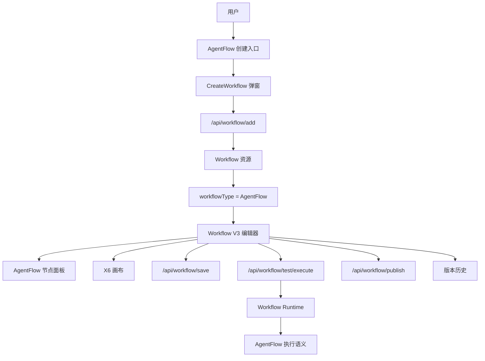
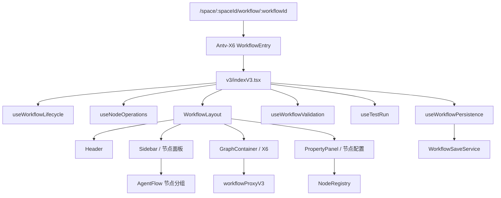
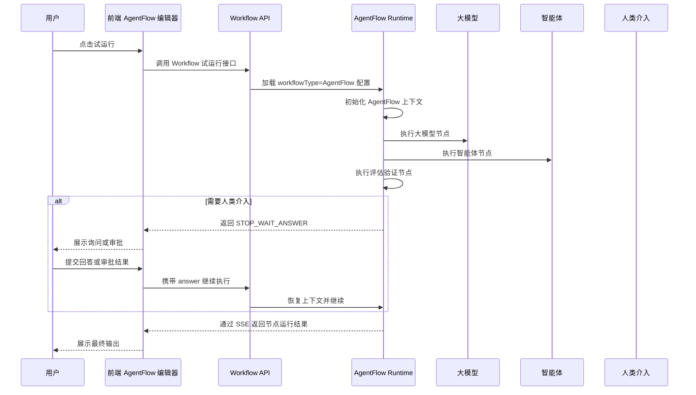
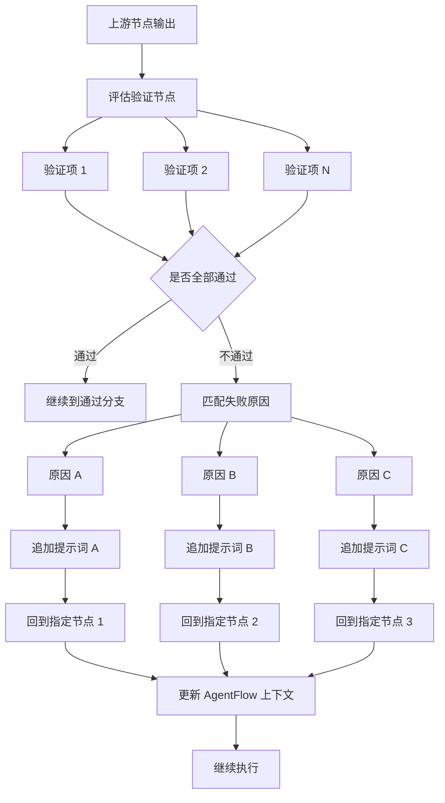
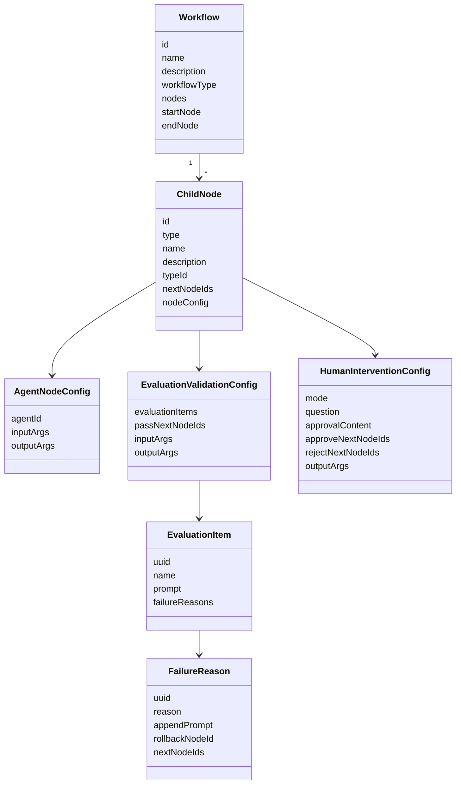

# AgentFlow 产品与技术方案

## 1. 背景与目标

AgentFlow 是 Workflow 的一个更宽松的 AI 驱动编排分支。它面向“多个智能体或大模型协同完成任务”的场景，保留 Workflow 已有的可视化节点编排能力，但降低配置复杂度，强调上下文连续性、AI 自主决策、评估验证和人类介入。

本方案将 AgentFlow 作为现有 `Workflow` 资源的子类型落地，通过 `workflowType = 'AgentFlow'` 区分普通 Workflow 与 AgentFlow。这样可以复用现有 Workflow V3 的画布、节点连线、保存、试运行、发布、权限和版本历史能力，避免重新建设一套资源体系。

### 1.1 目标

- 支持用户编排多个智能体和大模型。
- 支持现有 Workflow 节点，并新增 AgentFlow 核心节点。
- 支持上下文在节点间传递，并允许评估验证失败后回跳到指定节点。
- 支持人类介入，包括询问和审批。
- 保持现有 Workflow 能力稳定，普通 Workflow 不受 AgentFlow 改动影响。

### 1.2 非目标

- v1 不新增独立的 AgentFlow 资源类型、广场类型或发布类型。
- v1 不新增独立的 `/api/agent-flow/*` 接口路径。
- v1 不实现内嵌创建子智能体；智能体节点只选择已发布的 ChatBot 智能体。
- 本文档不包含具体代码实现，只定义产品、前后端协作和技术落地方案。

## 2. 总体架构

AgentFlow 复用 Workflow 的资源模型和执行体系，在现有 Workflow V3 编辑器上增加 AgentFlow 模式。前端通过详情接口返回的 `workflowType` 切换标题、节点面板和新增节点配置；后端通过同一个 Workflow Runtime 根据 `workflowType` 执行 AgentFlow 语义。



### 2.1 资源形态

| 项目 | 设计 |
| --- | --- |
| 资源类型 | 仍然是 `Workflow` |
| 区分字段 | `workflowType = 'Workflow' \| 'AgentFlow'`，建议协议 |
| 路由 | 复用 `/space/:spaceId/workflow/:workflowId` |
| 编辑器 | 复用 `src/pages/Antv-X6/v3` |
| 保存 | 复用 `/api/workflow/save` |
| 试运行 | 复用 `/api/workflow/test/execute` 和 `/api/workflow/test/node/execute` |
| 发布 | 复用 Workflow 发布能力 |
| 版本历史 | 复用 Workflow 配置历史能力 |

### 2.2 前端模块架构



## 3. 核心节点设计

AgentFlow v1 覆盖以下核心节点。

| 节点 | 类型 | 复用/新增 | 说明 |
| --- | --- | --- | --- |
| 开始 | `Start` | 复用 | 定义 AgentFlow 输入参数，可扩展上下文初始化提示词。 |
| 意图识别 | `IntentRecognition` | 复用 | 用于 AI 驱动的条件分支，按意图走不同分支。 |
| 智能体 | `Agent` | 新增 | 选择已发布 ChatBot 智能体，作为编排节点执行。 |
| 大模型 | `LLM` | 复用 | 调用模型，支持提示词、变量和工具配置。 |
| 评估验证 | `EvaluationValidation` | 新增 | 支持 N 项验证，每项可配置失败原因、回跳节点和追加提示词。 |
| 人类介入 | `HumanIntervention` | 新增 | 支持询问和审批，执行时可暂停并等待用户输入。 |

### 3.1 智能体节点

智能体节点用于在流程中调用一个已发布智能体。v1 只支持选择 `targetSubType = 'ChatBot'` 的已发布智能体，避免在节点内嵌复杂智能体配置。

配置能力：

- 选择已发布智能体。
- 显示并绑定智能体输入参数。
- 展示智能体输出参数，供后续节点引用。
- 支持普通出边和异常处理出边。

建议配置结构：

```ts
interface AgentNodeConfig {
  agentId?: number;
  inputArgs?: InputAndOutConfig[];
  outputArgs?: InputAndOutConfig[];
  extension?: Extension;
  exceptionHandleConfig?: ExceptionHandleConfig;
}
```

### 3.2 评估验证节点

评估验证节点用于对上游结果进行一组可配置验证。验证全部通过时继续走通过分支；任一验证不通过时，由运行时匹配失败原因，并按该原因配置回到指定节点，同时将追加提示词写入 AgentFlow 上下文。

配置能力：

- 支持 N 项验证。
- 每项验证可配置名称、验证提示词和输出要求。
- 每项验证可配置多个失败原因。
- 每个失败原因可配置：
  - 原因描述。
  - 回到的目标节点。
  - 追加提示词。
  - 可选的失败分支出边。

建议配置结构：

```ts
interface EvaluationValidationNodeConfig {
  inputArgs?: InputAndOutConfig[];
  outputArgs?: InputAndOutConfig[];
  evaluationItems?: EvaluationItemConfig[];
  passNextNodeIds?: number[];
  extension?: Extension;
  exceptionHandleConfig?: ExceptionHandleConfig;
}

interface EvaluationItemConfig {
  uuid: string;
  name: string;
  prompt: string;
  failureReasons: EvaluationFailureReasonConfig[];
}

interface EvaluationFailureReasonConfig {
  uuid: string;
  reason: string;
  appendPrompt?: string;
  nextNodeIds?: number[];
  rollbackNodeId?: number;
}
```

评估验证节点属于特殊分支节点。连线关系不应只放在节点顶层 `nextNodeIds`，而应保存在 `passNextNodeIds` 和 `failureReasons[].nextNodeIds` 中，类似现有 `Condition`、`IntentRecognition`、`QA` 的分支结构。

### 3.3 人类介入节点

人类介入节点用于在 AgentFlow 执行过程中暂停并等待用户反馈。v1 支持两种模式：

- `ASK`：向用户询问问题，用户回答后继续执行。
- `APPROVAL`：向用户发起审批，用户通过或拒绝后进入不同分支。

建议配置结构：

```ts
type HumanInterventionMode = 'ASK' | 'APPROVAL';

interface HumanInterventionNodeConfig {
  mode: HumanInterventionMode;
  question?: string;
  approvalContent?: string;
  inputArgs?: InputAndOutConfig[];
  outputArgs?: InputAndOutConfig[];
  approveNextNodeIds?: number[];
  rejectNextNodeIds?: number[];
  extension?: Extension;
  exceptionHandleConfig?: ExceptionHandleConfig;
}
```

运行时复用现有 `STOP_WAIT_ANSWER` 中断机制。审批模式需要在恢复执行时携带审批结果，由运行时决定进入通过或拒绝分支。

## 4. 数据模型设计

本节字段均为建议协议，用于前后端协作确认。

### 4.1 Workflow 类型扩展

```ts
export enum WorkflowTypeEnum {
  Workflow = 'Workflow',
  AgentFlow = 'AgentFlow',
}

interface AddWorkflowParams {
  spaceId: number;
  name: string;
  description: string;
  icon: string;
  workflowType?: WorkflowTypeEnum;
}

interface IgetDetails {
  id: number;
  name: string;
  description: string;
  nodes: ChildNode[];
  workflowType?: WorkflowTypeEnum;
}
```

兼容策略：

- 旧数据没有 `workflowType` 时按 `Workflow` 处理。
- 创建普通 Workflow 时不传或传 `Workflow`。
- 创建 AgentFlow 时传 `AgentFlow`。

### 4.2 节点类型扩展

```ts
export enum NodeTypeEnum {
  Agent = 'Agent',
  EvaluationValidation = 'EvaluationValidation',
  HumanIntervention = 'HumanIntervention',
}
```

需要同步扩展的位置：

- 节点枚举。
- 节点默认配置工厂。
- 节点图标和背景色。
- 节点面板分组。
- 节点配置面板注册。
- 端口生成逻辑。
- 连线保存同步逻辑。
- 删除节点时的分支引用清理逻辑。
- 试运行结果展示逻辑。

### 4.3 AgentFlow 上下文

AgentFlow 需要运行期上下文，用于保存节点间共享信息、评估失败追加提示词、人类介入反馈等内容。建议由后端在详情或上游参数接口中返回系统变量，前端沿用现有变量引用选择器展示。

建议上下文结构：

```ts
interface AgentFlowContext {
  history?: AgentFlowContextMessage[];
  evaluationFeedback?: AgentFlowEvaluationFeedback[];
  humanFeedback?: AgentFlowHumanFeedback[];
  variables?: Record<string, unknown>;
}

interface AgentFlowEvaluationFeedback {
  nodeId: number;
  reason: string;
  appendPrompt?: string;
  createdAt: string;
}

interface AgentFlowHumanFeedback {
  nodeId: number;
  mode: 'ASK' | 'APPROVAL';
  answer?: string;
  approved?: boolean;
  createdAt: string;
}
```

前端不直接维护运行期上下文状态，只负责展示可引用变量和保存节点配置。

## 5. 前端改造点

### 5.1 创建入口

涉及模块：

- `src/components/CreateWorkflow/index.tsx`
- `src/types/interfaces/library.ts`
- `src/services/library.ts`

改造内容：

- 创建弹窗支持传入 `workflowType`。
- AgentFlow 入口调用创建弹窗时传 `workflowType: 'AgentFlow'`。
- 创建成功后仍跳转到 `/space/:spaceId/workflow/:workflowId`。

### 5.2 编辑器模式识别

涉及模块：

- `src/pages/Antv-X6/v3/indexV3.tsx`
- `src/pages/Antv-X6/v3/hooks/useWorkflowLifecycle.ts`
- `src/pages/Antv-X6/v3/components/layout/Header.tsx`
- `src/pages/Antv-X6/v3/components/layout/Sidebar.tsx`

改造内容：

- 从 Workflow 详情中读取 `workflowType`。
- 当 `workflowType === 'AgentFlow'` 时：
  - Header 显示 AgentFlow 名称和图标。
  - Sidebar 使用 AgentFlow 节点分组。
  - 保留所有 Workflow 节点能力。

### 5.3 节点面板

AgentFlow 建议节点分组：

| 分组       | 节点                                               |
| ---------- | -------------------------------------------------- |
| 核心节点   | 智能体、大模型、意图识别、评估验证、人类介入       |
| 数据与工具 | 插件、工作流、MCP、知识库、HTTP、代码、数据表      |
| 控制与变量 | 条件分支、循环、变量、变量聚合、文本处理、过程输出 |

普通 Workflow 保持现有节点分组，避免影响已有用户习惯。

### 5.4 节点配置面板

涉及模块：

- `src/pages/Antv-X6/v3/config/NodeRegistry.tsx`
- `src/pages/Antv-X6/v3/component/complexNode.tsx`
- `src/pages/Antv-X6/v3/component/pluginNode.tsx`
- 可新增 `src/pages/Antv-X6/v3/component/agentFlowNode.tsx`

改造内容：

- Agent 节点复用 Plugin/Workflow 节点的输入输出展示结构。
- EvaluationValidation 节点使用嵌套 `Form.List` 管理验证项和失败原因。
- HumanIntervention 节点使用 `Segmented` 或 `Radio.Group` 切换询问/审批模式。

### 5.5 画布端口和节点渲染

涉及模块：

- `src/pages/Antv-X6/v3/component/registerCustomNodes.tsx`
- `src/pages/Antv-X6/v3/utils/workflowV3.tsx`
- `src/pages/Antv-X6/v3/utils/graphV3.ts`
- `src/utils/workflow.tsx`

改造内容：

- Agent 节点使用普通输入/输出端口。
- EvaluationValidation 节点生成通过端口和失败原因端口。
- HumanIntervention 审批模式生成通过/拒绝端口；询问模式使用普通输出端口。
- 节点卡片上展示关键配置摘要，例如验证项数量、失败原因数量、审批模式。

### 5.6 `workflowProxyV3` 分支同步

涉及模块：

- `src/pages/Antv-X6/v3/services/workflowProxyV3.ts`

改造内容：

- 将 EvaluationValidation 和 HumanIntervention 审批模式纳入特殊分支节点处理。
- `parseSourcePort` 识别新增端口类型。
- `updateSpecialNodeConnection` 支持：
  - `evaluationItems[].failureReasons[].nextNodeIds`
  - `passNextNodeIds`
  - `approveNextNodeIds`
  - `rejectNextNodeIds`
- `deleteNode` 清理所有新增分支中对被删除节点的引用。
- `syncFromGraph` 在全量保存前从边数据恢复新增分支关系。

### 5.7 试运行展示

涉及模块：

- `src/pages/Antv-X6/v3/hooks/useTestRun.ts`
- `src/components/TestRun/index.tsx`
- `src/pages/Antv-X6/v3/component/runResult.tsx`

改造内容：

- 复用现有 SSE 试运行流。
- Agent 节点展示智能体输入、输出和错误信息。
- EvaluationValidation 节点展示通过/失败、失败原因、追加提示词。
- HumanIntervention 节点在 `STOP_WAIT_ANSWER` 时展示询问或审批 UI。

## 6. 后端协作点

本方案不新增未确认的后端接口路径，只要求现有 `/api/workflow/*` 体系扩展字段和运行语义。

### 6.1 Workflow 字段

| 接口能力      | 需要扩展                                          |
| ------------- | ------------------------------------------------- |
| 创建 Workflow | 接收 `workflowType?: 'Workflow' \| 'AgentFlow'`   |
| 更新基础信息  | 保留并返回 `workflowType`                         |
| 查询详情      | 返回 `workflowType`、新增节点配置和上下文系统变量 |
| 全量保存      | 持久化新增节点配置和分支关系                      |
| 发布          | AgentFlow 按 Workflow 发布流程处理                |
| 版本历史      | AgentFlow 按 Workflow 历史配置处理                |

### 6.2 新增节点运行语义

| 节点 | 后端运行语义 |
| --- | --- |
| Agent | 调用指定 ChatBot 智能体，将输入参数映射给智能体，返回标准输出参数。 |
| EvaluationValidation | 使用模型或规则对上游输出执行 N 项验证，全部通过走通过分支；失败时匹配原因并回跳。 |
| HumanIntervention | 暂停执行并返回等待状态；收到用户回答或审批后恢复执行。 |

### 6.3 评估验证回跳

评估验证失败后，后端需要：

1. 判断失败原因。
2. 找到该原因配置的 `rollbackNodeId` 或 `nextNodeIds`。
3. 将 `appendPrompt` 写入 AgentFlow 上下文。
4. 从目标节点继续执行。
5. 避免无限回跳，建议后端设置最大回跳次数或运行步数上限。

## 7. 运行流程

### 7.1 AgentFlow 执行时序



### 7.2 评估验证回跳流程



### 7.3 节点模型关系



## 8. 测试计划

### 8.1 单元测试

重点覆盖：

- `workflowProxyV3`：
  - EvaluationValidation 通过分支新增、删除、保存同步。
  - EvaluationValidation 失败原因分支新增、删除、保存同步。
  - HumanIntervention 审批通过/拒绝分支新增、删除、保存同步。
  - 删除节点时清理所有新增分支引用。
- 节点默认配置：
  - Agent 节点默认 `inputArgs`、`outputArgs`。
  - EvaluationValidation 默认验证项和失败原因。
  - HumanIntervention 默认模式。
- 保存 payload：
  - `workflowType` 兼容旧数据。
  - 新增节点配置字段能被完整保留。

### 8.2 回归测试

普通 Workflow 场景：

- `workflowType` 缺省时仍按普通 Workflow 显示。
- 现有节点创建、编辑、连线、保存、刷新回显正常。
- 条件、意图识别、QA、异常处理分支不受新增特殊分支影响。
- 发布、版本历史、试运行行为不变。

### 8.3 手动验证

AgentFlow 场景：

1. 创建 AgentFlow。
2. 添加开始、智能体、大模型、评估验证、人类介入节点。
3. 配置智能体节点并绑定输入。
4. 配置评估验证 N 项验证和多个失败原因。
5. 配置失败原因回到不同节点并追加提示词。
6. 配置人类介入询问模式并试运行。
7. 配置人类介入审批模式并验证通过/拒绝分支。
8. 保存后刷新页面，确认节点配置和连线完整回显。
9. 发布 AgentFlow。
10. 通过版本历史恢复旧版本。

## 9. 风险与默认假设

### 9.1 默认假设

- AgentFlow v1 不新增独立资源类型，仍使用 Workflow 资源。
- AgentFlow v1 通过 `workflowType` 区分普通 Workflow。
- 智能体节点 v1 只支持选择已发布 `ChatBot` 智能体。
- 评估验证采用“原因分支回跳”语义。
- 人类介入基于现有 `STOP_WAIT_ANSWER` 状态扩展。
- 后端负责运行期上下文维护，前端只保存配置和展示变量引用。

### 9.2 主要风险

| 风险 | 影响 | 建议 |
| --- | --- | --- |
| 新增特殊分支破坏现有连线同步 | 普通 Workflow 保存回显异常 | 将新增分支逻辑封装为独立分支类型，并补充 `workflowProxyV3` 单测。 |
| 评估验证回跳导致无限循环 | 运行任务无法结束 | 后端设置最大回跳次数或最大执行步数。 |
| 人类介入状态与现有 QA 等待状态混用 | 试运行 UI 展示不准确 | 在等待状态 payload 中增加节点类型和介入模式。 |
| AgentFlow 与 Workflow 文案混杂 | 用户理解成本高 | Header、创建入口、节点面板按 `workflowType` 切换文案。 |
| Agent 节点输出结构不稳定 | 下游变量引用失败 | 后端返回标准 `outputArgs`，前端按现有变量引用规则展示。 |

## 10. 实施拆分建议

### 阶段一：基础类型和资源识别

- 增加 `WorkflowTypeEnum` 建议协议字段。
- 扩展创建、详情、保存类型。
- 编辑器读取 `workflowType` 并切换 AgentFlow 标题和图标。
- 保持普通 Workflow 完全兼容。

### 阶段二：节点 UI 和默认配置

- 增加 `Agent`、`EvaluationValidation`、`HumanIntervention` 节点类型。
- 增加节点默认配置。
- 增加节点面板分组。
- 增加属性面板表单。
- 增加节点卡片摘要展示。

### 阶段三：连线和保存同步

- 扩展端口生成逻辑。
- 扩展 `workflowProxyV3` 特殊分支同步。
- 扩展删除节点清理逻辑。
- 增加分支连线单元测试。

### 阶段四：后端联调

- 联调 `workflowType` 创建和详情回显。
- 联调 Agent 节点运行。
- 联调 EvaluationValidation 验证和回跳。
- 联调 HumanIntervention 暂停和恢复。
- 确认上下文系统变量返回格式。

### 阶段五：测试验收

- 执行新增单元测试。
- 执行普通 Workflow 回归。
- 执行 AgentFlow 手动验证场景。
- 验证保存、刷新、发布、版本恢复完整链路。
