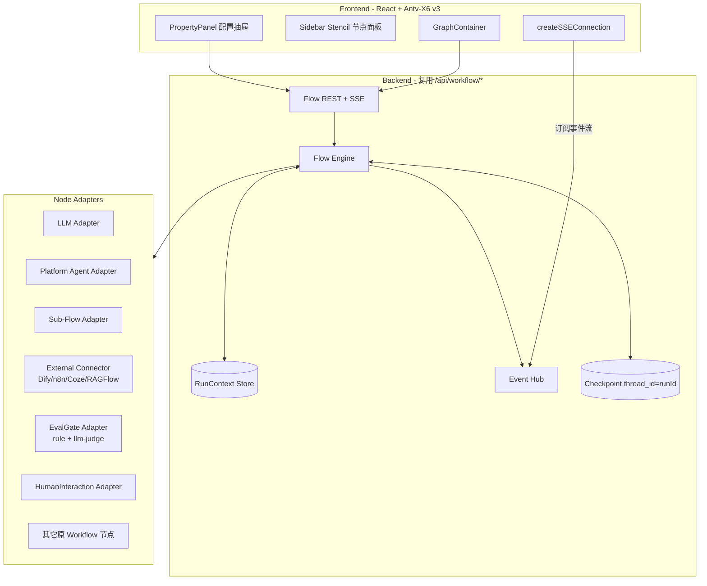
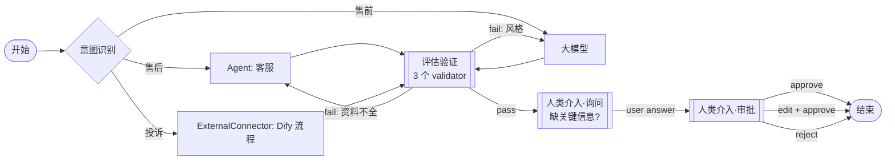
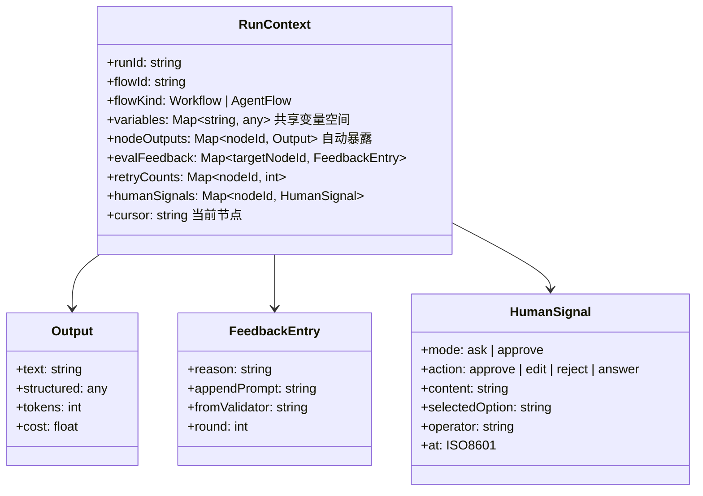
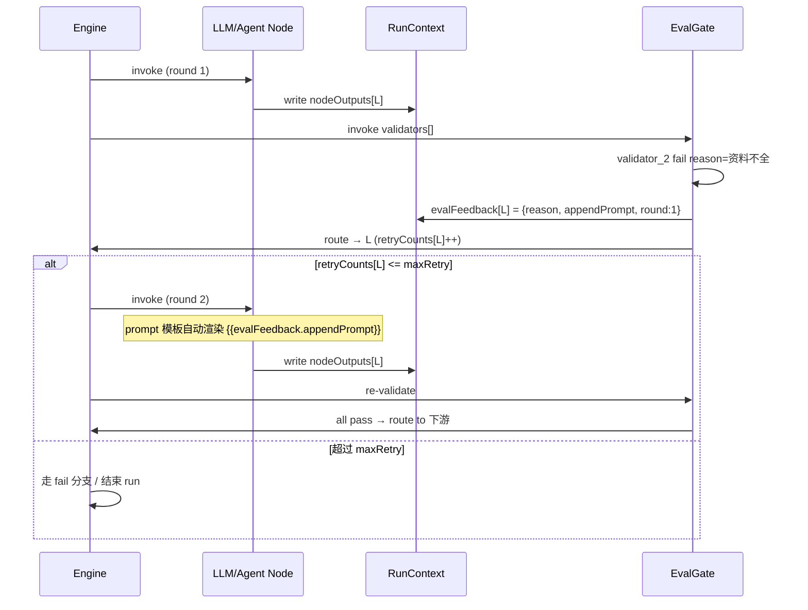
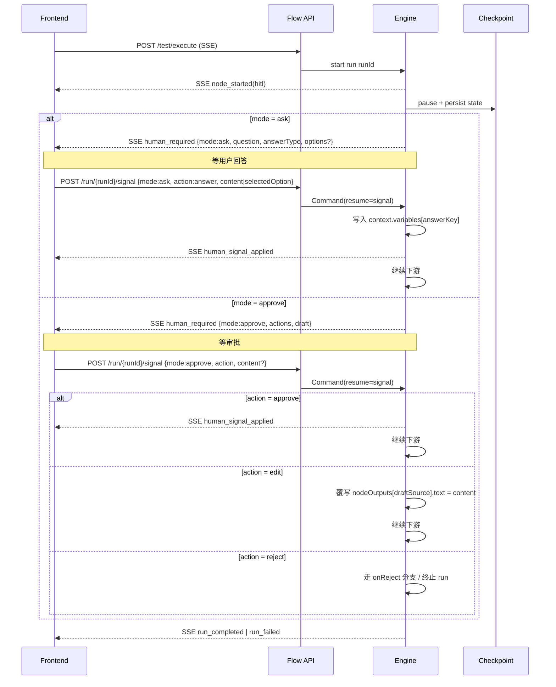
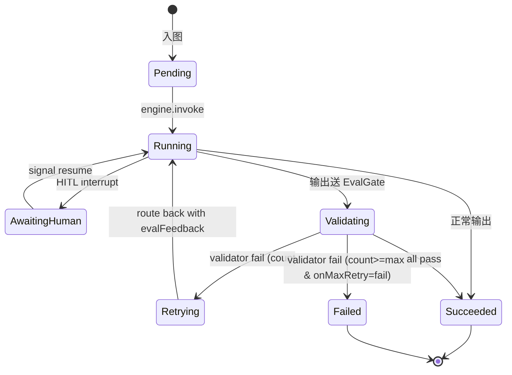
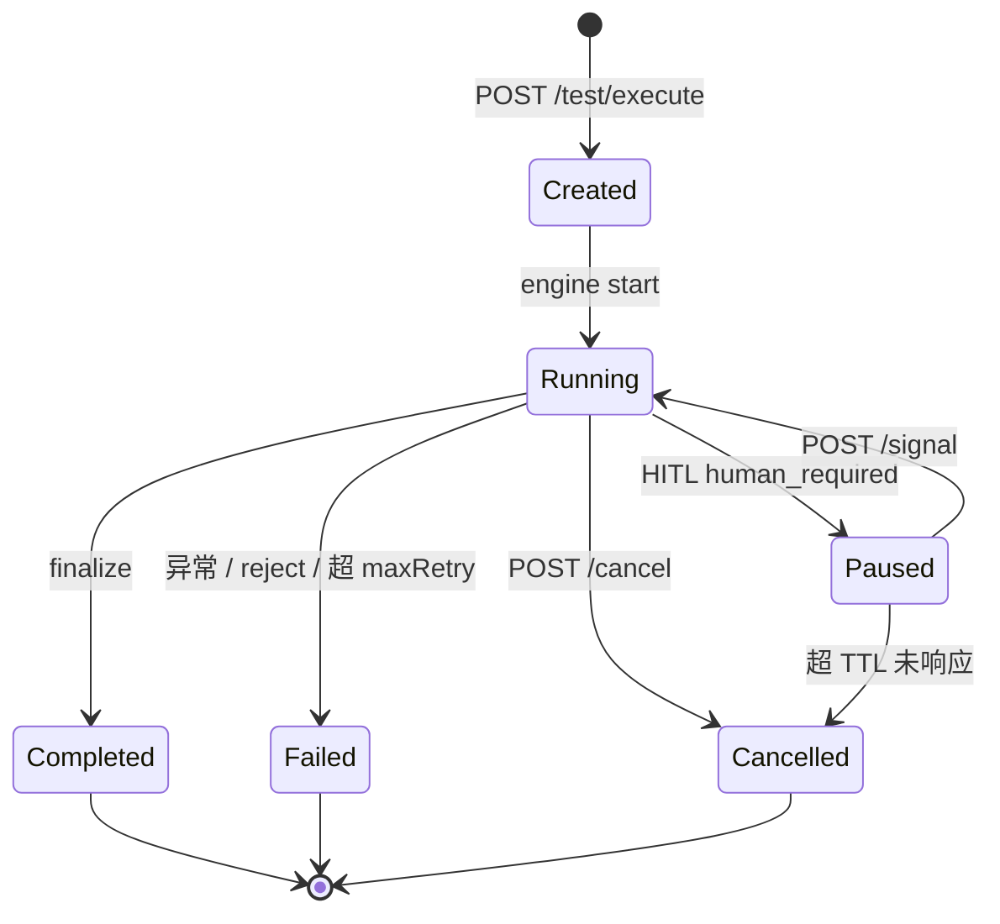
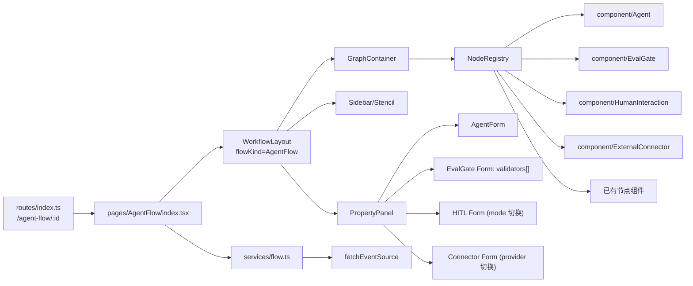
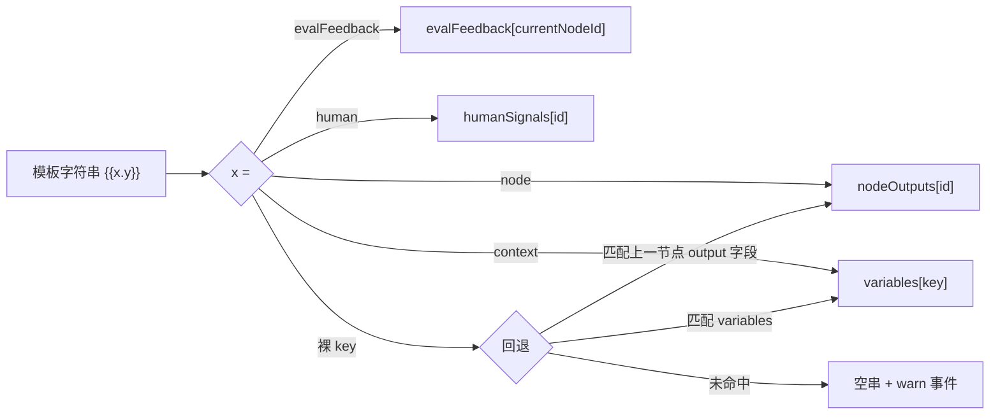

# AgentFlow 设计文档

> 在现有 Workflow（基于 Antv-X6 v3）基础上扩展的 **AI 驱动、上下文友好** 的编排能力。
>
> 文档版本：v1.0 · 维护者：前端架构组 · 关联代码：`src/pages/AgentFlow/`、`src/pages/Antv-X6/v3/`

## 目录

1. [背景与目标](#1-背景与目标)
2. [与 Workflow 的差异](#2-与-workflow-的差异)
3. [整体架构](#3-整体架构)
4. [节点体系](#4-节点体系)
5. [RunContext 数据模型](#5-runcontext-数据模型)
6. [核心执行时序](#6-核心执行时序)
7. [状态机](#7-状态机)
8. [事件流（SSE）规范](#8-事件流sse规范)
9. [节点配置 Schema](#9-节点配置-schema)
10. [前端模块结构](#10-前端模块结构)
11. [三方平台连接器](#11-三方平台连接器)
12. [变量解析与模板渲染](#12-变量解析与模板渲染)
13. [实施路线图](#13-实施路线图)
14. [关键文件清单](#14-关键文件清单)
15. [端到端验证清单](#15-端到端验证清单)
16. [参考](#16-参考)

---

## 1. 背景与目标

平台已有基于 Antv-X6 v3 的 **Workflow**（`src/pages/Antv-X6/`）。该方案接近 Dify/n8n 风格：节点间通过显式 `inputArgs/outputArgs` 连线传值、强类型校验、流程严格按 DAG 推进。这对**规则化**业务流编排非常合适，但在以下三类场景上有摩擦：

1. **多智能体协作**：缺少一类直接调用平台内 Agent / 嵌套子流程的"Agent 节点"
2. **质量自循环**：缺少"评估失败回跳并追加提示词"的结构化能力
3. **人机协同审批**：现有 `QuestionsNode` 只覆盖"问用户"，缺少"审批草稿（approve/edit/reject）"

AgentFlow 的目标是 **作为 Workflow 的姊妹形态** 出现，复用绝大部分前后端基建，新增四类节点与一套 RunContext 机制，让"AI 驱动 + 上下文 + 人机协作"的编排范式开箱即用。

## 2. 与 Workflow 的差异

| 维度 | Workflow | AgentFlow |
| --- | --- | --- |
| 节点间数据流 | 显式 `inputArgs/outputArgs` 连线 | **全局 RunContext** + 入参可选缺省自动取上一节点输出 |
| AI 驱动方式 | 节点是数据处理单元 | 节点内 AI 自治（图固定，节点内部由 LLM/Agent 决策） |
| 评估与回跳 | 通过 Condition 节点手工实现 | **EvalGate 节点** 原生支持 N validator + 回跳 + 追加提示词 |
| 人机协作 | `QuestionsNode`（仅询问） | **HumanInteraction 节点**：`ask` + `approve` 双模式 |
| 三方平台 | 通过 Plugin / HTTP 节点 | **ExternalConnector 节点**：Dify / n8n / Coze / Ragflow 原生接入 |
| Schema 严格度 | 强校验 | 入参可选；运行时校验；warn 不阻塞 |

> **决策**：AgentFlow 不重写引擎，复用 `/api/workflow/*` 与 X6 v3 画布，通过 **新增 NodeType + `flowKind` 字段** 实现。

## 3. 整体架构



## 4. 节点体系

### 4.1 拓扑示例



### 4.2 节点分类

| 分类 | 节点 | 来源 | 说明 |
| --- | --- | --- | --- |
| 控制流 | `Start` / `End` | 复用 | 入口/出口 |
| 控制流 | `IntentRecognition` | 复用 | LLM-as-classifier 多端口分支 |
| 控制流 | `EvalGate` | **新增** | N validator + 失败回跳 + 追加提示词 |
| 执行 | `LLM` (ModelNode) | 复用 | model + system/user prompt + tools |
| 执行 | `Agent` | **新增** | mode = `platform`（本平台 Agent）或 `subflow`（嵌套 AgentFlow） |
| 执行 | `ExternalConnector` | **新增** | provider = `dify` / `n8n` / `coze` / `ragflow` |
| 交互 | `HumanInteraction` | **新增** | mode = `ask`（text/select 答题） / `approve`（approve/edit/reject） |
| 数据 | Variable / Code / HTTP / Knowledge / ... | 复用 | 与 Workflow 共享 |

## 5. RunContext 数据模型



**关键约定**：

- `nodeOutputs[nodeId]` 自动写入，所有下游节点均可通过 `{{node.<id>.output}}` 引用
- `variables` 由用户/节点显式读写
- `evalFeedback[targetNodeId]` 由 EvalGate 写入，目标节点 prompt 模板自动渲染 `{{evalFeedback.appendPrompt}}`
- `retryCounts[nodeId]` 由 engine 维护，节点不直接操作
- `humanSignals[nodeId]` 持久化用户提交的 signal，便于审计

## 6. 核心执行时序

### 6.1 EvalGate 失败回跳



### 6.2 HumanInteraction 暂停-恢复（ask + approve 通用）



## 7. 状态机

### 7.1 单节点



### 7.2 Run 生命周期



## 8. 事件流（SSE）规范

复用 `src/utils/fetchEventSource.ts::createSSEConnection`。事件 schema：

```ts
interface FlowEvent {
  at: string; // ISO8601
  runId: string;
  type: EventType;
  actor: 'system' | 'human' | NodeKind;
  payload: Record<string, any>;
}
```

| 事件 | actor | payload 关键字段 | 触发时机 |
| --- | --- | --- | --- |
| `run_started` | system | `runId, flowId, flowKind` | engine 启动 |
| `node_started` | node.kind | `nodeId, round` | 节点开始 |
| `node_chunk` | node.kind | `nodeId, text` | LLM/Agent 流式片段 |
| `node_completed` | node.kind | `nodeId, output, tokens, cost` | 节点正常结束 |
| `node_failed` | node.kind | `nodeId, error` | 节点异常 |
| `gate_evaluated` | system | `nodeId, passed, failures[]` | EvalGate 完成 |
| `gate_routed` | system | `fromNodeId, toNodeId, validator, appendPrompt, round` | EvalGate 回跳 |
| `human_required` | system | `nodeId, mode(ask\|approve), payload` | HITL 暂停 |
| `human_signal_applied` | human | `nodeId, signal` | 用户提交 signal |
| `context_updated` | system | `keys[]` | RunContext 关键键变化（调试用） |
| `run_completed` | system | `runId, finalOutput, summary` | 整 run 成功 |
| `run_failed` | system | `runId, error` | 整 run 失败 |
| `run_cancelled` | human | `runId` | 取消 |

## 9. 节点配置 Schema

```ts
// EvalGate
export interface EvalGateConfig {
  validators: Array<{
    name: string;
    type: 'rule' | 'llm-judge';
    config: unknown; // rule: 规则参数；llm-judge: { model, judgePrompt, threshold }
    onFail: {
      targetNodeId: string; // 任意上游节点
      appendPrompt: string; // 注入到 evalFeedback.appendPrompt
      reason: string; // UI 展示给用户的失败原因
    };
  }>;
  maxRetry: number; // 节点级总重试上限
  onMaxRetry: 'fail' | 'continue' | 'human';
}

// Agent
export type AgentConfig =
  | { mode: 'platform'; agentId: string; inputs?: Record<string, string> }
  | { mode: 'subflow'; subFlowId: string; inputs?: Record<string, string> };

// HumanInteraction (HITL)
export type HumanInteractionConfig =
  | {
      mode: 'ask';
      question: string; // 支持 {{context.x}} 渲染
      answerType: 'text' | 'select';
      options?: { label: string; value: string }[]; // answerType=select 时
      answerKey: string; // 答案写入 RunContext.variables[answerKey]
      required?: boolean;
    }
  | {
      mode: 'approve';
      actions: ('approve' | 'edit' | 'reject')[];
      promptToReviewer: string;
      draftSource: string; // 默认 {{node.<prevId>.output}}
      onReject: { targetNodeId?: string } | 'fail';
    };

// ExternalConnector
export interface ExternalConnectorConfig {
  provider: 'dify' | 'n8n' | 'coze' | 'ragflow';
  endpoint: string;
  authRef: string; // 引用凭据 ID（不在 config 明文）
  payloadTemplate: string; // 支持 {{context.x}} 渲染
  responseMapping: Record<string, string>; // 响应路径 → RunContext 路径
}
```

## 10. 前端模块结构

### 10.0 工具与服务（已实现）

| 路径 | 说明 |
| --- | --- |
| `src/contexts/FlowKindContext.tsx` | `FlowKindProvider` / `useFlowKind()` |
| `src/services/flow.ts` | `flowApiPrefix(kind)` / `useFlowApiPrefix()` / `withFlowKind(payload, kind)` —— 后端分叉时只改这里 |
| `src/utils/runContextTemplate.ts` | `renderTemplate(tmpl, ctx, { currentNodeId })` / `findMissingReferences(...)` |
| `src/utils/agentFlowMock.ts` | `startMockAgentFlowRun({ scenario })` —— 后端未就绪时本地复现完整事件流 |
| `src/types/interfaces/runContext.ts` | RunContext / NodeOutput / EvalFeedback / HumanSignal 类型 |
| `src/pages/AgentFlow/index.tsx` | 路由 `/space/:spaceId/agent-flow/:workflowId` |
| `src/pages/Antv-X6/v3/component/agentFlowNodes.tsx` | 4 个新节点的属性面板 |

```
src/pages/AgentFlow/                         (新增页面壳)
  └─ index.tsx                                复用 WorkflowLayout, 传入 flowKind=AgentFlow
src/pages/Antv-X6/v3/
  ├─ config/NodeRegistry.tsx                  注册新 NodeType → 组件
  ├─ component/Agent/                         新增 Agent 节点 React 组件
  ├─ component/EvalGate/                      新增 EvalGate 节点 + 多 fail port
  ├─ component/HumanInteraction/              新增 HITL 节点 (mode: ask | approve)
  └─ component/ExternalConnector/             新增三方平台连接器节点
src/types/enums/common.ts                     NodeTypeEnum += Agent / EvalGate /
                                              HumanInteraction / ExternalConnector
                                              新增 FlowKindEnum (Workflow | AgentFlow)
src/types/interfaces/node.ts                  NodeConfig 扩展:
                                              - agentMode, agentId, subFlowId
                                              - evalValidators[]
                                              - hitlMode, askConfig, approveConfig
                                              - connectorProvider, connectorConfig
                                              - contextReads[], contextWrites[]
src/services/flow.ts                          统一 service, 内部按 flowKind 选 endpoint
src/routes/index.ts                           + /space/:spaceId/agent-flow/:flowId
```

依赖关系：



## 11. 三方平台连接器

| Provider | 端点 | 鉴权 | 输入 | 输出 | 流式 |
| --- | --- | --- | --- | --- | --- |
| **Dify** | `/v1/workflows/run` 或 `/v1/chat-messages` | API Key | `inputs` JSON | `outputs` JSON / `text` | ✅ SSE |
| **n8n** | webhook URL | header / basic | JSON body | JSON response | ❌ |
| **Coze** | `/v1/workflow/run` 或 `/v3/chat` | OAuth / PAT | `parameters` JSON | `data` JSON | ✅ SSE |
| **Ragflow** | `/v1/chats_openai/{chat_id}/chat/completions` | API Key | OpenAI 风格 messages | `choices[].message` | ✅ SSE |

- 凭据通过现有 plugin 凭据管理页复用，`authRef` 指向凭据 ID
- 三方流式响应在后端 Adapter 内拆解后以平台统一 `node_chunk` 事件转发
- 节点 config 不存任何 secret 字段

## 12. 变量解析与模板渲染



支持的语法：

```
{{context.userQuery}}                  从 RunContext.variables 取
{{node.agent_1.output}}                取指定节点输出
{{node.agent_1.output.json.title}}     嵌套字段
{{evalFeedback.appendPrompt}}          当前节点的回跳提示词
{{human.approval_1.content}}           历史 HITL 签名内容
```

未命中时返回空串并发出 `context_updated` warn 事件，便于调试。

## 13. 实施路线图

| 里程碑 | 周期 | 前端状态 | 后端依赖 |
| --- | --- | --- | --- |
| **M1 Foundations** | 1 周 | ✅ 完成 | 共用 `/api/workflow/*` |
| **M2 Agent & HITL** | 1.5 周 | ✅ 节点 UI 完成 | `human_required` / `human_signal_applied` 事件 + `/signal` 端点待对齐 |
| **M3 EvalGate** | 1.5 周 | ✅ 节点 UI 完成（validators FormList + onFail） | 后端验证执行 + 回跳 + `evalFeedback` 写 RunContext |
| **M4 RunContext & 入参可选** | 0.5 周 | ✅ 模板渲染器 + autoWire 开关完成 | 引擎实现自动接线 + 模板渲染 |
| **M5 ExternalConnector** | 1 周 | ✅ provider 差异化表单 + responseMapping FormList 完成 | 四个 provider 后端 Adapter |

总计约 **5.5 周**（不含联调与回归）。当前前端已就绪，等待后端契约对齐。

## 14. 关键文件清单

| 路径 | 性质 | 说明 |
| --- | --- | --- |
| `src/types/enums/common.ts` | 改 | `NodeTypeEnum` 扩展 + `FlowKindEnum` |
| `src/types/interfaces/node.ts` | 改 | `NodeConfig` union 扩展新增节点字段 |
| `src/types/interfaces/graph.ts` | 改 | `WorkflowData` 加 `flowKind` |
| `src/pages/AgentFlow/index.tsx` | 新 | 复用 `WorkflowLayout` |
| `src/pages/Antv-X6/v3/components/layout/WorkflowLayout.tsx` | 改 | 参数化 `flowKind` |
| `src/pages/Antv-X6/v3/config/NodeRegistry.tsx` | 改 | 注册新节点 |
| `src/pages/Antv-X6/v3/component/Agent/` | 新 | Agent 节点 |
| `src/pages/Antv-X6/v3/component/EvalGate/` | 新 | EvalGate 节点 |
| `src/pages/Antv-X6/v3/component/HumanInteraction/` | 新 | HITL 节点 |
| `src/pages/Antv-X6/v3/component/ExternalConnector/` | 新 | 三方连接器节点 |
| `src/services/flow.ts` | 新 | 统一 service，按 flowKind 选端点 |
| `src/services/workflow.ts` | 改 | 保留为薄壳代理 |
| `src/routes/index.ts` | 改 | `/space/:spaceId/agent-flow/:flowId` |
| `src/models/workflowV3.ts` | 改 | 加 `flowKind` 状态 |
| `src/utils/fetchEventSource.ts` | 改（按需） | 扩展事件类型常量 |

## 15. 端到端验证清单

1. 进入 `/space/X/agent-flow/Y`，从 Stencil 拖出：`Start → Agent(platform) → EvalGate(2 validators: rule + llm-judge) → HITL(mode=ask) → HITL(mode=approve) → End`
2. 在 EvalGate 配置 `validator_1.onFail`：
   - `targetNodeId = AgentNode.id`
   - `appendPrompt = "请补充客户的订单号"`
   - `maxRetry = 2`
3. 点测试运行：用 `createSSEConnection` 订阅 `/api/workflow/test/execute`（或新端点），断言事件序列：
   - `run_started`
   - `node_started(Agent, round:1)` → `node_chunk` × N → `node_completed(Agent)`
   - `node_started(EvalGate)` → `gate_evaluated{passed:false}` → `gate_routed{toNodeId:Agent, appendPrompt:"请补充客户的订单号"}`
   - `node_started(Agent, round:2)`（prompt 模板渲染后包含追加内容）→ `node_completed(Agent)`
   - `node_started(EvalGate)` → `gate_evaluated{passed:true}`
   - `node_started(HITL_ask)` → `human_required{mode:'ask', answerType:'select', options:[...]}`
   - 前端发 signal `{mode:'ask', action:'answer', selectedOption:'A'}` → `human_signal_applied`
   - `node_started(HITL_approve)` → `human_required{mode:'approve', draft, actions:['approve','edit','reject']}`
   - 前端发 signal `{mode:'approve', action:'edit', content:'修改后的草稿'}` → `human_signal_applied`
   - `run_completed`
4. 在后续节点的 prompt 中引用 `{{context.<answerKey>}}`，确认 ask 阶段的答案被正确取到
5. DevTools Network → 验证 SSE 帧的 `type` 字段全部命中规范
6. 与后端联调：确认 `flowKind` 字段位置 / 是否复用 `/api/workflow/*` 或新增 `/api/agent-flow/*` 别名 / `/signal` 端点契约 / `evalFeedback` 在 prompt 模板的注入点

## 16. 参考

- `docs/ch/SSE-Implementation-Guide.md` — 平台 SSE 通用规范
- 现有 Workflow 代码：`src/pages/Antv-X6/v3/`、`src/services/workflow.ts`、`src/types/interfaces/graph.ts`、`src/types/interfaces/node.ts`
- 内部研究：
  - `opc-orchestrator` — LangGraph + `interrupt()` HITL + `gate` 节点 reloop 模式
  - `eaw-flow-runtime` — Temporal 持久化 HITL + `NodeKind` 封闭枚举 + 事件 append/projection 派生
- 外部生态参考：Dify Workflow / n8n / Coze Workflow / Ragflow Agent API
