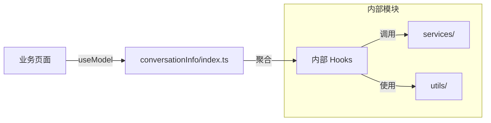
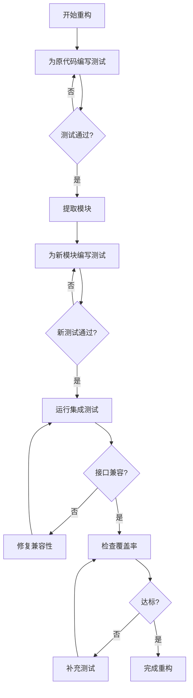

# conversationInfo Model 代码分层重构指南

## 📋 目录

- [概述](#概述)
- [核心架构](#核心架构)
- [快速开始](#快速开始)
- [功能详解](#功能详解)
- [实际使用场景](#实际使用场景)
  - [场景 1：在页面组件中使用](#场景-1在页面组件中使用)
  - [场景 2：使用独立功能 Hook](#场景-2使用独立功能-hook)
  - [场景 3：扩展新功能](#场景-3扩展新功能)
- [API 文档](#api-文档)
- [最佳实践](#最佳实践)
- [单元测试](#单元测试)
- [常见问题](#常见问题)
- [参考资料](#参考资料)

## 概述

本指南针对 `src/models/conversationInfo.ts` 文件进行分层重构，在**保持对外接口不变**的前提下，通过内部模块化拆分提升代码可维护性。

**核心原则**

- 保持 `useModel('conversationInfo')` 调用方式不变
- 返回值结构完全兼容，已接入业务无需任何修改
- 内部逻辑按职责拆分为独立模块
- 渐进式重构，可分阶段实施

**核心优势**

- 零业务侵入：现有调用代码无需修改
- 可维护性提升：1400 行代码拆分为多个小模块
- 可测试性增强：纯函数与副作用分离
- 可扩展性改善：新功能可独立模块添加

## 核心架构

### 技术栈

- React 18 + TypeScript
- UmiJS Model（基于 hooks 的状态管理）
- ahooks `useRequest`
- SSE (Server-Sent Events)

### 架构关系



### 目录结构

```
src/models/conversationInfo/
├── index.ts                    # 主入口（聚合导出，保持兼容）
├── hooks/
│   ├── useConversationState.ts # 会话状态管理
│   ├── useMessageList.ts       # 消息列表管理
│   ├── useSSEConnection.ts     # SSE 连接管理
│   ├── useFileTree.ts          # 文件树管理
│   ├── useVncDesktop.ts        # 远程桌面管理
│   ├── useScrollBehavior.ts    # 滚动行为管理
│   └── useDialogState.ts       # 弹窗状态管理
├── utils/
│   ├── messageProcessor.ts     # 消息处理工具
│   └── cardProcessor.ts        # 卡片处理工具
└── types.ts                    # 类型定义
```

## 快速开始

### 现有调用方式（保持不变）

```tsx
import { useModel } from 'umi';

const MyComponent = () => {
  const {
    conversationInfo,
    messageList,
    onMessageSend,
    // ... 其他方法
  } = useModel('conversationInfo');

  // 业务逻辑保持不变
};
```

### 分层后的内部结构

```tsx
// src/models/conversationInfo/index.ts
import { useConversationState } from './hooks/useConversationState';
import { useMessageList } from './hooks/useMessageList';
import { useSSEConnection } from './hooks/useSSEConnection';
import { useFileTree } from './hooks/useFileTree';
import { useVncDesktop } from './hooks/useVncDesktop';
import { useScrollBehavior } from './hooks/useScrollBehavior';
import { useDialogState } from './hooks/useDialogState';

export default () => {
  // 会话状态
  const conversationState = useConversationState();
  // 消息列表
  const messageListState = useMessageList();
  // SSE 连接
  const sseConnection = useSSEConnection();
  // 文件树
  const fileTreeState = useFileTree();
  // 远程桌面
  const vncDesktopState = useVncDesktop();
  // 滚动行为
  const scrollBehavior = useScrollBehavior();
  // 弹窗状态
  const dialogState = useDialogState();

  // 聚合返回，保持原有接口
  return {
    ...conversationState,
    ...messageListState,
    ...sseConnection,
    ...fileTreeState,
    ...vncDesktopState,
    ...scrollBehavior,
    ...dialogState,
  };
};
```

## 功能详解

### 模块划分原则

根据现有代码分析，按功能领域划分为以下模块：

| 模块                     | 职责                   | 代码行数 (约) |
| ------------------------ | ---------------------- | ------------- |
| `useConversationState`   | 会话信息、变量参数     | 150 行        |
| `useMessageList`         | 消息增删改查、状态管理 | 250 行        |
| `useSSEConnection`       | SSE 连接、事件处理     | 200 行        |
| `useFileTree`            | 文件树数据、刷新逻辑   | 100 行        |
| `useVncDesktop`          | 远程桌面、容器管理     | 100 行        |
| `useScrollBehavior`      | 滚动控制、自动滚动     | 80 行         |
| `useDialogState`         | 历史会话、定时任务弹窗 | 60 行         |
| `utils/messageProcessor` | 消息处理纯函数         | 150 行        |
| `utils/cardProcessor`    | 卡片处理纯函数         | 100 行        |

### useConversationState

管理会话核心状态。

```typescript
// hooks/useConversationState.ts
import { useState, useRef, useCallback } from 'react';
import type { ConversationInfo, BindConfigWithSub } from '@/types';

export const useConversationState = () => {
  // 会话信息
  const [conversationInfo, setConversationInfo] =
    useState<ConversationInfo | null>(null);
  // 当前会话ID
  const [currentConversationId, setCurrentConversationId] = useState<
    number | null
  >(null);
  // 请求ID
  const [requestId, setRequestId] = useState<string>('');
  // 调试结果
  const [finalResult, setFinalResult] =
    useState<ConversationFinalResult | null>(null);
  // 变量参数
  const [variables, setVariables] = useState<BindConfigWithSub[]>([]);
  const [requiredNameList, setRequiredNameList] = useState<string[]>([]);
  const [userFillVariables, setUserFillVariables] = useState<Record<
    string,
    string | number
  > | null>(null);
  // 是否需要更新主题
  const needUpdateTopicRef = useRef<boolean>(true);

  // 处理变量参数
  const handleVariables = useCallback((_variables: BindConfigWithSub[]) => {
    setVariables(_variables);
    const _requiredNameList = _variables
      ?.filter((item) => !item.systemVariable && item.require)
      ?.map((item) => item.name);
    setRequiredNameList(_requiredNameList || []);
  }, []);

  // 获取当前会话ID
  const getCurrentConversationId = useCallback(() => {
    return currentConversationId;
  }, [currentConversationId]);

  return {
    conversationInfo,
    setConversationInfo,
    currentConversationId,
    setCurrentConversationId,
    requestId,
    setRequestId,
    finalResult,
    setFinalResult,
    variables,
    setVariables,
    requiredNameList,
    userFillVariables,
    setUserFillVariables: setUserFillVariables,
    handleVariables,
    needUpdateTopicRef,
    getCurrentConversationId,
  };
};
```

### useMessageList

管理消息列表的增删改查。

```typescript
// hooks/useMessageList.ts
import { useState, useRef, useCallback } from 'react';
import type { MessageInfo } from '@/types';
import { MessageStatusEnum } from '@/types/enums';

export const useMessageList = () => {
  const [messageList, setMessageList] = useState<MessageInfo[]>([]);
  const [isMoreMessage, setIsMoreMessage] = useState<boolean>(false);
  const [loadingMore, setLoadingMore] = useState<boolean>(false);
  const [isConversationActive, setIsConversationActive] =
    useState<boolean>(false);

  const messageListRef = useRef<MessageInfo[]>([]);
  const messageIdRef = useRef<string>('');

  // 检查会话是否正在进行中
  const checkConversationActive = useCallback((messages: MessageInfo[]) => {
    const recentMessages = messages?.slice(-5) || [];
    const hasActiveMessage =
      recentMessages.some(
        (message) =>
          message.status === MessageStatusEnum.Loading ||
          message.status === MessageStatusEnum.Incomplete,
      ) || false;
    setIsConversationActive(hasActiveMessage);
  }, []);

  // 禁用会话活跃状态
  const disabledConversationActive = useCallback(() => {
    setIsConversationActive(false);
  }, []);

  return {
    messageList,
    setMessageList,
    isMoreMessage,
    setIsMoreMessage,
    loadingMore,
    setLoadingMore,
    isConversationActive,
    setIsConversationActive,
    messageListRef,
    messageIdRef,
    checkConversationActive,
    disabledConversationActive,
  };
};
```

### useScrollBehavior

管理滚动行为。

```typescript
// hooks/useScrollBehavior.ts
import { useRef, useState, useCallback } from 'react';

export const useScrollBehavior = () => {
  const messageViewRef = useRef<HTMLDivElement | null>(null);
  const scrollTimeoutRef = useRef<ReturnType<typeof setTimeout> | null>(null);
  const allowAutoScrollRef = useRef<boolean>(true);
  const [showScrollBtn, setShowScrollBtn] = useState<boolean>(false);

  // 滚动到底部
  const messageViewScrollToBottom = useCallback(() => {
    if (!allowAutoScrollRef.current) return;

    const element = messageViewRef.current;
    if (element) {
      (element as any).__isProgrammaticScroll = true;
      element.scrollTo({
        top: element.scrollHeight,
        behavior: 'smooth',
      });
      setTimeout(() => {
        (element as any).__isProgrammaticScroll = false;
      }, 600);
    }
  }, []);

  // 处理滚动到底部（带延迟）
  const handleScrollBottom = useCallback(() => {
    if (allowAutoScrollRef.current) {
      scrollTimeoutRef.current = setTimeout(() => {
        messageViewScrollToBottom();
      }, 400);
    }
  }, [messageViewScrollToBottom]);

  return {
    messageViewRef,
    scrollTimeoutRef,
    allowAutoScrollRef,
    showScrollBtn,
    setShowScrollBtn,
    messageViewScrollToBottom,
    handleScrollBottom,
  };
};
```

### 工具函数：messageProcessor

纯函数处理消息转换。

```typescript
// utils/messageProcessor.ts
import type {
  ConversationChatResponse,
  MessageInfo,
  ProcessingInfo,
} from '@/types';
import {
  ConversationEventTypeEnum,
  MessageStatusEnum,
  ProcessingEnum,
} from '@/types/enums';
import { getCustomBlock } from '@/plugins/ds-markdown-process';

/**
 * 处理 PROCESSING 事件
 */
export const processProcessingEvent = (
  currentMessage: MessageInfo,
  data: any,
): Partial<MessageInfo> => {
  const processingResult = data.result || {};
  data.executeId = processingResult.executeId;

  return {
    text: getCustomBlock(currentMessage.text || '', data),
    status: MessageStatusEnum.Loading,
    processingList: [
      ...(currentMessage?.processingList || []),
      data,
    ] as ProcessingInfo[],
  };
};

/**
 * 处理 MESSAGE 事件
 */
export const processMessageEvent = (
  currentMessage: MessageInfo,
  data: any,
): Partial<MessageInfo> => {
  const { text, type, finished } = data;

  if (type === 'think') {
    return {
      think: `${currentMessage.think}${text}`,
      status: MessageStatusEnum.Incomplete,
    };
  }

  if (type === 'question') {
    return {
      text: `${currentMessage.text}${text}`,
      status: finished ? null : MessageStatusEnum.Incomplete,
    };
  }

  return {
    text: `${currentMessage.text}${text}`,
    status: finished
      ? MessageStatusEnum.Complete
      : MessageStatusEnum.Incomplete,
  };
};

/**
 * 处理 FINAL_RESULT 事件
 */
export const processFinalResultEvent = (
  currentMessage: MessageInfo,
  data: any,
  requestId: string,
): Partial<MessageInfo> => {
  return {
    status: MessageStatusEnum.Complete,
    finalResult: data,
    requestId,
  };
};

/**
 * 处理 ERROR 事件
 */
export const processErrorEvent = (): Partial<MessageInfo> => {
  return {
    status: MessageStatusEnum.Error,
  };
};
```

## 实际使用场景

### 场景 1：在页面组件中使用

现有业务代码无需任何修改。

```tsx
// 业务页面代码（保持不变）
import { useModel } from 'umi';

const ChatPage = () => {
  const {
    conversationInfo,
    messageList,
    onMessageSend,
    isConversationActive,
    runQueryConversation,
  } = useModel('conversationInfo');

  useEffect(() => {
    if (conversationId) {
      runQueryConversation(conversationId);
    }
  }, [conversationId]);

  const handleSend = (message: string) => {
    onMessageSend(conversationInfo?.id, message);
  };

  return (
    <div>
      <MessageList messages={messageList} />
      <InputArea onSend={handleSend} disabled={isConversationActive} />
    </div>
  );
};
```

### 场景 2：使用独立功能 Hook

需要单独使用某个功能时，可直接引入对应 Hook。

```tsx
// 只需要文件树功能
import { useFileTree } from '@/models/conversationInfo/hooks/useFileTree';

const FilePanel = ({ conversationId }) => {
  const {
    fileTreeData,
    fileTreeDataLoading,
    handleRefreshFileList,
    isFileTreeVisible,
    closePreviewView,
  } = useFileTree();

  return (
    <div>
      {fileTreeDataLoading ? <Spin /> : <FileTree data={fileTreeData} />}
    </div>
  );
};
```

### 场景 3：扩展新功能

添加新功能时，创建独立 Hook 并在主入口聚合。

```typescript
// 1. 创建新 Hook
// hooks/useNewFeature.ts
export const useNewFeature = () => {
  const [featureState, setFeatureState] = useState(null);

  const doSomething = useCallback(() => {
    // 新功能逻辑
  }, []);

  return {
    featureState,
    doSomething,
  };
};

// 2. 在主入口聚合
// index.ts
import { useNewFeature } from './hooks/useNewFeature';

export default () => {
  // ... 其他 hooks
  const newFeature = useNewFeature();

  return {
    // ... 其他返回值
    ...newFeature,
  };
};
```

## API 文档

### 返回值（保持不变）

| 属性/方法 | 类型 | 说明 |
| --- | --- | --- |
| `conversationInfo` | `ConversationInfo \| null` | 当前会话信息 |
| `messageList` | `MessageInfo[]` | 消息列表 |
| `onMessageSend` | `(id, message, files?, ...) => void` | 发送消息 |
| `runQueryConversation` | `(id: number) => void` | 查询会话 |
| `isConversationActive` | `boolean` | 会话是否活跃 |
| `isMoreMessage` | `boolean` | 是否有更多消息 |
| `handleLoadMoreMessage` | `(id: number) => void` | 加载更多消息 |
| `runStopConversation` | `(id: string) => void` | 停止会话 |
| `resetInit` | `() => void` | 重置初始状态 |
| `fileTreeData` | `StaticFileInfo[]` | 文件树数据 |
| `isFileTreeVisible` | `boolean` | 文件树是否可见 |
| `openDesktopView` | `(id: number) => void` | 打开远程桌面 |
| `openPreviewView` | `(id: number) => void` | 打开预览视图 |
| ... | ... | 其他属性保持不变 |

### 内部 Hook 接口

#### useConversationState

```typescript
interface ConversationStateReturn {
  conversationInfo: ConversationInfo | null;
  setConversationInfo: (info: ConversationInfo | null) => void;
  currentConversationId: number | null;
  requestId: string;
  finalResult: ConversationFinalResult | null;
  variables: BindConfigWithSub[];
  handleVariables: (variables: BindConfigWithSub[]) => void;
  getCurrentConversationId: () => number | null;
}
```

#### useMessageList

```typescript
interface MessageListReturn {
  messageList: MessageInfo[];
  setMessageList: Dispatch<SetStateAction<MessageInfo[]>>;
  isMoreMessage: boolean;
  loadingMore: boolean;
  isConversationActive: boolean;
  checkConversationActive: (messages: MessageInfo[]) => void;
  disabledConversationActive: () => void;
}
```

#### useScrollBehavior

```typescript
interface ScrollBehaviorReturn {
  messageViewRef: RefObject<HTMLDivElement>;
  allowAutoScrollRef: MutableRefObject<boolean>;
  showScrollBtn: boolean;
  setShowScrollBtn: (show: boolean) => void;
  messageViewScrollToBottom: () => void;
  handleScrollBottom: () => void;
}
```

## 最佳实践

### 1. 渐进式迁移

```typescript
// 阶段 1：提取工具函数（无风险）
// 将 messageProcessor、cardProcessor 提取为纯函数

// 阶段 2：拆分无状态依赖的 Hook
// 如 useScrollBehavior、useDialogState

// 阶段 3：拆分有依赖关系的 Hook
// 如 useMessageList、useSSEConnection

// 阶段 4：整合并验证
// 确保所有功能正常，删除旧代码
```

### 2. 保持引用稳定

```typescript
// ✅ 正确：使用 useCallback 包装函数
const handleSend = useCallback(
  (message: string) => {
    // ...
  },
  [dependencies],
);

// ❌ 错误：每次渲染创建新函数
const handleSend = (message: string) => {
  // ...
};
```

### 3. 状态共享

```typescript
// 需要跨 Hook 共享状态时，通过参数传递
export const useSSEConnection = (
  messageListState: ReturnType<typeof useMessageList>,
  scrollBehavior: ReturnType<typeof useScrollBehavior>,
) => {
  const { setMessageList, checkConversationActive } = messageListState;
  const { handleScrollBottom } = scrollBehavior;

  // 使用共享的状态和方法
};
```

### 4. 错误处理

```typescript
// 统一错误处理模式
const handleError = useCallback((error: Error, context: string) => {
  console.error(`[${context}] Error:`, error);
  message.error('操作失败，请稍后重试');
  // 更新错误状态
}, []);
```

## 单元测试

### 测试策略

重构过程中，单元测试是保证代码质量的关键。按照模块类型采用不同的测试策略：

| 模块类型 | 测试方法  | 工具                         | 重点               |
| -------- | --------- | ---------------------------- | ------------------ |
| 工具函数 | 单元测试  | Jest                         | 输入输出验证       |
| Hooks    | Hook 测试 | @testing-library/react-hooks | 状态变化、回调行为 |
| 主入口   | 集成测试  | Jest + React Testing Library | 接口兼容性         |

### 测试目录结构

```
src/models/conversationInfo/
├── __tests__/
│   ├── utils/
│   │   ├── messageProcessor.test.ts
│   │   └── cardProcessor.test.ts
│   ├── hooks/
│   │   ├── useConversationState.test.ts
│   │   ├── useMessageList.test.ts
│   │   ├── useScrollBehavior.test.ts
│   │   └── useDialogState.test.ts
│   └── index.test.ts              # 集成测试
├── hooks/
├── utils/
└── index.ts
```

### 工具函数测试

工具函数是纯函数，测试最简单直接。

```typescript
// __tests__/utils/messageProcessor.test.ts
import {
  processProcessingEvent,
  processMessageEvent,
  processFinalResultEvent,
  processErrorEvent,
} from '../utils/messageProcessor';
import { MessageStatusEnum, MessageModeEnum } from '@/types/enums';

describe('messageProcessor', () => {
  describe('processMessageEvent', () => {
    const baseMessage = {
      id: 'msg-1',
      text: 'Hello ',
      think: '',
      status: MessageStatusEnum.Loading,
    };

    it('should append text for normal message', () => {
      const data = { text: 'World', type: 'normal', finished: false };
      const result = processMessageEvent(baseMessage, data);

      expect(result.text).toBe('Hello World');
      expect(result.status).toBe(MessageStatusEnum.Incomplete);
    });

    it('should set Complete status when finished is true', () => {
      const data = { text: '!', type: 'normal', finished: true };
      const result = processMessageEvent(baseMessage, data);

      expect(result.text).toBe('Hello !');
      expect(result.status).toBe(MessageStatusEnum.Complete);
    });

    it('should append to think for think type', () => {
      const data = { text: 'thinking...', type: 'think', finished: false };
      const result = processMessageEvent(baseMessage, data);

      expect(result.think).toBe('thinking...');
      expect(result.status).toBe(MessageStatusEnum.Incomplete);
    });

    it('should handle question type with null status when finished', () => {
      const data = { text: 'question', type: 'question', finished: true };
      const result = processMessageEvent(baseMessage, data);

      expect(result.text).toBe('Hello question');
      expect(result.status).toBeNull();
    });
  });

  describe('processFinalResultEvent', () => {
    it('should return Complete status with finalResult', () => {
      const currentMessage = { id: 'msg-1', text: 'test' };
      const data = { success: true, outputText: 'result' };
      const requestId = 'req-123';

      const result = processFinalResultEvent(currentMessage, data, requestId);

      expect(result.status).toBe(MessageStatusEnum.Complete);
      expect(result.finalResult).toEqual(data);
      expect(result.requestId).toBe(requestId);
    });
  });

  describe('processErrorEvent', () => {
    it('should return Error status', () => {
      const result = processErrorEvent();
      expect(result.status).toBe(MessageStatusEnum.Error);
    });
  });
});
```

### Hook 测试

使用 `@testing-library/react-hooks` 测试 Hook 的状态和行为。

```typescript
// __tests__/hooks/useMessageList.test.ts
import { renderHook, act } from '@testing-library/react-hooks';
import { useMessageList } from '../hooks/useMessageList';
import { MessageStatusEnum } from '@/types/enums';

describe('useMessageList', () => {
  it('should initialize with empty message list', () => {
    const { result } = renderHook(() => useMessageList());

    expect(result.current.messageList).toEqual([]);
    expect(result.current.isMoreMessage).toBe(false);
    expect(result.current.loadingMore).toBe(false);
    expect(result.current.isConversationActive).toBe(false);
  });

  it('should update messageList', () => {
    const { result } = renderHook(() => useMessageList());
    const newMessages = [
      { id: '1', text: 'Hello', status: MessageStatusEnum.Complete },
      { id: '2', text: 'World', status: MessageStatusEnum.Complete },
    ];

    act(() => {
      result.current.setMessageList(newMessages);
    });

    expect(result.current.messageList).toHaveLength(2);
    expect(result.current.messageList[0].text).toBe('Hello');
  });

  describe('checkConversationActive', () => {
    it('should set active when has Loading message', () => {
      const { result } = renderHook(() => useMessageList());
      const messages = [
        { id: '1', status: MessageStatusEnum.Complete },
        { id: '2', status: MessageStatusEnum.Loading },
      ];

      act(() => {
        result.current.checkConversationActive(messages);
      });

      expect(result.current.isConversationActive).toBe(true);
    });

    it('should set active when has Incomplete message', () => {
      const { result } = renderHook(() => useMessageList());
      const messages = [
        { id: '1', status: MessageStatusEnum.Complete },
        { id: '2', status: MessageStatusEnum.Incomplete },
      ];

      act(() => {
        result.current.checkConversationActive(messages);
      });

      expect(result.current.isConversationActive).toBe(true);
    });

    it('should set inactive when all messages complete', () => {
      const { result } = renderHook(() => useMessageList());
      const messages = [
        { id: '1', status: MessageStatusEnum.Complete },
        { id: '2', status: MessageStatusEnum.Complete },
      ];

      act(() => {
        result.current.checkConversationActive(messages);
      });

      expect(result.current.isConversationActive).toBe(false);
    });

    it('should only check last 5 messages', () => {
      const { result } = renderHook(() => useMessageList());
      // 创建 10 条消息，前 5 条是 Loading，后 5 条是 Complete
      const messages = [
        ...Array(5)
          .fill(null)
          .map((_, i) => ({
            id: `old-${i}`,
            status: MessageStatusEnum.Loading,
          })),
        ...Array(5)
          .fill(null)
          .map((_, i) => ({
            id: `new-${i}`,
            status: MessageStatusEnum.Complete,
          })),
      ];

      act(() => {
        result.current.checkConversationActive(messages);
      });

      // 只检查最后 5 条，都是 Complete，所以应该是 inactive
      expect(result.current.isConversationActive).toBe(false);
    });
  });

  it('should disable conversation active', () => {
    const { result } = renderHook(() => useMessageList());

    // 先设置为 active
    act(() => {
      result.current.checkConversationActive([
        { id: '1', status: MessageStatusEnum.Loading },
      ]);
    });
    expect(result.current.isConversationActive).toBe(true);

    // 然后禁用
    act(() => {
      result.current.disabledConversationActive();
    });
    expect(result.current.isConversationActive).toBe(false);
  });
});
```

```typescript
// __tests__/hooks/useScrollBehavior.test.ts
import { renderHook, act } from '@testing-library/react-hooks';
import { useScrollBehavior } from '../hooks/useScrollBehavior';

describe('useScrollBehavior', () => {
  beforeEach(() => {
    jest.useFakeTimers();
  });

  afterEach(() => {
    jest.useRealTimers();
  });

  it('should initialize with correct default values', () => {
    const { result } = renderHook(() => useScrollBehavior());

    expect(result.current.messageViewRef.current).toBeNull();
    expect(result.current.allowAutoScrollRef.current).toBe(true);
    expect(result.current.showScrollBtn).toBe(false);
  });

  it('should update showScrollBtn', () => {
    const { result } = renderHook(() => useScrollBehavior());

    act(() => {
      result.current.setShowScrollBtn(true);
    });

    expect(result.current.showScrollBtn).toBe(true);
  });

  it('should not scroll when allowAutoScrollRef is false', () => {
    const { result } = renderHook(() => useScrollBehavior());
    const mockScrollTo = jest.fn();

    // 模拟 DOM 元素
    result.current.messageViewRef.current = {
      scrollTo: mockScrollTo,
      scrollHeight: 1000,
    } as any;

    // 禁用自动滚动
    result.current.allowAutoScrollRef.current = false;

    act(() => {
      result.current.messageViewScrollToBottom();
    });

    expect(mockScrollTo).not.toHaveBeenCalled();
  });

  it('should scroll when allowAutoScrollRef is true', () => {
    const { result } = renderHook(() => useScrollBehavior());
    const mockScrollTo = jest.fn();

    result.current.messageViewRef.current = {
      scrollTo: mockScrollTo,
      scrollHeight: 1000,
    } as any;

    act(() => {
      result.current.messageViewScrollToBottom();
    });

    expect(mockScrollTo).toHaveBeenCalledWith({
      top: 1000,
      behavior: 'smooth',
    });
  });

  it('should call scroll with delay in handleScrollBottom', () => {
    const { result } = renderHook(() => useScrollBehavior());
    const mockScrollTo = jest.fn();

    result.current.messageViewRef.current = {
      scrollTo: mockScrollTo,
      scrollHeight: 1000,
    } as any;

    act(() => {
      result.current.handleScrollBottom();
    });

    // 验证延迟调用
    expect(mockScrollTo).not.toHaveBeenCalled();

    act(() => {
      jest.advanceTimersByTime(400);
    });

    expect(mockScrollTo).toHaveBeenCalled();
  });
});
```

```typescript
// __tests__/hooks/useConversationState.test.ts
import { renderHook, act } from '@testing-library/react-hooks';
import { useConversationState } from '../hooks/useConversationState';

describe('useConversationState', () => {
  it('should initialize with null values', () => {
    const { result } = renderHook(() => useConversationState());

    expect(result.current.conversationInfo).toBeNull();
    expect(result.current.currentConversationId).toBeNull();
    expect(result.current.requestId).toBe('');
    expect(result.current.variables).toEqual([]);
  });

  it('should update conversation info', () => {
    const { result } = renderHook(() => useConversationState());
    const mockInfo = { id: 123, topic: 'Test' };

    act(() => {
      result.current.setConversationInfo(mockInfo);
    });

    expect(result.current.conversationInfo).toEqual(mockInfo);
  });

  describe('handleVariables', () => {
    it('should set variables and extract required names', () => {
      const { result } = renderHook(() => useConversationState());
      const mockVariables = [
        { name: 'var1', require: true, systemVariable: false },
        { name: 'var2', require: false, systemVariable: false },
        { name: 'var3', require: true, systemVariable: true }, // 系统变量不应包含
        { name: 'var4', require: true, systemVariable: false },
      ];

      act(() => {
        result.current.handleVariables(mockVariables);
      });

      expect(result.current.variables).toEqual(mockVariables);
      expect(result.current.requiredNameList).toEqual(['var1', 'var4']);
    });

    it('should handle empty variables', () => {
      const { result } = renderHook(() => useConversationState());

      act(() => {
        result.current.handleVariables([]);
      });

      expect(result.current.variables).toEqual([]);
      expect(result.current.requiredNameList).toEqual([]);
    });
  });

  it('should get current conversation id', () => {
    const { result } = renderHook(() => useConversationState());

    act(() => {
      result.current.setCurrentConversationId(456);
    });

    expect(result.current.getCurrentConversationId()).toBe(456);
  });
});
```

### 集成测试

验证重构后的主入口与原接口完全兼容。

```typescript
// __tests__/index.test.ts
import { renderHook } from '@testing-library/react-hooks';
import useConversationInfo from '../index';

describe('conversationInfo Model 集成测试', () => {
  // 定义期望的返回值 key 列表（原接口）
  const expectedKeys = [
    // 会话状态
    'conversationInfo',
    'setConversationInfo',
    'currentConversationId',
    'requestId',
    'finalResult',
    'setFinalResult',
    'variables',
    'setVariables',
    'requiredNameList',
    'userFillVariables',
    'handleVariables',
    'getCurrentConversationId',

    // 消息列表
    'messageList',
    'setMessageList',
    'isMoreMessage',
    'loadingMore',
    'isConversationActive',
    'checkConversationActive',
    'disabledConversationActive',

    // 滚动行为
    'messageViewRef',
    'allowAutoScrollRef',
    'showScrollBtn',
    'setShowScrollBtn',
    'messageViewScrollToBottom',
    'handleScrollBottom',

    // 弹窗状态
    'isHistoryConversationOpen',
    'openHistoryConversation',
    'closeHistoryConversation',
    'isTimedTaskOpen',
    'openTimedTask',
    'closeTimedTask',

    // 文件树
    'fileTreeData',
    'fileTreeDataLoading',
    'isFileTreeVisible',
    'isFileTreePinned',
    'handleRefreshFileList',
    'closePreviewView',

    // 远程桌面
    'openDesktopView',
    'openPreviewView',
    'vncContainerInfo',

    // 其他
    'onMessageSend',
    'runQueryConversation',
    'runStopConversation',
    'resetInit',
    // ... 根据实际接口补充
  ];

  it('should return all expected keys', () => {
    const { result } = renderHook(() => useConversationInfo());

    expectedKeys.forEach((key) => {
      expect(result.current).toHaveProperty(key);
    });
  });

  it('should have correct initial state', () => {
    const { result } = renderHook(() => useConversationInfo());

    expect(result.current.conversationInfo).toBeNull();
    expect(result.current.messageList).toEqual([]);
    expect(result.current.isConversationActive).toBe(false);
    expect(result.current.fileTreeData).toEqual([]);
    expect(result.current.isFileTreeVisible).toBe(false);
  });

  it('should have callable methods', () => {
    const { result } = renderHook(() => useConversationInfo());

    expect(typeof result.current.setConversationInfo).toBe('function');
    expect(typeof result.current.onMessageSend).toBe('function');
    expect(typeof result.current.resetInit).toBe('function');
    expect(typeof result.current.handleScrollBottom).toBe('function');
  });
});
```

### Mock 依赖

测试时需要 Mock 外部依赖。

```typescript
// __tests__/setup.ts
import '@testing-library/jest-dom';

// Mock useModel
jest.mock('umi', () => ({
  useModel: jest.fn((modelName) => {
    if (modelName === 'conversationHistory') {
      return {
        runHistory: jest.fn(),
        runHistoryItem: jest.fn(),
      };
    }
    if (modelName === 'chat') {
      return {
        showPagePreview: jest.fn(),
        handleChatProcessingList: jest.fn(),
      };
    }
    return {};
  }),
}));

// Mock useRequest
jest.mock('ahooks', () => ({
  useRequest: jest.fn((service, options = {}) => ({
    run: jest.fn(),
    runAsync: jest.fn(() => Promise.resolve({ code: 200, data: null })),
    loading: false,
    data: null,
    error: null,
    cancel: jest.fn(),
  })),
}));

// Mock antd message
jest.mock('antd', () => ({
  message: {
    success: jest.fn(),
    error: jest.fn(),
    warning: jest.fn(),
  },
}));

// Mock SSE connection
jest.mock('@/utils/fetchEventSourceConversationInfo', () => ({
  createSSEConnection: jest.fn(() => jest.fn()),
}));

// Mock services
jest.mock('@/services/agentConfig', () => ({
  apiAgentConversation: jest.fn(),
  apiAgentConversationChatStop: jest.fn(),
  apiAgentConversationChatSuggest: jest.fn(),
  apiAgentConversationMessageList: jest.fn(),
  apiAgentConversationUpdate: jest.fn(),
}));

jest.mock('@/services/vncDesktop', () => ({
  apiEnsurePod: jest.fn(() => Promise.resolve({ code: 200, data: null })),
  apiGetStaticFileList: jest.fn(),
  apiKeepalivePod: jest.fn(),
  apiRestartAgent: jest.fn(),
  apiRestartPod: jest.fn(),
}));
```

### 运行测试

```bash
# 运行所有测试
pnpm test

# 运行特定模块测试
pnpm test src/models/conversationInfo

# 运行并生成覆盖率报告
pnpm test --coverage src/models/conversationInfo

# 监听模式
pnpm test --watch src/models/conversationInfo
```

### 测试覆盖率要求

重构前后应保证测试覆盖率不低于以下标准：

| 模块类型 | 语句覆盖率 | 分支覆盖率 | 函数覆盖率 |
| -------- | ---------- | ---------- | ---------- |
| 工具函数 | ≥ 90%      | ≥ 85%      | ≥ 95%      |
| Hooks    | ≥ 80%      | ≥ 75%      | ≥ 90%      |
| 主入口   | ≥ 70%      | ≥ 65%      | ≥ 80%      |

```javascript
// jest.config.js 覆盖率配置
module.exports = {
  collectCoverageFrom: [
    'src/models/conversationInfo/**/*.{ts,tsx}',
    '!src/models/conversationInfo/**/*.d.ts',
    '!src/models/conversationInfo/__tests__/**',
  ],
  coverageThreshold: {
    'src/models/conversationInfo/utils/': {
      statements: 90,
      branches: 85,
      functions: 95,
      lines: 90,
    },
    'src/models/conversationInfo/hooks/': {
      statements: 80,
      branches: 75,
      functions: 90,
      lines: 80,
    },
  },
};
```

### 重构测试流程



## 常见问题

### Q1：重构后是否需要修改业务代码？

**A**：不需要。主入口 `index.ts` 保持返回值结构完全一致，所有 `useModel('conversationInfo')` 调用无需修改。

### Q2：如何处理 Hook 之间的依赖关系？

**A**：通过参数传递。在主入口中实例化 Hook 时，将依赖的 Hook 返回值作为参数传入。

```typescript
// index.ts
const messageListState = useMessageList();
const scrollBehavior = useScrollBehavior();
const sseConnection = useSSEConnection(messageListState, scrollBehavior);
```

### Q3：工具函数和 Hook 如何区分？

**A**：

- **工具函数**：纯函数，无副作用，不使用 React Hooks
- **Hook**：包含状态管理、副作用，使用 React Hooks

```typescript
// 工具函数（纯函数）
export const processMessage = (data: any): MessageInfo => {
  return { ...data, processed: true };
};

// Hook（有状态）
export const useMessageList = () => {
  const [messageList, setMessageList] = useState([]);
  // ...
};
```

### Q4：如何测试各个模块？

**A**：

- 工具函数：单元测试
- Hook：使用 `@testing-library/react-hooks`
- 集成测试：验证主入口返回值

```typescript
// 工具函数测试
describe('messageProcessor', () => {
  it('should process MESSAGE event', () => {
    const result = processMessageEvent(currentMessage, data);
    expect(result.text).toBe(expected);
  });
});

// Hook 测试
import { renderHook, act } from '@testing-library/react-hooks';

describe('useMessageList', () => {
  it('should add message', () => {
    const { result } = renderHook(() => useMessageList());
    act(() => {
      result.current.setMessageList([newMessage]);
    });
    expect(result.current.messageList).toHaveLength(1);
  });
});
```

### Q5：如何回滚？

**A**：由于保持了原有文件 `conversationInfo.ts` 的接口，可以：

1. 保留原文件作为备份
2. 新建 `conversationInfo/` 目录进行重构
3. 验证完成后再删除原文件

## 参考资料

- 原始文件：`../../src/models/conversationInfo.ts`
- 类型定义：`../../src/types/interfaces/conversationInfo.ts`
- SSE 工具：`../../src/utils/fetchEventSourceConversationInfo.ts`
- 服务接口：`../../src/services/agentConfig.ts`
