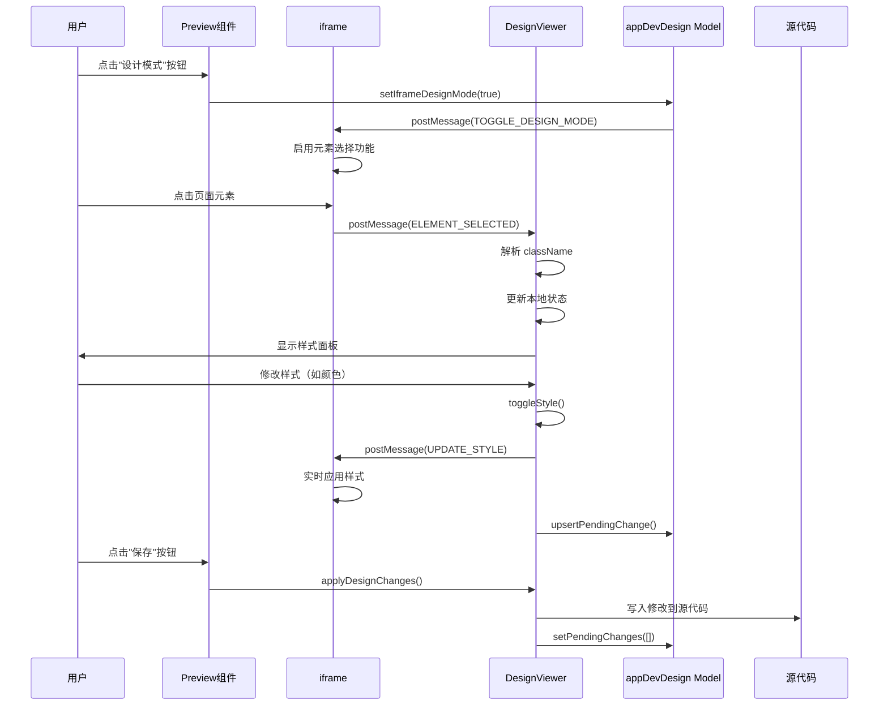

# DesignViewer Design 模式开发指南

## 目录

- [概述](#概述)
- [架构设计](#架构设计)
  - [组件结构](#组件结构)
  - [数据流](#数据流)
  - [状态管理](#状态管理)
  - [Vite 插件预注入](#vite-插件预注入)
  - [消息通信](#消息通信)
- [核心功能](#核心功能)
- [工作流程](#工作流程)
  - [环境准备](#环境准备)
  - [完整工作流程](#完整工作流程)
  - [详细步骤说明](#详细步骤说明)
- [已实现功能](#已实现功能)
- [待实现功能](#待实现功能)
- [技术实现细节](#技术实现细节)
- [开发规范](#开发规范)
- [常见问题](#常见问题)
  - [插件未安装或配置错误](#0-插件未安装或配置错误)
  - [样式不生效](#1-样式不生效)
  - [样式冲突](#2-样式冲突)
  - [变更未保存](#3-变更未保存)
  - [元素选择失败](#4-元素选择失败)
  - [性能问题](#5-性能问题)
- [相关文档](#相关文档)

## 概述

DesignViewer 是一个可视化设计编辑器组件，允许用户通过直观的 UI 面板编辑页面元素的样式和内容。它基于 Tailwind CSS 类名系统，实现了所见即所得的设计体验。

### 核心特性

- **实时预览**：修改样式后立即在 iframe 中看到效果
- **Tailwind CSS 集成**：完全基于 Tailwind CSS 类名系统
- **双向同步**：支持从源代码解析样式，也支持将修改写回源代码
- **元素定位**：通过 sourceInfo（文件路径、行号、列号）精确定位元素
- **变更追踪**：所有修改记录在 pendingChanges 中，支持批量保存

### 使用场景

- 快速调整页面元素的样式
- 可视化编辑组件属性
- 实时预览设计效果
- 批量应用样式修改

## 架构设计

### 组件结构

```
DesignViewer/
├── index.tsx                    # 主组件
├── index.less                   # 样式文件
├── applyDesignChanges.ts        # 应用设计更改到源代码
├── messages.ts                  # 消息类型定义
├── design.images.constants.ts  # 图标常量
└── utils/                       # 工具函数
    ├── tailwind-border.ts       # 边框相关工具
    ├── tailwind-color.ts        # 颜色相关工具
    ├── tailwind-fontSize.ts     # 字体大小工具
    ├── tailwind-fontWeight.ts   # 字体粗细工具
    ├── tailwind-letterSpacing.ts # 字间距工具
    ├── tailwind-lineHeight.ts   # 行高工具
    ├── tailwind-opacity.ts      # 透明度工具
    ├── tailwind-radius.ts       # 圆角工具
    ├── tailwind-shadow.ts       # 阴影工具
    ├── tailwind-space.ts        # 间距工具（padding/margin）
    └── tailwind-textAlign.tsx   # 文本对齐工具
```

### 数据流

```
用户操作
  ↓
DesignViewer UI 面板
  ↓
本地状态更新 (useState)
  ↓
toggleStyle() 生成 Tailwind 类名
  ↓
postMessage 发送到 iframe
  ↓
iframe 实时应用样式
  ↓
记录到 pendingChanges
  ↓
用户保存
  ↓
applyDesignChanges() 应用到源代码
```

### 状态管理

使用 UmiJS Model (`appDevDesign`) 管理全局状态：

```typescript
interface AppDevDesignModel {
  // 是否开启设计模式
  iframeDesignMode: boolean;
  // iframe 是否加载完毕
  isIframeLoaded: boolean;
  // 选中的元素信息
  selectedElement: ElementInfo | null;
  // 待处理的变更列表
  pendingChanges: Array<{
    type: 'style' | 'content';
    sourceInfo: SourceInfo;
    newValue: string;
    originalValue?: string;
  }>;
}
```

### Vite 插件预注入

DesignViewer 依赖 `@xagi/vite-plugin-design-mode` Vite 插件来实现源码映射功能。该插件在编译时向 DOM 元素注入源码位置信息（`data-xagi-*` 属性），使得 DesignViewer 能够精确定位元素在源代码中的位置。

#### 插件作用

1. **源码映射注入**：在编译时使用 Babel AST 转换 JSX/TSX/JS 文件，将源码位置信息作为紧凑的 `data-xagi-info` JSON 属性注入到 DOM 元素（减少 DOM 体积）
2. **元素标识**：为每个元素生成唯一标识符（`data-xagi-element-id`），格式为 `文件路径:行号:列号_标签名#ID`（如果有 id 属性）或 `文件路径:行号:列号_标签名`（如果没有 id 属性），用于列表项同步和元素识别
3. **静态内容检测**：智能识别纯静态文本（无变量、表达式或子元素），只有静态内容才能直接编辑（标记为 `data-xagi-static-content="true"`）
4. **列表项同步**：编辑列表项时自动同步所有相关实例（内容或样式），使用 `element-id` 识别相关列表项
5. **组件识别**：识别组件名称、导入路径，区分组件使用位置和定义位置，识别 UI 组件（components/ui 目录下的组件）
6. **API 端点**：提供源码获取和修改的 API 端点，支持实时编辑和批量更新
7. **双击编辑**：双击静态文本元素即可进入编辑模式，实时预览并自动保存到源码

#### 安装流程

**在后端启动项目开发服务前，需要先安装插件：**

```bash
# 1. 安装 Vite 插件（自动配置）
pnpm dlx @xagi/vite-plugin-design-mode@latest install

# 2. 安装项目依赖
pnpm install

# 3. 启动开发服务
pnpm dev
```

**安装命令说明：**

- `pnpm dlx @xagi/vite-plugin-design-mode@latest install` 会自动：
  - 在 `package.json` 的 `devDependencies` 中添加插件依赖
  - 在 `vite.config.ts/js/mjs` 中添加插件配置
  - 使用默认配置，无需手动传参

**默认配置：**

```typescript
// vite.config.ts
import { defineConfig } from 'vite';
import react from '@vitejs/plugin-react';
import appdevDesignMode from '@xagi/vite-plugin-design-mode';

export default defineConfig({
  plugins: [
    react(),
    appdevDesignMode(), // 使用默认配置
  ],
});
```

**默认配置项：**

- `enabled: true` - 启用插件
- `enableInProduction: false` - 仅在开发环境生效
- `verbose: true` - 启用详细日志
- `attributePrefix: 'data-xagi'` - 源码映射属性的前缀
- `include: ['src/**/*.{ts,js,tsx,jsx}']` - 处理 src 目录下的文件
- `exclude: ['node_modules', 'dist']` - 排除指定目录

#### 生成的属性

插件处理的元素将具有以下属性（默认前缀为 `data-xagi`，可通过 `attributePrefix` 配置项自定义）：

**核心属性（实际注入）：**

- **`{prefix}-info`**: 包含完整源码映射信息的 JSON 字符串，包含以下字段：

  - `fileName`: 源码文件路径
  - `lineNumber`: 源码行号
  - `columnNumber`: 源码列号
  - `elementType`: 元素类型（标签名）
  - `componentName`: 组件名称（如果适用）
  - `functionName`: 函数名称（如果适用）
  - `elementId`: 唯一元素标识符
  - `importPath`: 组件导入路径（用于区分组件使用位置和定义位置）
  - `isUIComponent`: 是否是 UI 组件（components/ui 目录下的组件）

- **`{prefix}-element-id`**: 唯一元素标识符，格式为 `文件路径:行号:列号_标签名#ID`（如果有 id 属性）或 `文件路径:行号:列号_标签名`（如果没有 id 属性）。用于列表项同步和元素识别。

- **`{prefix}-position`**: 位置信息，格式为 `行号:列号`（简化版位置信息）

- **`{prefix}-static-content`**: 标记元素是否包含纯静态内容（值为 `'true'`），用于判断元素是否可以直接编辑。只有包含纯静态文本（无变量、表达式或子元素）的元素才会被标记。

- **`{prefix}-static-class`**: 标记 className 是否为纯静态字符串（值为 `'true'`），用于判断样式是否可以直接编辑。

- **`{prefix}-children-source`**: 子元素的源码位置信息，格式为 `文件路径:行号:列号`（用于透传组件追踪静态文本子元素的来源位置）

**优化说明：**

为了减少 DOM 体积，插件采用了紧凑的属性策略：

- **所有主要信息都包含在 `{prefix}-info` 中**，不再单独注入 `{prefix}-file`、`{prefix}-line`、`{prefix}-column`、`{prefix}-component`、`{prefix}-function`、`{prefix}-import` 等属性
- 这些信息可以通过解析 `{prefix}-info` JSON 字符串获取

#### 工作原理

1. **编译时转换**：插件在编译时使用 Babel AST 转换 JSX/TSX/JS 文件
2. **抽象语法树分析**：分析 AST 识别 React 组件和 DOM 元素
   - 追踪 ImportDeclaration 以解析组件定义和导入路径
   - 静态分析确定内容是否为纯静态文本（`isStaticContent`）
   - 识别 UI 组件（components/ui 目录下的组件）
3. **源码映射数据注入**：将源码位置信息作为紧凑的 `data-*` 属性（默认前缀 `data-xagi`）注入到 DOM 元素
   - 主要信息存储在 `data-xagi-info` JSON 属性中（减少 DOM 体积）
   - 添加 `data-xagi-element-id` 用于唯一标识和列表项同步
   - 添加 `data-xagi-static-content` 标记可编辑的静态内容
4. **虚拟模块加载**：通过 Vite 虚拟模块机制动态加载客户端代码
5. **运行时通信**：设计模式 UI 通过桥接系统与外部工具通信，支持实时编辑
   - 支持 iframe 模式，通过 `postMessage` 与父窗口通信
   - 支持元素选择、样式更新、内容更新等消息类型
6. **源码持久化**：修改的样式和内容通过 API 端点实时写入源码文件
   - 使用智能文本替换算法，基于行/列信息安全修改源码
   - 支持样式（className）、内容（innerText）、属性更新
7. **列表项同步**：使用 `element-id` 识别相关列表项，编辑一个实例自动同步到所有实例
8. **批量更新**：支持批量更新多个元素，通过防抖机制优化性能
9. **备份与历史**：可选启用备份和历史记录功能，支持撤销操作

> 📖 **详细说明**: 关于插件的完整文档和配置选项，请参考 [Vite Plugin AppDev Design Mode README](https://github.com/dongdada29/vite-plugin-appdev-design-mode/blob/main/README.md)。

### 消息通信

DesignViewer 通过 `postMessage` API 与 iframe 通信：

**iframe → Parent (DesignViewer)**

- `ELEMENT_SELECTED`: 元素被选中
- `ELEMENT_DESELECTED`: 元素取消选中
- `CONTENT_UPDATED`: 内容更新
- `STYLE_UPDATED`: 样式更新
- `DESIGN_MODE_CHANGED`: 设计模式状态变化

**Parent → iframe**

- `TOGGLE_DESIGN_MODE`: 切换设计模式
- `UPDATE_STYLE`: 更新样式
- `UPDATE_CONTENT`: 更新内容
- `BATCH_UPDATE`: 批量更新

## 核心功能

### 1. 元素选择与解析

当用户在 iframe 中点击元素时：

1. iframe 发送 `ELEMENT_SELECTED` 消息
2. DesignViewer 接收消息并解析 `ElementInfo`
3. 从 `className` 中解析 Tailwind CSS 类名
4. 更新本地状态，显示在 UI 面板中

```typescript
const parseTailwindClassesAndUpdateStates = (className: string) => {
  // 1. 重置本地状态
  resetLocalStates();

  // 2. 拆分类名
  const classes = className.split(/\s+/).filter((c) => c.trim());

  // 3. 遍历解析每个类名
  classes.forEach((cls) => {
    // 解析 padding: p-4, px-8, py-2, pt-1 等
    // 解析 margin: m-4, mx-8, my-2, mt-1 等
    // 解析颜色: text-red-500, bg-blue-600 等
    // 解析字体: font-bold, text-lg, leading-6 等
    // ... 更多样式解析
  });

  // 4. 更新本地状态
  updateLocalStatesFromStyles(styles);
};
```

### 2. 样式切换机制

核心方法 `toggleStyle()` 负责管理 Tailwind 类名的添加和移除：

```typescript
const toggleStyle = (
  newStyle: string,
  regex: RegExp,
  attribute?: toggleStyleAttributeType,
) => {
  // 1. 获取当前类名列表
  const currentClasses = editingClass.split(' ').filter((c) => c.trim());

  // 2. 根据正则表达式过滤掉同类样式
  const filterCurrentClasses = currentClasses.filter((c) => {
    // 特殊处理：避免误删其他样式（如 text-center 和 text-lg）
    if (attribute === 'fontSize') {
      // 保留 text-center 等非字体大小的 text- 类名
      return !regex.test(c) || c === 'text-center';
    }
    return !regex.test(c);
  });

  // 3. 添加新样式（如果存在）
  if (newStyle) {
    filterCurrentClasses.push(newStyle);
  }

  // 4. 更新 editingClass 并发送到 iframe
  const finalClasses = filterCurrentClasses.join(' ');
  setEditingClass(finalClasses);
  handleStyleUpdate(finalClasses);
};
```

### 3. 实时预览

样式修改通过 `postMessage` 实时发送到 iframe：

```typescript
const handleStyleUpdate = (newClass: string) => {
  // 1. 记录到 pendingChanges
  upsertPendingChange('style', newClass);

  // 2. 发送到 iframe
  const iframe = document.querySelector('iframe');
  if (iframe && iframe.contentWindow) {
    iframe.contentWindow.postMessage(
      {
        type: 'UPDATE_STYLE',
        payload: {
          sourceInfo: selectedElement?.sourceInfo,
          newClass,
          persist: false, // 不持久化，仅预览
        },
        timestamp: Date.now(),
      },
      '*',
    );
  }
};
```

### 4. 变更应用

用户保存时，通过 `applyDesignChanges()` 将修改应用到源代码：

```typescript
export const applyDesignChanges = async (
  fileContent: string,
  changes: Array<{
    type: 'style' | 'content';
    sourceInfo: SourceInfo;
    newValue: string;
    originalValue?: string;
  }>,
): Promise<string> => {
  // 1. 按位置从后往前排序，防止索引偏移
  const sortedChanges = [...changes].sort((a, b) => {
    if (a.sourceInfo.lineNumber !== b.sourceInfo.lineNumber) {
      return b.sourceInfo.lineNumber - a.sourceInfo.lineNumber;
    }
    return b.sourceInfo.columnNumber - a.sourceInfo.columnNumber;
  });

  // 2. 应用每个修改
  for (const change of sortedChanges) {
    updatedContent = await smartReplaceInSource(updatedContent, {
      lineNumber: change.sourceInfo.lineNumber,
      columnNumber: change.sourceInfo.columnNumber,
      newValue: change.newValue,
      originalValue: change.originalValue,
      type: change.type,
      tagName: change.sourceInfo.elementType,
    });
  }

  return updatedContent;
};
```

## 工作流程

### 环境准备

在使用 DesignViewer 之前，需要确保项目已安装并配置了 `@xagi/vite-plugin-design-mode` 插件。

**安装步骤：**

```bash
# 1. 安装 Vite 插件（自动配置）
pnpm dlx @xagi/vite-plugin-design-mode@latest install

# 2. 安装项目依赖
pnpm install

# 3. 启动开发服务
pnpm dev
```

> ⚠️ **重要提示**: 插件必须在启动开发服务之前安装。如果项目已经在运行，需要先停止服务，安装插件后再重新启动。

**验证安装：**

安装完成后，检查 `vite.config.ts` 中是否已自动添加插件配置：

```typescript
import appdevDesignMode from '@xagi/vite-plugin-design-mode';

export default defineConfig({
  plugins: [
    react(),
    appdevDesignMode(), // 插件已自动配置
  ],
});
```

### 完整工作流程



### 详细步骤说明

#### 1. 启用设计模式

```typescript
// 用户点击"设计模式"按钮
const handleToggleDesignMode = () => {
  setIframeDesignMode(true);

  // 发送消息到 iframe
  const iframe = document.querySelector('iframe');
  if (iframe?.contentWindow) {
    iframe.contentWindow.postMessage(
      {
        type: 'TOGGLE_DESIGN_MODE',
        enabled: true,
        timestamp: Date.now(),
      },
      '*',
    );
  }
};
```

#### 2. 选择元素

```typescript
// iframe 中元素被点击
window.addEventListener('click', (e) => {
  const element = e.target;
  const sourceInfo = getSourceInfo(element); // 从 data-* 属性获取

  window.parent.postMessage(
    {
      type: 'ELEMENT_SELECTED',
      payload: {
        elementInfo: {
          tagName: element.tagName,
          className: element.className,
          textContent: element.textContent,
          isStaticText: isStaticTextElement(element),
          sourceInfo,
        },
      },
      timestamp: Date.now(),
    },
    '*',
  );
});
```

#### 3. 解析样式

```typescript
// DesignViewer 接收消息并解析
useEffect(() => {
  const handleMessage = (event: MessageEvent) => {
    if (event.data.type === 'ELEMENT_SELECTED') {
      const { elementInfo } = event.data.payload;
      setSelectedElement(elementInfo);

      // 解析 Tailwind 类名
      if (elementInfo.className) {
        parseTailwindClassesAndUpdateStates(elementInfo.className);
      }
    }
  };

  window.addEventListener('message', handleMessage);
  return () => window.removeEventListener('message', handleMessage);
}, []);
```

#### 4. 修改样式

```typescript
// 用户修改颜色
const handleColorChange = (color: string) => {
  setLocalColor(color);

  // 切换样式类名
  if (color === 'Default') {
    toggleStyle('', getColorClassRegexp('text'));
  } else {
    const colorClass = `text-${color}`;
    toggleStyle(colorClass, getColorClassRegexp('text'));
  }
};
```

#### 5. 保存修改

```typescript
// 应用所有待处理的修改
const handleSave = async () => {
  const fileContent = await getFileContent(filePath);
  const updatedContent = await applyDesignChanges(fileContent, pendingChanges);
  await saveFileContent(filePath, updatedContent);
  setPendingChanges([]);
};
```

## 已实现功能

### 1. 文本内容编辑 ✅

- **功能**：编辑静态文本元素的内容
- **实现**：通过 `Input.TextArea` 组件编辑，实时同步到 iframe
- **限制**：仅支持 `isStaticText === true` 的元素（即标记了 `data-xagi-static-content="true"` 的元素）
- **插件支持**：插件还支持双击编辑功能，用户可以直接在 iframe 中双击静态文本元素进入编辑模式
- **列表项同步**：当编辑列表项时，插件会自动同步所有相关实例（通过 `data-xagi-element-id` 识别）

```typescript
{
  selectedElement?.isStaticText && (
    <div className={cx(styles.propertySection)}>
      <div className={cx(styles.propertyLabel)}>文本内容</div>
      <Input.TextArea
        value={localTextContent}
        onChange={(e) => handleTextContentChange(e.target.value)}
        autoSize={{ minRows: 3, maxRows: 4 }}
      />
    </div>
  );
}
```

### 2. 字体样式 ✅

#### 2.1 字体粗细 (Font Weight)

- **选项**：Thin, Extra Light, Light, Regular, Medium, Semi Bold, Bold, Extra Bold, Black
- **类名映射**：`font-thin`, `font-extralight`, `font-light`, `font-normal`, `font-medium`, `font-semibold`, `font-bold`, `font-extrabold`, `font-black`

#### 2.2 字体大小 (Font Size)

- **选项**：xs, sm, base, lg, xl, 2xl, 3xl, 4xl, 5xl, 6xl, 7xl, 8xl, 9xl
- **类名映射**：`text-xs`, `text-sm`, `text-base`, `text-lg`, `text-xl`, `text-2xl`, 等

#### 2.3 行高 (Line Height)

- **选项**：基于 Tailwind 默认行高配置
- **类名映射**：`leading-none`, `leading-tight`, `leading-snug`, `leading-normal`, `leading-relaxed`, `leading-loose`, 等

#### 2.4 字间距 (Letter Spacing)

- **选项**：None, Tighter, Tight, Normal, Wide, Wider, Widest
- **类名映射**：`tracking-tighter`, `tracking-tight`, `tracking-normal`, `tracking-wide`, `tracking-wider`, `tracking-widest`

#### 2.5 文本对齐 (Text Align)

- **选项**：Left, Center, Right, Justify, Reset
- **类名映射**：`text-left`, `text-center`, `text-right`, `text-justify`

### 3. 颜色 ✅

#### 3.1 文字颜色

- **支持**：所有 Tailwind 颜色和色阶（50-950）
- **特殊值**：Default, transparent, black, white
- **类名格式**：`text-{color}-{shade}`，如 `text-red-500`

#### 3.2 背景颜色

- **支持**：所有 Tailwind 颜色和色阶（50-950）
- **特殊值**：Default, transparent, black, white
- **类名格式**：`bg-{color}-{shade}`，如 `bg-blue-600`

### 4. 布局 ✅

#### 4.1 外边距 (Margin)

- **功能**：支持四边独立设置
- **模式**：
  - **锁定模式**：统一设置所有边（`m-{value}`）
  - **解锁模式**：
    - **折叠**：上下（`my-{value}`）和左右（`mx-{value}`）
    - **展开**：四边独立（`mt-{value}`, `mr-{value}`, `mb-{value}`, `ml-{value}`）
- **选项**：基于 Tailwind spacing 配置（0, px, 0.5, 1, 1.5, 2, ..., 96, auto）

#### 4.2 内边距 (Padding)

- **功能**：支持四边独立设置
- **模式**：同外边距
- **选项**：基于 Tailwind spacing 配置（不包含 auto）

### 5. 边框 ✅

#### 5.1 边框颜色

- **支持**：所有 Tailwind 颜色和色阶
- **类名格式**：`border-{color}-{shade}`

#### 5.2 边框样式

- **选项**：None, Solid, Dashed, Dotted, Double
- **类名映射**：`border-none`, `border-solid`, `border-dashed`, `border-dotted`, `border-double`

#### 5.3 边框宽度

- **功能**：支持四边独立设置
- **模式**：
  - **折叠**：统一设置所有边（`border` 或 `border-{value}`）
  - **展开**：四边独立（`border-t-{value}`, `border-r-{value}`, `border-b-{value}`, `border-l-{value}`）
- **选项**：0px (border-0), 1px (border), 2px (border-2), 4px (border-4), 8px (border-8)

### 6. 外观 ✅

#### 6.1 透明度 (Opacity)

- **选项**：0, 5, 10, 20, 25, 30, 40, 50, 60, 70, 75, 80, 90, 95, 100
- **类名映射**：`opacity-0`, `opacity-5`, `opacity-10`, 等

#### 6.2 圆角 (Radius)

- **选项**：None, None (rounded-none), Small (rounded-sm), Default (rounded), Medium (rounded-md), Large (rounded-lg), XL (rounded-xl), 2XL (rounded-2xl), 3XL (rounded-3xl), Full (rounded-full)
- **类名映射**：`rounded-none`, `rounded-sm`, `rounded`, `rounded-md`, 等

#### 6.3 阴影 (Shadow)

- **选项**：None, Small (shadow-sm), Default (shadow), Medium (shadow-md), Large (shadow-lg), XL (shadow-xl), 2XL (shadow-2xl), Inner (shadow-inner)
- **类名映射**：`shadow-none`, `shadow-sm`, `shadow`, `shadow-md`, 等

## 待实现功能

### 1. 文本装饰 ❌

**功能描述**：支持文本装饰样式（斜体、删除线、下划线、上划线）

**预期实现**：

```typescript
// 文本装饰选项
const textDecorationOptions = [
  { label: 'Italic', value: 'italic', class: 'italic' },
  { label: 'Strikethrough', value: 'strikethrough', class: 'line-through' },
  { label: 'Underline', value: 'underline', class: 'underline' },
  { label: 'Overline', value: 'overline', class: 'overline' },
];

// 处理文本装饰变更
const handleTextDecorationChange = (decoration: string) => {
  const newDecorations = textDecoration.includes(decoration)
    ? textDecoration.filter((d) => d !== decoration)
    : [...textDecoration, decoration];

  // 生成类名并应用
  const decorationClasses = newDecorations
    .map((d) => textDecorationOptions.find((opt) => opt.value === d)?.class)
    .filter(Boolean)
    .join(' ');

  toggleStyle(decorationClasses, TEXT_DECORATION_REGEXP);
};
```

**相关文件**：

- `src/pages/AppDev/components/DesignViewer/index.tsx` (第 1456-1510 行已注释)

### 2. Typography（字体族）❌

**功能描述**：支持选择字体族（Sans Serif, Serif, Monospace 等）

**预期实现**：

```typescript
// Typography 选项
const typographyOptions = [
  { label: 'Default', value: 'Default' },
  { label: 'Sans Serif', value: 'Sans Serif', class: 'font-sans' },
  { label: 'Serif', value: 'Serif', class: 'font-serif' },
  { label: 'Monospace', value: 'Monospace', class: 'font-mono' },
];

// 处理 Typography 变更
const handleTypographyChange = (value: string) => {
  setLocalTypography(value);

  if (value === 'Default') {
    toggleStyle('', /^font-(sans|serif|mono)$/);
  } else {
    const typographyClass = typographyOptions.find(
      (opt) => opt.value === value,
    )?.class;
    if (typographyClass) {
      toggleStyle(typographyClass, /^font-(sans|serif|mono)$/);
    }
  }
};
```

**相关文件**：

- `src/pages/AppDev/components/DesignViewer/index.tsx` (第 1366-1374 行已注释)

### 3. 更多操作菜单 ❌

**功能描述**：提供更多操作选项（复制属性、重置、删除）

**预期实现**：

```typescript
// 更多操作菜单项
const moreMenuItems = [
  {
    key: 'copy',
    label: '复制属性',
    onClick: () => {
      // 复制当前元素的 className 到剪贴板
      navigator.clipboard.writeText(selectedElement?.className || '');
      message.success('属性已复制到剪贴板');
    },
  },
  {
    key: 'reset',
    label: '重置',
    onClick: () => {
      // 重置所有样式到默认值
      resetLocalStates();
      handleStyleUpdate('');
    },
  },
  {
    key: 'delete',
    label: '删除',
    onClick: () => {
      // 删除当前元素（需要 iframe 支持）
      // 发送 DELETE_ELEMENT 消息到 iframe
    },
  },
];
```

**相关文件**：

- `src/pages/AppDev/components/DesignViewer/index.tsx` (第 1342-1348 行已注释)

### 4. 边框四边独立颜色 ❌

**功能描述**：支持为边框的四个边设置不同的颜色

**预期实现**：

```typescript
// 边框颜色状态（四边独立）
const [localBorderColor, setLocalBorderColor] = useState<SpaceValueType>({
  top: 'Default',
  right: 'Default',
  bottom: 'Default',
  left: 'Default',
});

// 处理边框颜色变更（四边独立）
const handleBorderColorChange = (
  type: 'top' | 'right' | 'bottom' | 'left' | 'all',
  color: string,
) => {
  const newBorderColor = { ...localBorderColor };
  if (type === 'all') {
    newBorderColor.top = color;
    newBorderColor.right = color;
    newBorderColor.bottom = color;
    newBorderColor.left = color;
  } else {
    newBorderColor[type] = color;
  }
  setLocalBorderColor(newBorderColor);

  // 生成类名：border-t-{color}, border-r-{color}, 等
  // 注意：Tailwind 默认不支持四边独立颜色，可能需要自定义配置
};
```

**技术挑战**：

- Tailwind CSS 默认不支持四边独立的边框颜色
- 需要自定义 Tailwind 配置或使用 CSS 变量

### 5. 渐变背景 ❌

**功能描述**：支持设置渐变背景

**预期实现**：

```typescript
// 渐变类型选项
const gradientOptions = [
  { label: 'None', value: 'none' },
  { label: 'Linear', value: 'linear' },
  { label: 'Radial', value: 'radial' },
  { label: 'Conic', value: 'conic' },
];

// 渐变方向选项（Linear）
const gradientDirectionOptions = [
  { label: 'To Right', value: 'to-r', class: 'bg-gradient-to-r' },
  { label: 'To Left', value: 'to-l', class: 'bg-gradient-to-l' },
  { label: 'To Top', value: 'to-t', class: 'bg-gradient-to-t' },
  { label: 'To Bottom', value: 'to-b', class: 'bg-gradient-to-b' },
  // ... 更多方向
];
```

**技术挑战**：

- 需要支持多个颜色停止点
- 需要处理渐变方向和角度

### 6. 变换效果 ❌

**功能描述**：支持变换效果（旋转、缩放、倾斜、平移）

**预期实现**：

```typescript
// 变换选项
const transformOptions = {
  rotate: ['0', '1', '2', '3', '6', '12', '45', '90', '180'],
  scale: ['0', '50', '75', '90', '95', '100', '105', '110', '125', '150'],
  skew: ['0', '1', '2', '3', '6', '12'],
  translate: [
    '0',
    '1',
    '2',
    '3',
    '4',
    '5',
    '6',
    '8',
    '10',
    '12',
    '16',
    '20',
    '24',
  ],
};
```

### 7. 动画效果 ❌

**功能描述**：支持动画效果（淡入、淡出、滑动等）

**预期实现**：

```typescript
// 动画选项
const animationOptions = [
  { label: 'None', value: 'none' },
  { label: 'Spin', value: 'spin', class: 'animate-spin' },
  { label: 'Ping', value: 'ping', class: 'animate-ping' },
  { label: 'Pulse', value: 'pulse', class: 'animate-pulse' },
  { label: 'Bounce', value: 'bounce', class: 'animate-bounce' },
];
```

### 8. 响应式设计 ❌

**功能描述**：支持响应式断点设置（sm, md, lg, xl, 2xl）

**预期实现**：

```typescript
// 响应式断点选项
const breakpointOptions = [
  { label: 'Default', value: 'default' },
  { label: 'SM (640px)', value: 'sm' },
  { label: 'MD (768px)', value: 'md' },
  { label: 'LG (1024px)', value: 'lg' },
  { label: 'XL (1280px)', value: 'xl' },
  { label: '2XL (1536px)', value: '2xl' },
];

// 处理响应式样式
const handleResponsiveStyleChange = (
  breakpoint: string,
  styleType: string,
  value: string,
) => {
  // 生成响应式类名，如 md:text-lg, lg:bg-blue-500
  const responsiveClass =
    breakpoint === 'default'
      ? `${styleType}-${value}`
      : `${breakpoint}:${styleType}-${value}`;

  toggleStyle(responsiveClass, RESPONSIVE_STYLE_REGEXP);
};
```

## 技术实现细节

### 1. Tailwind 类名解析

#### 1.1 间距解析

```typescript
// 从 Tailwind 类名中解析间距值
export const parseTailwindSpacing = (className: string): string => {
  // 匹配类名中的数字部分，如 "p-4" 中的 "4"
  const match = className.match(/-(\d+(?:\.\d+)?|px)$/);
  if (match) {
    return match[1].toString();
  }
  return '0';
};
```

#### 1.2 颜色解析

```typescript
// 从 Tailwind 颜色类名中获取实际颜色值
export const getColorFromTailwindClass = (
  className: string,
  callback: (color: string | null) => void,
) => {
  // 1. 处理特殊值（transparent, black, white）
  if (className === 'transparent') {
    callback('transparent');
    return;
  }

  // 2. 从颜色映射表中查找
  const colorOptions = generateFullTailwindColorOptions();
  const colorClass = className.replace(/^(text|bg|border)-/, '');
  const matchedOption = colorOptions.find((opt) => opt.label === colorClass);

  if (matchedOption) {
    callback(matchedOption.value);
  } else {
    callback('Default');
  }
};
```

#### 1.3 字体大小解析

```typescript
// 从 Tailwind 字体大小类名中解析
export const parseTailwindFontSize = (className: string): string | null => {
  // 匹配 text-xs, text-sm, text-base, text-lg, text-xl, text-2xl 等
  const match = className.match(
    /^text-(xs|sm|base|lg|xl|2xl|3xl|4xl|5xl|6xl|7xl|8xl|9xl)$/,
  );
  if (match) {
    return match[1];
  }
  return null;
};
```

### 2. 样式切换逻辑

#### 2.1 避免样式冲突

```typescript
const toggleStyle = (
  newStyle: string,
  regex: RegExp,
  attribute?: toggleStyleAttributeType,
) => {
  const currentClasses = editingClass.split(' ').filter((c) => c.trim());

  // 特殊处理：避免误删其他样式
  const filterCurrentClasses = currentClasses.filter((c) => {
    if (attribute === 'fontSize') {
      // 保留 text-center 等非字体大小的 text- 类名
      const matchesFontSize = regex.test(c);
      if (c === 'text-center' || (c.startsWith('text-') && !matchesFontSize)) {
        return true;
      }
      return !matchesFontSize;
    } else if (attribute === 'textAlign') {
      // 只移除文本对齐类名，保留其他 text- 类名
      const matchesTextAlign = regex.test(c);
      if (matchesTextAlign) {
        return false;
      }
      return true;
    } else {
      // 其他情况：排除字体大小相关的类名
      const fontSizeClasses = fontSizeOptions
        .filter((option) => option.value !== 'Default')
        .map((option) => `text-${option.value}`);
      if (fontSizeClasses.includes(c) || c.includes('text-center')) {
        return true;
      }
      return !regex.test(c);
    }
  });

  // 添加新样式
  if (newStyle) {
    filterCurrentClasses.push(newStyle);
  }

  const finalClasses = filterCurrentClasses.join(' ');
  setEditingClass(finalClasses);
  handleStyleUpdate(finalClasses);
};
```

#### 2.2 四边独立样式处理

```typescript
// 处理四边独立的样式（如 margin, padding, border-width）
const handleMarginChange = (
  type: PaddingOrMarginType,
  value: string | null,
) => {
  if (value !== null) {
    const { spaceObject: newMargin, prefix } = getPaddingOrMarginSpace(
      type,
      value,
      'margin',
      localMargin,
    );
    setLocalMargin(newMargin);

    // 生成正则表达式，精确匹配相同前缀
    const marginRegex =
      prefix === 'm'
        ? /^m-(?![xytrbl])/ // m- 后面不能是 x、y、t、r、b、l
        : new RegExp(`^${prefix}-`);

    toggleStyle(`${prefix}-${value}`, marginRegex);
  }
};
```

### 3. 变更追踪

#### 3.1 添加变更

```typescript
const upsertPendingChange = (
  type: 'style' | 'content',
  newValue: string,
  originalValue?: string,
) => {
  if (!selectedElement) return;

  setPendingChanges((prev: any) => {
    // 查找是否已存在相同位置的变更
    const existingIndex = prev.findIndex(
      (item: any) =>
        item.type === type &&
        item.sourceInfo.fileName === selectedElement.sourceInfo.fileName &&
        item.sourceInfo.lineNumber === selectedElement.sourceInfo.lineNumber,
    );

    const newChange = {
      type,
      sourceInfo: selectedElement.sourceInfo,
      newValue,
      originalValue:
        originalValue ||
        (type === 'style'
          ? selectedElement.className
          : selectedElement.textContent),
    };

    // 如果存在，更新；否则添加
    if (existingIndex >= 0) {
      const newList = [...prev];
      newList[existingIndex] = newChange;
      return newList;
    } else {
      return [...prev, newChange];
    }
  });
};
```

#### 3.2 应用变更

```typescript
export const applyDesignChanges = async (
  fileContent: string,
  changes: Array<{
    type: 'style' | 'content';
    sourceInfo: SourceInfo;
    newValue: string;
    originalValue?: string;
  }>,
): Promise<string> => {
  let updatedContent = fileContent;

  // 按位置从后往前排序，防止索引偏移
  const sortedChanges = [...changes].sort((a, b) => {
    if (a.sourceInfo.lineNumber !== b.sourceInfo.lineNumber) {
      return b.sourceInfo.lineNumber - a.sourceInfo.lineNumber;
    }
    return b.sourceInfo.columnNumber - a.sourceInfo.columnNumber;
  });

  // 应用每个修改
  for (const change of sortedChanges) {
    try {
      updatedContent = await smartReplaceInSource(updatedContent, {
        lineNumber: change.sourceInfo.lineNumber,
        columnNumber: change.sourceInfo.columnNumber,
        newValue: change.newValue,
        originalValue: change.originalValue,
        type: change.type,
        tagName: change.sourceInfo.elementType,
      });
    } catch (error) {
      console.error('[DesignViewer] Apply change failed:', error, change);
      // 继续处理其他修改
    }
  }

  return updatedContent;
};
```

> 📖 **详细说明**: 关于 `smartReplaceInSource` 函数的查找替换规则、支持的用例和测试场景，请参考 [查找替换规则用例文档](./DesignViewer-Replacement-Rules.md)。

### 4. 消息通信

#### 4.1 消息监听

```typescript
useEffect(() => {
  const handleMessage = (event: MessageEvent) => {
    const { type, payload } = event.data;

    switch (type) {
      case 'ELEMENT_SELECTED':
        // 处理元素选择
        const elementInfo = payload.elementInfo;
        setSelectedElement(elementInfo);
        if (elementInfo.className) {
          parseTailwindClassesAndUpdateStates(elementInfo.className);
        }
        break;

      case 'CONTENT_UPDATED':
        // 处理内容更新
        setLocalTextContent(payload.newValue);
        upsertPendingChange('content', payload.newValue, payload.oldValue);
        break;

      case 'DESIGN_MODE_CHANGED':
        // 处理设计模式状态变化
        setIframeDesignMode(event.data.enabled);
        if (!event.data.enabled) {
          setSelectedElement(null);
        }
        break;
    }
  };

  window.addEventListener('message', handleMessage);
  return () => {
    window.removeEventListener('message', handleMessage);
  };
}, []);
```

#### 4.2 消息发送

```typescript
// 发送样式更新消息
const handleStyleUpdate = (newClass: string) => {
  upsertPendingChange('style', newClass);

  const iframe = document.querySelector('iframe');
  if (iframe && iframe.contentWindow) {
    iframe.contentWindow.postMessage(
      {
        type: 'UPDATE_STYLE',
        payload: {
          sourceInfo: selectedElement?.sourceInfo,
          newClass,
          persist: false, // 不持久化，仅预览
        },
        timestamp: Date.now(),
      },
      '*',
    );
  }
};

// 发送内容更新消息
const handleContentUpdate = (newContent: string) => {
  if (!selectedElement) return;

  upsertPendingChange('content', newContent);

  const iframe = document.querySelector('iframe');
  if (iframe && iframe.contentWindow) {
    iframe.contentWindow.postMessage(
      {
        type: 'UPDATE_CONTENT',
        payload: {
          sourceInfo: selectedElement?.sourceInfo,
          newContent,
          persist: false,
        },
        timestamp: Date.now(),
      },
      '*',
    );
  }
};
```

## 开发规范

### 1. 文件命名规范

- **组件文件**：`ComponentName/index.tsx`
- **样式文件**：`ComponentName/index.less`
- **工具文件**：`utils/tailwind-{feature}.ts`
- **类型文件**：`messages.ts`（统一管理消息类型）

### 2. 代码组织规范

```typescript
// 1. 导入外部依赖
import React from 'react';
import { Button, Input } from 'antd';

// 2. 导入内部依赖
import { useModel } from 'umi';
import { ElementInfo } from './messages';

// 3. 类型定义
interface ComponentProps {
  // ...
}

// 4. 组件实现
const Component: React.FC<ComponentProps> = ({ ...props }) => {
  // ...
};

// 5. 导出
export default Component;
```

### 3. 状态管理规范

- **本地状态**：使用 `useState` 管理组件内部状态
- **全局状态**：使用 UmiJS Model 管理跨组件状态
- **状态命名**：使用描述性命名，如 `localColor`, `isMarginLocked`

### 4. 样式处理规范

- **Tailwind 类名**：统一使用 Tailwind CSS 类名系统
- **类名生成**：通过工具函数生成，避免硬编码
- **样式切换**：使用 `toggleStyle()` 方法统一处理

### 5. 消息通信规范

- **消息类型**：在 `messages.ts` 中统一定义
- **消息验证**：验证 `sourceInfo` 的有效性
- **错误处理**：优雅处理消息发送失败的情况

### 6. 工具函数规范

- **单一职责**：每个工具函数只处理一个功能
- **类型安全**：使用 TypeScript 类型注解
- **文档注释**：为每个函数添加 JSDoc 注释

## 常见问题

### 0. 插件未安装或配置错误

**问题**：设计模式无法正常工作，点击元素没有反应，或者无法获取源码映射信息

**排查步骤：**

1. **检查插件是否已安装**

   ```bash
   # 检查 package.json 中是否包含插件依赖
   cat package.json | grep vite-plugin-design-mode
   ```

2. **检查 Vite 配置**

   ```typescript
   // 检查 vite.config.ts 中是否包含插件配置
   import appdevDesignMode from '@xagi/vite-plugin-design-mode';

   export default defineConfig({
     plugins: [
       react(),
       appdevDesignMode(), // 必须包含此配置
     ],
   });
   ```

3. **检查元素是否包含源码映射属性**

   ```javascript
   // 在浏览器控制台中检查元素
   const element = document.querySelector('.my-element');
   const prefix = 'data-xagi'; // 或从 window.__APPDEV_DESIGN_MODE_CONFIG__ 获取
   const sourceInfo = element.getAttribute(`${prefix}-info`);

   if (sourceInfo) {
     const sourceData = JSON.parse(sourceInfo);
     console.log('源码映射信息:', sourceData);
     // 应该输出包含 fileName, lineNumber, columnNumber, elementType 等的对象
     // {
     //   fileName: 'src/App.tsx',
     //   lineNumber: 10,
     //   columnNumber: 5,
     //   elementType: 'div',
     //   componentName: 'App',
     //   elementId: 'src/App.tsx:10:5_div',
     //   ...
     // }
   } else {
     console.error('未找到源码映射属性，插件可能未正确安装');
   }

   // 检查静态内容标记
   const isEditable =
     element.getAttribute(`${prefix}-static-content`) === 'true';
   console.log('是否可编辑:', isEditable);
   ```

4. **检查开发服务是否在插件安装后重启**
   - 插件必须在启动开发服务之前安装
   - 如果服务已在运行，需要先停止服务，安装插件后再重新启动

**解决方案：**

```bash
# 1. 安装插件（如果未安装）
pnpm dlx @xagi/vite-plugin-design-mode@latest install

# 2. 安装依赖
pnpm install

# 3. 停止当前开发服务（如果正在运行）
# Ctrl+C 或 kill 进程

# 4. 重新启动开发服务
pnpm dev
```

**验证安装：**

安装完成后，在浏览器开发者工具中检查元素，应该能看到 `data-xagi-*` 属性：

```html
<div
  class="my-element"
  data-xagi-info='{"fileName":"src/App.tsx","lineNumber":10,"columnNumber":5,"elementType":"div","componentName":"App","elementId":"src/App.tsx:10:5_div","isUIComponent":false}'
  data-xagi-element-id="src/App.tsx:10:5_div"
  data-xagi-position="10:5"
  data-xagi-static-content="true"
  data-xagi-static-class="true"
>
  Content
</div>
```

**注意**：为了减少 DOM 体积，插件采用了紧凑的属性策略。所有主要信息（如 `fileName`、`lineNumber`、`columnNumber` 等）都包含在 `data-xagi-info` JSON 属性中，不再单独注入 `data-xagi-file`、`data-xagi-line`、`data-xagi-column` 等属性。这些信息可以通过解析 `data-xagi-info` JSON 字符串获取。

### 1. 样式不生效

**问题**：修改样式后，iframe 中没有看到效果

**排查步骤**：

1. 检查 iframe 是否正确接收消息
2. 检查 Tailwind CSS 类名是否正确
3. 检查 iframe 中是否加载了 Tailwind CSS
4. 检查浏览器控制台是否有错误

**解决方案**：

```typescript
// 添加调试日志
const handleStyleUpdate = (newClass: string) => {
  console.log('[DesignViewer] Updating style:', newClass);

  const iframe = document.querySelector('iframe');
  if (iframe && iframe.contentWindow) {
    iframe.contentWindow.postMessage(
      {
        type: 'UPDATE_STYLE',
        payload: {
          sourceInfo: selectedElement?.sourceInfo,
          newClass,
          persist: false,
        },
        timestamp: Date.now(),
      },
      '*',
    );

    console.log('[DesignViewer] Message sent to iframe');
  } else {
    console.error('[DesignViewer] Iframe not found');
  }
};
```

### 2. 样式冲突

**问题**：修改一个样式时，其他样式被意外删除

**原因**：正则表达式匹配过于宽泛

**解决方案**：

```typescript
// 使用更精确的正则表达式
const toggleStyle = (newStyle: string, regex: RegExp, attribute?: string) => {
  const currentClasses = editingClass.split(' ').filter((c) => c.trim());

  // 特殊处理：避免误删其他样式
  const filterCurrentClasses = currentClasses.filter((c) => {
    if (attribute === 'fontSize') {
      // 保留 text-center 等非字体大小的 text- 类名
      const matchesFontSize = regex.test(c);
      if (c === 'text-center' || (c.startsWith('text-') && !matchesFontSize)) {
        return true;
      }
      return !matchesFontSize;
    }
    return !regex.test(c);
  });

  // ...
};
```

### 3. 变更未保存

**问题**：修改样式后，保存时没有应用到源代码

**排查步骤**：

1. 检查 `pendingChanges` 是否正确记录
2. 检查 `applyDesignChanges` 是否被调用
3. 检查 `smartReplaceInSource` 是否正确执行
4. 检查 `sourceInfo` 是否有效

**解决方案**：

```typescript
// 添加变更追踪日志
const upsertPendingChange = (type: 'style' | 'content', newValue: string) => {
  console.log('[DesignViewer] Upserting change:', { type, newValue });

  setPendingChanges((prev: any) => {
    // ...
    console.log('[DesignViewer] Pending changes:', newList);
    return newList;
  });
};
```

### 4. 元素选择失败

**问题**：点击 iframe 中的元素时，DesignViewer 没有响应

**排查步骤**：

1. 检查设计模式是否已启用
2. 检查 iframe 是否正确发送消息
3. 检查消息监听器是否正确注册
4. 检查 `sourceInfo` 是否有效

**解决方案**：

```typescript
// 添加消息监听调试
useEffect(() => {
  const handleMessage = (event: MessageEvent) => {
    console.log('[DesignViewer] Received message:', event.data);

    if (event.data.type === 'ELEMENT_SELECTED') {
      const { elementInfo } = event.data.payload;
      console.log('[DesignViewer] Element selected:', elementInfo);

      // 验证 sourceInfo
      if (
        !elementInfo?.sourceInfo?.fileName ||
        elementInfo.sourceInfo.lineNumber === 0
      ) {
        console.error('[DesignViewer] Invalid sourceInfo:', elementInfo);
        return;
      }

      setSelectedElement(elementInfo);
      // ...
    }
  };

  window.addEventListener('message', handleMessage);
  return () => window.removeEventListener('message', handleMessage);
}, []);
```

### 5. 性能问题

**问题**：频繁修改样式时，页面卡顿

**解决方案**：

```typescript
// 使用防抖处理频繁的样式更新
import { debounce } from 'lodash';

const debouncedStyleUpdate = useMemo(
  () =>
    debounce((newClass: string) => {
      const iframe = document.querySelector('iframe');
      if (iframe?.contentWindow) {
        iframe.contentWindow.postMessage(
          {
            type: 'UPDATE_STYLE',
            payload: {
              sourceInfo: selectedElement?.sourceInfo,
              newClass,
              persist: false,
            },
            timestamp: Date.now(),
          },
          '*',
        );
      }
    }, 100),
  [selectedElement],
);

// 使用防抖版本
const handleStyleUpdate = (newClass: string) => {
  upsertPendingChange('style', newClass);
  debouncedStyleUpdate(newClass);
};
```

## 总结

DesignViewer 的 Design 模式是一个功能强大的可视化设计编辑器，通过 Tailwind CSS 类名系统实现了所见即所得的设计体验。本文档详细介绍了其架构设计、核心功能、工作流程、技术实现细节和开发规范，希望能帮助其他同学更好地理解和使用这个功能。

### 关键要点

1. **基于 Tailwind CSS**：所有样式都通过 Tailwind CSS 类名实现
2. **双向同步**：支持从源代码解析样式，也支持将修改写回源代码
3. **实时预览**：通过 postMessage 实现与 iframe 的实时通信
4. **变更追踪**：所有修改记录在 pendingChanges 中，支持批量保存
5. **元素定位**：通过 sourceInfo 精确定位元素在源代码中的位置

### 后续优化方向

1. **性能优化**：使用防抖和节流优化频繁的样式更新
2. **功能扩展**：实现更多样式选项（文本装饰、渐变、动画等）
3. **用户体验**：添加撤销/重做功能、样式预设、批量操作等
4. **错误处理**：完善错误处理和用户提示
5. **响应式支持**：支持响应式断点设置

## 相关文档

- [查找替换规则用例文档](./DesignViewer-Replacement-Rules.md) - 详细梳理了 `applyDesignChanges.ts` 中使用的查找替换规则、已支持的用例和详细测试场景。包含样式替换、内容替换、属性替换的完整规则说明，以及多行内容替换、模糊标签匹配、dangerouslySetInnerHTML 处理等关键场景的测试用例。

---

**文档版本**：v1.0.0  
**最后更新**：2025-12-09  
**维护者**：DesignViewer 开发团队
