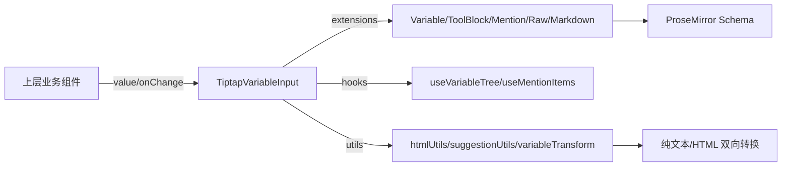

# TiptapVariableInput 组件使用指南

## 📋 目录

- [概述](#概述)
- [核心架构](#核心架构)
- [快速开始](#快速开始)
- [功能详解](#功能详解)
- [实际使用场景](#实际使用场景)
  - [场景 1：智能体提示词编辑](#场景-1智能体提示词编辑)
  - [场景 2：工作流节点配置](#场景-2工作流节点配置)
  - [场景 3：程序化插入](#场景-3程序化插入)
  - [场景 4：在 Ant Design Form 中使用](#场景-4在-ant-design-form-中使用)
- [API 文档](#api-文档)
- [最佳实践](#最佳实践)
- [常见问题](#常见问题)
- [参考资料](#参考资料)

## 概述

TiptapVariableInput 是基于 Tiptap 的富文本输入组件，支持变量插入、@ 提及、工具块、Raw 原始内容以及 Markdown 高亮，可用于智能体提示词、工作流节点配置等需要“结构化占位符 + 自由编辑”的场景。

**核心优势**

- 变量插入与自动补全：`{{variable}}` 语法，支持可编辑/不可编辑两种形态
- @ Mentions：可选择用户/文件/自定义实体
- 工具块与技能：`{#ToolBlock ...#}{#/ToolBlock#}` 结构化占位
- Raw 节点：安全展示 HTML/XML 原始内容
- Markdown 高亮：快捷输入与粘贴规则可选开启
- 光标与滚动恢复：外部受控值更新时保持体验稳定

## 核心架构

### 技术栈

- React 18 + TypeScript
- Tiptap + ProseMirror
- Ant Design 主题变量
- 自定义扩展：变量、工具块、Raw 节点、Markdown 高亮、自动补全大括号、mention/variable suggestion

### 架构关系



### 目录结构

```
src/components/TiptapVariableInput/
├── components/           # 建议列表 UI
├── extensions/           # 变量、mention、工具块、Raw、Markdown、高亮等扩展
├── hooks/                # useVariableTree / useMentionItems
├── utils/                # htmlUtils、suggestionUtils、variableTransform 等
├── styles.less           # 样式
├── types.ts              # 类型定义
└── TiptapVariableInput.tsx
```

## 快速开始

### 安装依赖

```bash
# 推荐 pnpm
pnpm add @tiptap/react @tiptap/starter-kit @tiptap/suggestion @tiptap/pm
# 依赖：antd、lodash 如已存在可跳过
```

### 基础使用

```tsx
import TiptapVariableInput, {
  VariableType,
  type PromptVariable,
} from '@/components/TiptapVariableInput';
import { useState } from 'react';

const variables: PromptVariable[] = [
  { key: 'user.name', type: VariableType.String, name: '用户名' },
  { key: 'user.email', type: VariableType.String, name: '邮箱' },
];

export default () => {
  const [value, setValue] = useState('Hello {{user.name}}');
  return (
    <TiptapVariableInput
      value={value}
      onChange={setValue}
      variables={variables}
      placeholder="输入 { 插入变量，@ 触发提及"
    />
  );
};
```

### 纯文本存储（推荐）

```tsx
import { extractTextFromHTML } from '@/components/TiptapVariableInput/utils/htmlUtils';

const handleChange = (html: string) => {
  const text = extractTextFromHTML(html); // 纯文本格式，含 {{}} 与 ToolBlock
  setValue(text);
};
```

### UmiJS 集成

- 直接从 `@/components/TiptapVariableInput` 导入组件与类型
- 在布局或入口引入 `styles.less` 保证样式

### 普通 React 项目

- 路径改为本地组件目录
- 确保样式被构建工具加载（Less/CSS Modules 均可）

## 功能详解

### 变量插入与建议

- 输入 `{` 或 `{}` 触发变量建议框
- 支持紧邻变量之间、变量内部完整替换、普通文本中间插入
- 完整触发与替换规则见 `../../src/components/TiptapVariableInput/VARIABLE_SUGGESTION_RULES.md`
- 变量模式：`text`（默认，无跳字，显示装饰）、`node`（可编辑节点）、`mark`（不推荐）

### @ Mentions

- `@` 触发建议，数据通过 `mentions` 传入
- `disableMentions` 为 `true` 时默认关闭，按需开启

### 工具块 / 技能

- 以 `{#ToolBlock id="xxx" type="yyy" name="zzz"#}content{#/ToolBlock#}` 存储
- 可在建议面板中插入，便于结构化指令

### Raw 节点

- 安全展示 HTML/XML 原始文本，不被 ProseMirror 解析
- 使用 `convertToRawNodeHTML` 生成 `<pre data-raw="true" ...>` 片段直接放入 value
- 适用于展示完整文档片段或配置

### Markdown 高亮

- `enableMarkdown` 控制输入/粘贴规则
- 内置 MarkdownHighlight 扩展提供颜色提示
- 自动保护 XML 标签中的下划线，避免被识别为斜体

### XML 标签支持

- 支持自定义 XML 标签（如 `<task_result>`、`<OutputFormat>`）正确显示
- 自动转义防止被浏览器解析
- Markdown 高亮自动跳过 XML 标签范围
- 详细规则见 `../../src/components/TiptapVariableInput/HTML_XML_PROCESSING_RULES.md`

### 文本转换

- `convertTextToHTML`：纯文本（含变量/工具块）转可编辑 HTML
- `extractTextFromHTML`：编辑器 HTML 转纯文本
- `shouldConvertTextToHTML`：判断是否需要转换

### 光标与滚动恢复

- 外部 value 变化时自动保存/恢复光标与滚动，避免闪烁
- 受控模式下避免因序列化差异导致的无限循环

## 实际使用场景

### 场景 1：智能体提示词编辑

系统/用户提示词中混合变量、技能块，保存为纯文本格式，出站时再渲染。

### 场景 2：工作流节点配置

节点参数支持变量插入，表单保存时用 `extractTextFromHTML` 写入后端。

### 场景 3：程序化插入

通过 `getEditor` 获得实例，调用 `editor.commands.insertContent('{{user.name}}')` 在光标位置插入。

### 场景 4：在 Ant Design Form 中使用

在表单中使用 TiptapVariableInput 组件，需要正确处理值的转换和表单验证。

#### 基础用法

```tsx
import { Form, Button } from 'antd';
import TiptapVariableInput, {
  VariableType,
  type PromptVariable,
} from '@/components/TiptapVariableInput';
import { extractTextFromHTML } from '@/components/TiptapVariableInput/utils/htmlUtils';

const variables: PromptVariable[] = [
  { key: 'user.name', type: VariableType.String, name: '用户名' },
  { key: 'user.email', type: VariableType.String, name: '邮箱' },
];

function MyForm() {
  const [form] = Form.useForm();

  const onFinish = (values: any) => {
    // values.prompt 已经是纯文本格式（通过 getValueFromEvent 转换）
    console.log('表单值:', values);
    // 提交到后端
  };

  return (
    <Form form={form} onFinish={onFinish} layout="vertical">
      <Form.Item
        name="prompt"
        label="提示词"
        rules={[
          { required: true, message: '请输入提示词' },
          {
            validator: (_, value) => {
              if (!value || value.trim() === '') {
                return Promise.reject(new Error('提示词不能为空'));
              }
              return Promise.resolve();
            },
          },
        ]}
        // 关键：使用 getValueFromEvent 将 HTML 转换为纯文本
        getValueFromEvent={(html) => {
          // 组件返回的是 HTML 格式，转换为纯文本存储
          return typeof html === 'string' ? extractTextFromHTML(html) : '';
        }}
        // 可选：自定义值转换，确保表单初始值正确显示
        normalize={(value) => {
          // 如果存储的是纯文本，直接返回（组件内部会自动转换）
          return value || '';
        }}
      >
        <TiptapVariableInput
          placeholder="输入提示词，使用 { 插入变量"
          variables={variables}
          style={{ minHeight: '120px' }}
        />
      </Form.Item>

      <Form.Item>
        <Button type="primary" htmlType="submit">
          提交
        </Button>
      </Form.Item>
    </Form>
  );
}
```

#### 设置初始值

```tsx
function MyFormWithInitialValue() {
  const [form] = Form.useForm();

  // 设置初始值（纯文本格式）
  React.useEffect(() => {
    form.setFieldsValue({
      prompt: 'Hello {{user.name}}, welcome!',
    });
  }, [form]);

  return (
    <Form form={form} layout="vertical">
      <Form.Item
        name="prompt"
        label="提示词"
        getValueFromEvent={(html) => extractTextFromHTML(html)}
      >
        <TiptapVariableInput placeholder="输入提示词" variables={variables} />
      </Form.Item>
    </Form>
  );
}
```

#### 表单验证

```tsx
function MyFormWithValidation() {
  const [form] = Form.useForm();

  return (
    <Form form={form} layout="vertical">
      <Form.Item
        name="prompt"
        label="提示词"
        rules={[
          { required: true, message: '请输入提示词' },
          {
            validator: (_, value) => {
              if (!value) {
                return Promise.resolve();
              }
              // 验证是否包含至少一个变量
              const hasVariable = /\{\{[^}]+\}\}/.test(value);
              if (!hasVariable) {
                return Promise.reject(
                  new Error('提示词中至少需要包含一个变量'),
                );
              }
              return Promise.resolve();
            },
          },
          {
            max: 1000,
            message: '提示词长度不能超过 1000 个字符',
          },
        ]}
        getValueFromEvent={(html) => extractTextFromHTML(html)}
      >
        <TiptapVariableInput
          placeholder="输入提示词，必须包含至少一个变量"
          variables={variables}
        />
      </Form.Item>
    </Form>
  );
}
```

#### 动态变量列表

```tsx
function MyFormWithDynamicVariables() {
  const [form] = Form.useForm();
  const [variables, setVariables] = useState<PromptVariable[]>([]);

  // 从 API 获取变量列表
  useEffect(() => {
    fetchVariables().then((data) => {
      setVariables(data);
    });
  }, []);

  return (
    <Form form={form} layout="vertical">
      <Form.Item
        name="prompt"
        label="提示词"
        getValueFromEvent={(html) => extractTextFromHTML(html)}
      >
        <TiptapVariableInput
          placeholder="输入提示词"
          variables={variables} // 动态变量列表
        />
      </Form.Item>
    </Form>
  );
}
```

#### 条件渲染

```tsx
function MyFormWithConditional() {
  const [form] = Form.useForm();
  const [enableVariable, setEnableVariable] = useState(true);

  return (
    <Form form={form} layout="vertical">
      <Form.Item name="enableVariable" label="启用变量">
        <Switch checked={enableVariable} onChange={setEnableVariable} />
      </Form.Item>

      <Form.Item
        noStyle
        shouldUpdate={(prevValues, currentValues) =>
          prevValues.enableVariable !== currentValues.enableVariable
        }
      >
        {({ getFieldValue }) => {
          const enabled = getFieldValue('enableVariable');
          return enabled ? (
            <Form.Item
              name="prompt"
              label="提示词"
              getValueFromEvent={(html) => extractTextFromHTML(html)}
            >
              <TiptapVariableInput
                placeholder="输入提示词"
                variables={variables}
              />
            </Form.Item>
          ) : (
            <Form.Item name="prompt" label="提示词">
              <Input.TextArea placeholder="输入提示词" />
            </Form.Item>
          );
        }}
      </Form.Item>
    </Form>
  );
}
```

#### 完整示例：工作流节点配置表单

```tsx
import { Form, Button, Input, Select } from 'antd';
import TiptapVariableInput from '@/components/TiptapVariableInput';
import { extractTextFromHTML } from '@/components/TiptapVariableInput/utils/htmlUtils';
import type { PromptVariable } from '@/components/TiptapVariableInput';

interface WorkflowNodeFormProps {
  variables: PromptVariable[];
  onSubmit: (values: any) => void;
}

function WorkflowNodeForm({ variables, onSubmit }: WorkflowNodeFormProps) {
  const [form] = Form.useForm();

  const handleSubmit = (values: any) => {
    // values.prompt 已经是纯文本格式
    onSubmit(values);
  };

  return (
    <Form
      form={form}
      onFinish={handleSubmit}
      layout="vertical"
      initialValues={{
        nodeName: '',
        prompt: '',
      }}
    >
      <Form.Item
        name="nodeName"
        label="节点名称"
        rules={[{ required: true, message: '请输入节点名称' }]}
      >
        <Input placeholder="请输入节点名称" />
      </Form.Item>

      <Form.Item
        name="prompt"
        label="提示词"
        rules={[
          { required: true, message: '请输入提示词' },
          {
            validator: (_, value) => {
              if (value && value.length > 2000) {
                return Promise.reject(
                  new Error('提示词长度不能超过 2000 个字符'),
                );
              }
              return Promise.resolve();
            },
          },
        ]}
        getValueFromEvent={(html) => extractTextFromHTML(html)}
      >
        <TiptapVariableInput
          placeholder="输入提示词，使用 { 插入变量"
          variables={variables}
          style={{ minHeight: '150px' }}
        />
      </Form.Item>

      <Form.Item>
        <Button type="primary" htmlType="submit">
          保存配置
        </Button>
        <Button style={{ marginLeft: 8 }} onClick={() => form.resetFields()}>
          重置
        </Button>
      </Form.Item>
    </Form>
  );
}
```

#### 关键要点

1. **值转换**：必须使用 `getValueFromEvent` 将组件返回的 HTML 转换为纯文本格式存储

   ```tsx
   getValueFromEvent={(html) => extractTextFromHTML(html)}
   ```

2. **初始值**：表单初始值使用纯文本格式，组件内部会自动转换为 HTML 进行编辑

3. **表单验证**：验证规则作用于转换后的纯文本值

4. **性能优化**：使用 `useMemo` 稳定 `variables` 引用，避免不必要的重渲染

5. **条件渲染**：使用 `Form.Item` 的 `shouldUpdate` 实现条件渲染

## API 文档

### Props（常用）

- `value: string` 受控值（HTML 或纯文本，内部会转换）
- `onChange: (html: string) => void` 内容变化回调（返回 HTML）
- `variables?: PromptVariable[]` 变量列表
- `skills?: any[]` 工具/技能列表
- `mentions?: MentionItem[]` @ 数据源
- `placeholder?: string` 占位符
- `readonly?: boolean` 只读
- `disabled?: boolean` 禁用
- `disableMentions?: boolean` 是否禁用 @ 建议（默认 true）
- `enableMarkdown?: boolean` 是否启用 Markdown 快捷语法
- `enableEditableVariables?: boolean` 是否启用可编辑变量节点（默认 true）
- `variableMode?: 'node' | 'mark' | 'text'` 变量实现模式（默认 text）
- `onVariableSelect?: (variable, path) => void` 选择变量回调
- `getEditor?: (editor) => void` 获取 tiptap 编辑器实例

### 关键类型（节选）

```ts
enum VariableType {
  String = 'string',
  Integer = 'integer',
  Boolean = 'boolean',
  Number = 'number',
  Object = 'object',
  Array = 'array',
  ArrayString = 'array_string',
  ArrayInteger = 'array_integer',
  ArrayBoolean = 'array_boolean',
  ArrayNumber = 'array_number',
  ArrayObject = 'array_object',
}

interface PromptVariable {
  key: string;
  type: VariableType;
  name: string;
  description?: string;
  children?: PromptVariable[];
  label?: string;
  example?: any;
  systemVariable?: boolean;
}

interface MentionItem {
  id: string;
  label: string;
  type?: 'user' | 'file' | 'datasource' | 'custom';
  data?: any;
}
```

### 工具函数（来自 `utils/htmlUtils.ts` 等）

- `extractTextFromHTML(html)`：HTML → 纯文本（保留 `{{}}`、ToolBlock）
- `convertTextToHTML(text, disableMentions, enableEditableVariables, mode)`：纯文本 → HTML
- `shouldConvertTextToHTML(text)`：是否需要转换
- `convertToRawNodeHTML(content, type)`：生成 Raw 节点 HTML 片段
- `shouldUseRawNode(content)`：判断是否建议用 Raw 节点
- `extractRawNodeContents(html)`：提取所有 Raw 内容

## 最佳实践

- **存储格式**：推荐存纯文本（含 `{{}}` 与 ToolBlock），展示时再转 HTML。
- **变量列表稳定性**：使用 `useMemo` 传递 `variables`、`skills`，避免重复渲染。
- **性能**：`onChange` 回调中做轻量处理，重计算放到外层；保持 props 引用稳定。
- **变量模式选择**：常规使用 `text`；需要编辑变量内容用 `node`；`mark` 场景有限。
- **错误处理**：获取 editor 实例前检查；插入失败友好提示并提供降级（直接拼接 value）。
- **样式定制**：覆盖 `.variable-block-chip`、`.variable-block-chip-editable`、`.tool-block-chip`、`.raw-content` 等类名；可结合 Ant Design 主题变量。

## 常见问题

1. **变量建议何时触发？**  
   详见 `../../src/components/TiptapVariableInput/VARIABLE_SUGGESTION_RULES.md`，包含触发/不触发场景与完整替换规则。

2. **返回的是 HTML，但存储要纯文本？**  
   在 `onChange` 中调用 `extractTextFromHTML` 后再存储。

3. **光标跳动或滚动位置变化？**  
   组件已内置恢复逻辑，如仍异常，检查是否在外层频繁重建 `variables/skills`。

4. **如何自定义变量/工具块样式？**  
   修改或覆盖 `styles.less` 中对应类名，或通过 `className` 传入容器自定义样式。

5. **如何关闭某些功能？**
   - `disableMentions` 设为 `true` 关闭 @
   - `enableMarkdown` 设为 `false` 关闭 Markdown 快捷
   - `enableEditableVariables` 设为 `false` 禁用可编辑变量节点

## 参考资料

- 组件 README：`../../src/components/TiptapVariableInput/README.md`
- 变量建议规则：`../../src/components/TiptapVariableInput/VARIABLE_SUGGESTION_RULES.md`
- HTML/XML 处理规则：`../../src/components/TiptapVariableInput/HTML_XML_PROCESSING_RULES.md`
- Markdown 自定义渲染指南：`./Markdown-Custom-Renderer-Guide.md`
