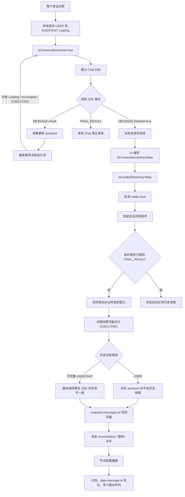
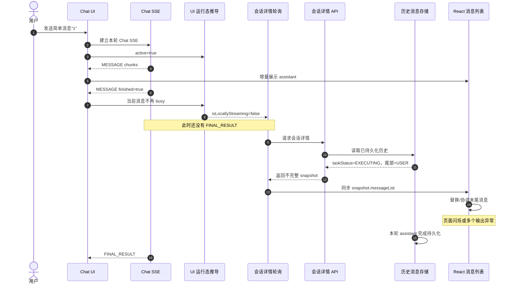
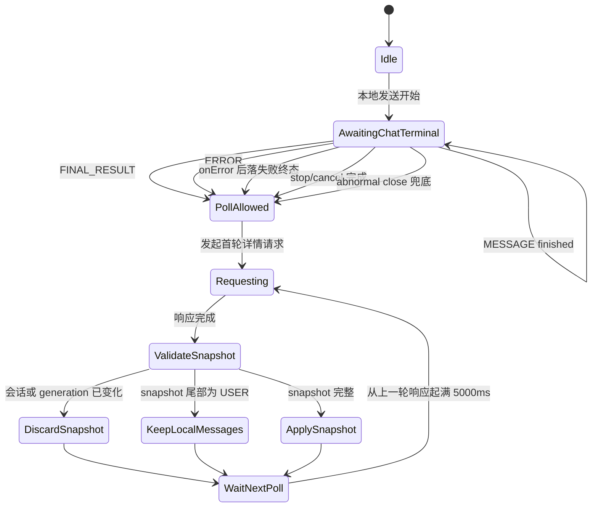

# Chat 会话结束阶段闪烁问题分析报告（重写版）

> 文档日期：2026-08-16  
> 当前分支：`feat-2026.7.31`  
> 当前代码基线：`22a769ca2`（不含工作区内临时诊断改动）  
> 分析范围：Chat SSE、会话详情轮询、历史消息快照同步、最近使用状态同步  
> 当前阶段：分析与定位；尚未实施业务修复

## 1. 执行结论

### 1.1 已确认结论

1. **老提交实际运行没有当前页面闪烁问题，当前分支最近代码实际运行存在问题。**
2. 用户已切换到 `c6869aec4`（2026-07-12）进行页面验证，结果正常；回到当前分支基线 `22a769ca2`（2026-08-15）后，问题可复现。
3. 因此，本问题已确定是以下 Git 区间内的前端回归：

   ```text
   c6869aec4（实测正常）
       ..
   22a769ca2（实测异常）
   ```

4. 当前异常链路中，已实际捕获到前端在本轮 Chat 尚未收到 `FINAL_RESULT` 前发起并消费会话详情查询：请求比 `FINAL_RESULT` 提前 1059ms。
5. 该详情响应可能仍以本轮 `USER` 消息结尾，而页面内存中已经存在 SSE 产生的 assistant 输出。此时把历史快照同步回当前消息列表，会造成列表结构回退、重新协调或节点重建，表现为：

   - 页面结束阶段偶发闪烁；
   - 最后几条消息的 `data-message-id` 变化；
   - 多个 assistant 输出被同时展示或错误合并；
   - 最近使用状态更新与页面闪动出现在接近的时间点。

6. 后端已确认接口契约：正常完成链路中，前端收到 `FINAL_RESULT` 后再新发起会话历史查询，应能读取到本轮最近一条 assistant 消息。
7. 所以正确边界不是固定等待 1000ms，而是：**本地 Chat 收到协议终态前，不允许会话详情轮询读取并应用本轮历史消息；收到终态后即可开始第一轮查询。**

### 1.2 已完成的精确父子版本验证

已使用独立 worktree、同一账号、同一会话和相同发送内容，对 `c7a3c0322` 与其直接子提交 `30fb00730` 完成实际页面 A/B：

| 版本 | 实际发送轮数 | DOM 结果 | 详情请求结果 |
| --- | --- | --- | --- |
| `c7a3c0322` | 5 | 只新增 USER/ASSISTANT 节点；旧节点移除 0 次；重复 ID 0 次 | 未观察到会话详情 snapshot 请求 |
| `30fb00730` | 6 | 6 轮均出现本轮临时节点被历史节点替换，`data-message-id` 改变 | snapshot 返回后紧接着发生节点替换 |

因此，针对“完整 snapshot 写回导致末尾消息节点 ID 替换”这一可见问题，`30fb00730` 已通过父子提交实际运行对照确认是 first-bad。尚未确认的是更早的 `22748cc3` 在老版本是否已经产生不可见的终态前状态查询，以及最近使用列表是否存在独立的直接渲染影响。

## 2. 证据等级

本报告将证据分为三类，避免再次把代码推断写成运行事实。

| 等级 | 含义 | 本次证据 |
| --- | --- | --- |
| A：实际运行确认 | 在对应版本实际打开页面并复现同一操作 | `c6869aec4` 正常；`22a769ca2` 异常 |
| B：运行日志确认 | 请求、响应、SSE 事件具有可比较时间戳 | 当前版本已捕获 `poll-request` 比 `FINAL_RESULT` 提前 1059ms，且响应尾部为 USER 后被消费 |
| C：静态代码分析 | 由 Git diff、依赖链和状态流推导 | `22748cc3` 引入潜在门禁条件；`30fb00730` 开始把完整快照同步进消息列表 |

A 级父子提交对照已确定可见节点替换的首个坏提交；B 级日志进一步确认当前分支仍存在终态前轮询竞态；C 级证据用于解释两者的代码机制。

## 3. 用户可见现象

已观察到：

1. assistant 回复即将结束时，页面偶尔闪一下；
2. 页面最后几条消息发生重新渲染，`data-message-id` 随之变化；
3. 历史消息 ID 与 Chat 接口 `requestId` 对齐后，闪烁仍可能出现；
4. 新问题表现为多个输出被一起展示；
5. 闪烁与最近使用列表状态变化时间接近；
6. 会话详情返回的消息尾部可能是 `USER`，而页面上已经显示本轮 assistant 输出。

仅对齐 ID 不能解决第 6 项：如果服务端快照中根本没有本轮 assistant，就不存在可用于稳定匹配的对应项，列表结构仍会发生变化。

## 4. 必须区分的状态概念

| 状态或事件 | 实际含义 | 能否作为正常完成后的历史读取边界 |
| --- | --- | --- |
| `MESSAGE finished=true` | 当前消息块或输出块结束 | 否 |
| assistant `Complete` | 当前 UI 消息不再处于 Loading/Incomplete | 否 |
| `isConversationActive=false` | UI 根据消息状态推导出“当前看起来不忙” | 否 |
| `taskStatus=COMPLETE` | 会话任务状态为终态 | 只能作为状态证据，不能代替本次 Chat SSE 终态顺序 |
| `FINAL_RESULT` | 本轮 Chat 正常协议终态 | 是 |
| SSE `ERROR` | 本轮 Chat 失败协议终态 | 是，按失败流程处理 |
| SSE `onError` | 传输失败 | 是，先落失败/异常终态 |
| stop/cancel 成功 | 用户主动终止本轮 Chat | 是，按取消流程处理 |
| 历史尾部为 `USER` | 当前持久化快照缺少对应 assistant 的强信号 | 不得把该消息快照覆盖到当前 SSE 列表 |

核心区别：

```text
UI 当前不忙
    ≠
本轮 Chat 协议已经结束
```

## 5. 已确认的版本范围与首个坏提交

### 5.1 实际运行范围

| 版本        | 日期                       | 运行结果           | 结论       |
| ----------- | -------------------------- | ------------------ | ---------- |
| `c6869aec4` | 2026-07-12 10:56:36 +08:00 | 未出现当前页面问题 | 已实测正常 |
| `22a769ca2` | 2026-08-15 02:41:45 +08:00 | 当前问题可复现     | 已实测异常 |

Git 已确认 `c6869aec4` 是 `22a769ca2` 的祖先，因此这是有效的回归区间。

### 5.2 父子提交 A/B 结论

| 变化前 | 首个异常提交 | 代码变化 | 实际运行结论 |
| --- | --- | --- | --- |
| `f0586295` | `22748cc3`（2026-06-29） | 移除轮询对 `taskStatus=EXECUTING` 的限制，并让本地流状态变化参与刷新 | 仅静态确认潜在条件，未做页面 A/B |
| `c7a3c0322` | `30fb00730`（2026-08-07） | 轮询从主要同步状态升级为获取完整 snapshot，并把 `messageList` 交给页面同步 | 已实际确认：父提交 5 轮无替换，当前提交 6 轮全部替换 |

`22748cc3` 早于已经实测正常的 `c6869aec4`。这说明：即使它引入了潜在提前轮询条件，也不能把它当作可见闪烁的首个异常版本。老代码可能只读取状态，没有用不完整快照覆盖主消息列表，因此页面仍然正常。

`30fb00730` 位于用户已确认的好/坏版本区间内；本次精确父子 A/B 已落实它是“snapshot 写回引发节点替换”的首个异常提交。

## 6. 当前系统完整组件关系

```mermaid
flowchart LR
  User["用户发送消息"] --> UI["UnifiedChatSession 页面"]
  UI --> Model["conversationInfo model"]
  Model --> ChatSSE["POST /conversation/chat SSE"]

  ChatSSE -->|"MESSAGE / PROCESSING"| MessageReducer["增量更新内存消息"]
  ChatSSE -->|"FINAL_RESULT / ERROR"| TerminalReducer["写入 Chat 终态"]
  MessageReducer --> Runtime["根据消息列表推导 UI 运行态"]
  Runtime --> Active["isConversationActive"]

  Active -->|"作为 isLocallyStreaming"| ResumeHook["useConversationStreamResume"]
  ResumeHook --> PollGate["轮询 ready 条件"]
  PollGate --> DetailAPI["fetchConversationSnapshot"]
  DetailAPI --> Snapshot["taskStatus + messageList"]

  Snapshot --> SnapshotMerge["syncConversationSnapshotMessages"]
  SnapshotMerge --> UI
  Snapshot --> StatusSync["taskStatus 同步"]
  StatusSync --> Recent["最近使用 / 会话列表"]

  ResumeHook -->|"发现远端 EXECUTING"| SubSSE["/chat/sub/:conversationId"]
  SubSSE --> MessageReducer
```



风险点是同一个详情 snapshot 同时承担两种职责：

- 查询 `taskStatus`：用于远端状态发现、最近使用状态补偿；
- 同步 `messageList`：会直接影响当前页面 DOM，必须保证快照完整。

## 7. 当前异常运行流程



## 8. 错误时序图



判定请求是否提前，必须比较**请求发起时间**与 `FINAL_RESULT` 时间。请求即使在 `FINAL_RESULT` 后返回，只要它在终态前发起，仍属于提前读取。

## 9. 当前运行证据

### 9.1 版本切换证据

Git reflog 记录了老提交与当前分支之间的切换；结合用户实际页面验证，确认：

```text
c6869aec4  老代码：正常
22a769ca2  当前分支基线：异常
```

在这个区间内，本次进一步完成了 `c7a3c0322 → 30fb00730` 的精确父子提交验证。

### 9.2 当前版本捕获的终态前轮询原始日志

测试版本：`22a769ca2` 加当前工作区纯诊断日志；诊断改动不改变 ready 条件、请求时机、请求次数或快照消费逻辑。

实际捕获顺序：

```text
1786872693315  message-finished  completed=false
1786872693333  local-stream-ended
1786872693333  poll-request      ready 已打开
1786872693449  poll-response     taskStatus=EXECUTING, snapshotTailIsUser=true
1786872693450  poll-consume      outcome=dispatch-snapshot
1786872694392  chat-terminal     eventType=FINAL_RESULT
```

计算：

```text
1786872694392 - 1786872693333 = 1059ms
```

该轮详情请求在 `FINAL_RESULT` 前 1059ms 发起，响应尾部为 USER，并被实际发送到 snapshot consumer。这把“终态前轮询”从静态推断提升为运行日志确认。

同样连续测试的另外两轮中，`FINAL_RESULT` 分别先于 `local-stream-ended / poll-request` 到达，未进入该竞态。因此问题具有偶发性，取决于 `MESSAGE finished`、UI 状态推导和 `FINAL_RESULT` 的到达顺序。

### 9.3 精确父子提交页面 A/B

测试条件：独立 Git worktree、同一浏览器任务空间、同一账号、同一会话 `1560614`、逐轮发送消息 `1`。

```text
c7a3c0322：5 轮
- 每轮只新增 USER/ASSISTANT
- 旧 data-message-id 移除 0 次
- 重复 ID 0 次
- 未观察到会话详情 snapshot 请求

30fb00730：6 轮
- 6 轮均先新增临时 USER/ASSISTANT
- 随后临时节点被历史 snapshot 节点替换
- data-message-id 每轮发生变化
- 详情响应与节点替换时间直接相邻
```

其中一轮 `30fb00730` 的完整证据：

```text
1786872604583  POST /conversation/chat
1786872604601  新增临时节点
                 USER      ffd017b2-b339-41e1-bcb3-db949a7d2a07
                 ASSISTANT eeffd31e-0bc3-4ac1-9522-dd55420445d6
1786872608039  POST /conversation/1560614
1786872608164  snapshot response
                 taskStatus=COMPLETE
                 tail.role=ASSISTANT
                 tail.id=b3c62a67353b428cae6692273163b5e6
1786872608175  移除两个临时节点，新增两个历史节点
```

该样本说明 `30fb00730` 的可见节点替换不要求历史尾部为 USER：即使 snapshot 已经 COMPLETE 且包含 assistant，只要本地临时消息与历史消息标识不同，完整 snapshot 写回仍会重建末尾节点。

### 9.4 用户直接提供的一组正常顺序日志

用户此前提供的日志中存在另一组顺序：

```text
1786741493646  已解析终态 COMPLETE
1786741493646  stream-closed 后刷新最近使用列表
1786741493807  最近使用列表响应
1786741498068  status poll request
1786741498203  status poll response
```

这组样本中，状态轮询请求发生在终态后约 4.4 秒，属于正常顺序。它只能证明这一轮没有发生终态前轮询，不能证明当前代码所有路径都正确，也不能单独证明其他轮次存在提前请求。

### 9.5 当前版本的不完整历史快照特征

会话 `1560614` 的一次详情响应中观察到：

```text
taskStatus = EXECUTING
messageList 最后一条 role = USER
USER.text = "1"
```

该数据说明用户消息已经进入历史，但对应 assistant 尚未出现在该次历史快照中。若此时页面已通过 SSE 展示 assistant，再应用该快照就会形成内存态与持久化态冲突。

## 10. 根因分层

### 10.1 生命周期门禁错误

当前轮询 ready 主要依赖：

```text
conversationId 存在
AND isLocallyStreaming=false
AND isResumeSubscribed=false
AND resumeStream 存在
```

其中 `isLocallyStreaming` 来自 UI 消息运行态，而不是独立的 Chat 协议生命周期。`MESSAGE finished=true` 可能让 UI 先变为空闲，但本轮 Chat 尚未收到 `FINAL_RESULT`。

### 10.2 不完整快照被允许进入主消息列表

门禁提前本身未必产生明显 UI 问题。真正造成闪烁的是轮询响应中的完整 `messageList` 被同步到当前页面。

如果历史快照缺少本轮 assistant：

```text
页面内存：USER + SSE ASSISTANT
服务端快照：USER
```

两套列表无法仅靠 ID 对齐合并，最终会触发删除、重建或错误聚合。

### 10.3 最近使用列表是伴随链路，不是当前已确认根因

`FINAL_RESULT`、stream close、taskStatus 补偿会触发最近使用列表刷新，所以它与闪烁时间接近。当前证据更直接指向详情 snapshot 写回主消息列表。

在没有记录到“最近使用响应直接改变当前消息数组”的调用链前，不应把最近使用列表定义为直接根因。

## 11. 临时诊断日志设计

统一过滤关键字：

```text
[DEBUG-chat-poll-before-final]
```

日志目标只用于确定时序，不修改轮询门禁、请求次数、请求间隔或快照消费规则。

### 11.1 当前日志位置

| 文件 | 日志职责 | 业务影响控制 |
| --- | --- | --- |
| `src/utils/fetchEventSourceConversationInfo.ts` | 在原 SSE `onMessage` 执行后记录 `MESSAGE finished`、`FINAL_RESULT`、`ERROR` | 原业务回调先执行 |
| `src/components/business-component/UnifiedChatSession/hooks/useConversationStreamResume.ts` | 记录本地流结束、poll gate、请求、响应、消费结果 | 复用原有状态和请求，不新增业务门禁 |
| `src/utils/conversationPollingDiagnostics.ts` | 集中格式化、序号、耗时、尾部摘要 | 仅 development 启用，microtask 输出 |
| `src/models/conversationInfo.ts` | 不放诊断日志 | 当前文件保持零诊断 diff |

### 11.2 日志事件

| 事件 | 关键字段 | 用途 |
| --- | --- | --- |
| `message-finished` | `timestamp`、`conversationId`、`requestId` | 记录消息块结束，不当作 Chat 终态 |
| `chat-terminal` | `timestamp`、`eventType` | 记录真正协议终态 |
| `local-stream-ended` | `timestamp`、`taskStatus`、`localTail` | 记录 UI 流状态何时提前下降 |
| `poll-gate` | `ready`、`blockedBy` | 记录为何允许轮询 |
| `poll-request` | `timestamp`、`sequence`、`generation` | 与终态时间比较 |
| `poll-response` | `durationMs`、`snapshotTaskStatus`、`snapshotTailIsUser` | 判断响应是否完整 |
| `poll-consume` | `outcome` | 判断不完整快照是否实际写入 UI |

日志不输出消息正文、附件、token 或账户信息。

### 11.3 确认异常的日志顺序

```text
message-finished
local-stream-ended
poll-gate       ready=true
poll-request    timestamp=P0
poll-response   snapshotTailIsUser=true
poll-consume    outcome=dispatch-snapshot
chat-terminal   timestamp=T0, eventType=FINAL_RESULT
```

关键条件：

```text
P0 < T0
```

### 11.4 正常顺序

```text
message-finished
chat-terminal   timestamp=T0
poll-request    timestamp=P0
poll-response   timestamp=P1
poll-request    timestamp=P2
```

必须满足：

```text
P0 >= T0
P2 - P1 >= 5000ms
```

## 12. 正确目标流程

1000ms 不应成为业务规则。正确性来自显式终态门禁。



完整业务约束：

1. 本地发送开始时进入 `AwaitingChatTerminal`；
2. `MESSAGE finished` 不释放门禁；
3. `FINAL_RESULT / ERROR / onError / stop / abnormal close` 才能结束本轮协议生命周期；
4. 正常完成收到 `FINAL_RESULT` 后可以立即发起首轮查询，无需固定延迟；
5. 每一轮后续查询从上一轮响应完成时间开始计算 5 秒；
6. 在应用 snapshot 前校验 conversationId、generation、本地是否又开始发送；
7. snapshot 尾部为 USER 时，放弃该轮消息同步，保留 SSE 内存消息；
8. sub 已接管时停止详情轮询；
9. visibilitychange 入口不得绕过同一个终态门禁。

## 13. 首个异常提交确认结果

父子提交 A/B 已完成：

| 顺序 | 版本        | 实际结果                           | 判断      |
| ---- | ----------- | ---------------------------------- | --------- |
| 1    | `c7a3c0322` | 5 轮无节点替换                     | good      |
| 2    | `30fb00730` | 6 轮均发生 snapshot 后节点 ID 替换 | first-bad |

```text
c7a3c0322：相同场景正常
30fb00730：相同场景异常
```

因此不需要继续对“节点 ID 替换”做 Git 二分。若后续需要把“多个输出错误合并”识别为独立于节点替换的第二个回归，再以 `30fb00730..22a769ca2` 为新区间建立单独的可重复判定条件。

## 14. 已实施修复

1. `conversationInfo` 与隔离的 `conversationAgent` model 增加 `isAwaitingChatTerminal`，发送开始置为 `true`；
2. 只有 `FINAL_RESULT / ERROR / onError / abnormal close 兜底完成` 才解除该状态，普通 `MESSAGE finished=true` 不解除；
3. 详情轮询主入口和 `visibilitychange` 入口共用终态门禁；
4. 快照尾部为 USER 时不调用消息快照消费者，保留当前 SSE 内存消息；
5. `visibilitychange` 查询增加单实例在途锁，避免同一 Hook 并发重复拉取；
6. 消息 DOM 的 `data-message-id` 使用 `clientRenderKey`，与 React key 保持一致；服务端真实 ID 单独记录在 `data-server-message-id`；
7. 保留 conversationId、poll generation、本地发送中 stale 检查；
8. 未增加固定 1000ms 保护窗口。

## 15. 验收标准

### 15.1 时序

- 本地 Chat 收到协议终态前，会话详情请求数为 0；
- 首轮详情请求时间不早于 `FINAL_RESULT / ERROR / stop / abnormal close`；
- 后续轮询从上一轮响应完成起至少间隔 5000ms；
- 页面重新可见时不能绕过终态门禁。

### 15.2 数据一致性

- snapshot 尾部为 USER 时，不覆盖当前 SSE assistant；
- 旧 conversationId、旧 generation、发送中的响应全部丢弃；
- sub 接管期间不重复详情轮询；
- 最近使用状态仍能正确更新到 COMPLETE、FAILED 或 CANCEL。

### 15.3 页面表现

- 在同一会话连续逐条发送至少 20 次简单消息；
- 回复结束阶段无可见闪烁；
- 稳定消息的 `data-message-id` 不因不完整快照变化；
- 不出现多个 assistant 输出错误合并或同时展示；
- 输入框、停止按钮、自动滚动和跨窗口恢复不回归。

## 16. 最终判断

当前最高置信度结论是：

> `c6869aec4` 老提交已实测正常，`22a769ca2` 当前分支基线已实测异常。本问题是两者之间引入的前端回归。

当前运行日志已经确认：UI 消息先结束导致 `isLocallyStreaming` 提前下降，会话详情轮询可以在 `FINAL_RESULT` 前恢复；本次捕获请求提前 1059ms，响应为 EXECUTING 且尾部 USER，并被实际消费。

精确父子提交 A/B 同时确认：`30fb00730` 首次把完整 snapshot 同步回主消息列表，是“末尾节点被替换、data-message-id 改变”这一可见问题的 first-bad。当前问题由两个条件叠加形成：终态门禁可能提前打开，以及 snapshot 写回能够改动当前 SSE 消息列表。

## 17. 修复后验收结果（2026-08-16）

真实页面：`/home/chat/1560614/3994`。

### 17.1 终态门禁

修复后连续发送 6 次：

- 发送开始后、`FINAL_RESULT` 前的会话详情请求：`0/6`；
- 其中一次本地流式态比 `FINAL_RESULT` 提前 `516ms` 结束，日志显示 `blockedBy: ["chat-terminal-pending"]`，未发起详情请求；
- 该轮在 `FINAL_RESULT` 后 `12ms` 才发起首轮详情请求。

再次连续发送 4 次：

- 有效发送窗口内终态前详情请求：`0/4`；
- 其中一次本地流式态比 `FINAL_RESULT` 提前 `61ms` 结束，门禁保持；
- 首轮详情请求在 `FINAL_RESULT` 后 `8ms` 发出。

### 17.2 消息身份与轮询节奏

- 4 次发送中稳定 `data-message-id` 变化次数：`0`；
- 后端落库 ID 仍会正常写入 `data-server-message-id`，不再改变 React/DOM 稳定身份；
- 后续轮询从上一轮响应完成后计时，实测间隔为 `5001～5002ms`；
- 相关单元、model、组件测试共 `71` 个通过；新增三类回归覆盖：终态门禁、USER 尾快照丢弃、visibility 在途去重。

结论：代码与自动化页面验收均已满足本报告的核心时序和稳定身份标准；仍建议人工观察一次肉眼闪烁与长回答/工具调用场景。
