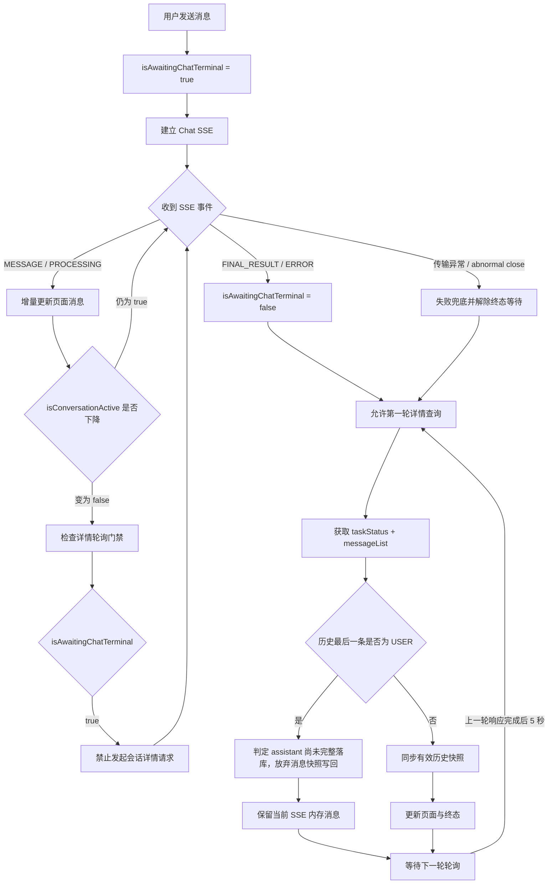

# Chat 会话终态轮询闪烁修复总结

> 整理日期：2026-08-16  
> 修复分支：`fix/chat-terminal-polling-flash`  
> 修复提交：`fa0096725 fix(chat): gate history polling on terminal events`  
> 验收状态：自动化验收通过，用户已完成手动验收并确认问题不再出现

## 1. 问题概述

会话回复即将结束时，页面偶尔出现闪烁、最后几条消息重新渲染、`data-message-id` 变化，以及多个 assistant 输出同时展示的问题。

问题并不是单纯的消息 ID 不一致，而是前端错误地把“当前消息块已经结束”当成“本轮 Chat 已经结束”。在 `FINAL_RESULT` 到达前，`isConversationActive` 可能已经变为 `false`，从而提前放开会话详情轮询。

提前请求到的历史快照可能尚未完成落库，最后一条消息仍是 `USER`，缺少页面内存中已经通过 SSE 展示的 assistant 消息。如果将这个不完整快照覆盖到当前消息列表，就会导致 React 重新协调末尾消息，最终表现为闪烁、节点身份变化或输出组合异常。

核心关系是：

```text
MESSAGE finished=true / isConversationActive=false
    不等于
本轮 Chat 已收到 FINAL_RESULT / ERROR
```

## 2. 根因

本问题由两个条件叠加产生：

1. 会话详情轮询原来主要依赖 `isConversationActive`。普通消息块结束后，这个 UI 活跃态可能在 `FINAL_RESULT` 前下降，轮询因此提前启动。
2. 轮询返回的完整 `messageList` 会同步回主消息列表。不完整历史快照一旦被消费，就会覆盖或重组当前 SSE 内存消息。

版本定位结果：

- `c6869aec4`（2026-07-12）实测正常；
- `22a769ca2`（2026-08-15）实测异常；
- 对直接父子提交进行页面 A/B 后，确认 `30fb00730` 是“完整 snapshot 写回导致末尾消息节点替换”这一可见问题的首个异常提交；
- 详细定位证据见 [chat-terminal-polling-flash-analysis.md](./chat-terminal-polling-flash-analysis.md)。

## 3. 修复原则

本次修复没有增加固定 1000ms 等待时间。后端已经确认：前端收到 `FINAL_RESULT` 后再拉取历史，会话最近一条 assistant 应当可以读取到。

因此采用协议事件门禁：

- 发送 Chat 请求时，进入“等待协议终态”状态；
- `MESSAGE finished=true` 只代表消息块结束，不能解除门禁；
- 收到 `FINAL_RESULT` 或 `ERROR` 后解除门禁；
- 传输错误、异常关闭、重置等退出路径也必须解除门禁，避免永久阻塞；
- 门禁解除后，允许立即发起第一轮详情查询；
- 后续轮询仍按原有策略，从上一轮响应完成后间隔 5 秒。

## 4. 修改后的运行流程



## 5. 具体代码修改

### 5.1 新增独立的协议终态状态

在以下两个会话 model 中新增 `isAwaitingChatTerminal`：

- `src/models/conversationInfo.ts`
- `src/models/conversationAgent.ts`

状态生命周期：

| 时机                         | 状态        |
| ---------------------------- | ----------- |
| 发起本地 Chat                | `true`      |
| 普通 `MESSAGE finished=true` | 保持 `true` |
| 收到 `FINAL_RESULT`          | `false`     |
| 收到协议 `ERROR`             | `false`     |
| SSE `onError`                | `false`     |
| 异常关闭兜底结束             | `false`     |
| 会话重置                     | `false`     |

这个状态与 `isConversationActive` 分离：前者描述协议生命周期，后者描述当前 UI 是否仍有 Loading、Incomplete 或执行中的内容。

### 5.2 将终态门禁传递到所有会话入口

`isAwaitingChatTerminal` 通过统一会话组件传递到流恢复和轮询 Hook，覆盖以下入口：

- 普通 Chat 页面；
- Conversation Agent 会话；
- Agent 预览与调试；
- Plugin Chat 会话。

涉及文件：

- `src/components/business-component/UnifiedChatSession/types.ts`
- `src/components/business-component/UnifiedChatSession/index.tsx`
- `src/pages/Chat/index.tsx`
- `src/pages/ConversationAgent/AgentConversationChatPanel/index.tsx`
- `src/pages/ConversationAgent/hooks/useConversationAgentChatSession.ts`
- `src/pages/EditAgent/PreviewAndDebug/index.tsx`
- `src/pages/SpacePluginTool/components/PluginChatSession/index.tsx`

### 5.3 收紧会话详情轮询门禁

`useConversationStreamResume` 的轮询条件统一为：

```text
存在 conversationId
并且本地没有正在流式输出
并且本轮 Chat 已经收到协议终态
并且没有 sub 流正在接管
并且存在 resumeStream 能力
```

主定时轮询和页面 `visibilitychange` 恢复查询都使用这套终态约束，避免切回浏览器标签页时绕过门禁。

涉及文件：

- `src/components/business-component/UnifiedChatSession/hooks/useConversationStreamResume.ts`

### 5.4 丢弃尾部为 USER 的不完整历史快照

会话详情返回后，如果历史消息最后一条是 `USER`，说明本轮 assistant 很可能尚未落库完成。此时：

- 可以记录响应和状态诊断信息；
- 不调用消息快照消费者；
- 不使用该 `messageList` 覆盖当前 SSE 内存消息；
- 等待下一轮查询获取完整数据。

该保护同时应用于定时轮询和 `visibilitychange` 查询。

### 5.5 防止可见性恢复查询并发

为 `visibilitychange` 查询增加单实例在途锁。同一个 Hook 已经有可见性恢复请求在途时，重复的可见性事件不会再发起第二个详情请求，减少乱序响应覆盖的可能性。

原有的以下保护仍然保留：

- conversationId 一致性校验；
- poll generation 校验；
- 本地重新开始发送后丢弃旧请求回包；
- sub 接管期间停止轮询。

### 5.6 稳定消息 DOM 身份

`ChatView` 中：

- `data-message-id` 改用与 React key 相同的 `clientRenderKey`，保证服务端补齐 ID 时 DOM 身份不跳变；
- 服务端真实消息 ID 单独放入 `data-server-message-id`，便于排查和业务核对。

涉及文件：

- `src/components/ChatView/index.tsx`

这项修改用于稳定展示身份，但不是终态前轮询问题的替代修复。真正阻止不完整快照覆盖的仍然是终态门禁和 USER 尾快照保护。

## 6. 诊断日志

新增了集中式临时诊断模块：

- `src/utils/conversationPollingDiagnostics.ts`

日志只在开发环境启用，统一标识为：

```text
[DEBUG-chat-poll-before-final]
```

主要事件包括：

| 事件                 | 用途                                              |
| -------------------- | ------------------------------------------------- |
| `message-finished`   | 记录普通消息块结束，但不视为 Chat 终态            |
| `chat-terminal`      | 记录 `FINAL_RESULT / ERROR` 的真实到达时间        |
| `local-stream-ended` | 记录 UI 本地流状态下降时间                        |
| `poll-gate`          | 记录轮询是否就绪及具体阻塞原因                    |
| `poll-request`       | 记录请求发起时间、触发来源、轮询序号和 generation |
| `poll-response`      | 记录响应时间、耗时、任务状态及历史尾消息          |
| `poll-consume`       | 记录快照被应用或丢弃，以及末尾消息身份差异        |
| `poll-error`         | 记录详情查询失败                                  |

日志封装遵循低侵入原则：真实请求先发起，再异步输出诊断信息，避免同步 `console` 改变竞态窗口。诊断状态使用有上限的 Map，最多跟踪 20 个会话。

该模块属于可删除的诊断设施。问题稳定运行一段时间后，可以整体删除该文件及以下调用点，而不改变终态门禁业务逻辑：

- `src/utils/fetchEventSourceConversationInfo.ts` 中的 SSE 边界日志；
- `useConversationStreamResume.ts` 中的门禁、请求和消费日志。

## 7. 测试与验收

新增或补充的自动化覆盖：

- 本地流已经结束、但协议终态尚未到达时，轮询保持关闭；
- 历史快照尾部为 USER 时，不覆盖当前消息列表；
- 可见性恢复请求在途时，忽略重复 `visibilitychange`；
- 发送开始时 `isAwaitingChatTerminal=true`；
- 普通 `MESSAGE finished=true` 不解除终态等待；
- `FINAL_RESULT` 和异常路径能够解除终态等待。

涉及测试：

- `tests/useConversationStreamResume.test.ts`
- `tests/conversationInfoModel.test.ts`

修复后的自动化页面验收结果：

- 连续多轮发送中，`FINAL_RESULT` 前的详情请求为 0；
- 本地流状态提前下降时，日志显示被 `chat-terminal-pending` 阻塞；
- 首轮详情请求发生在 `FINAL_RESULT` 后；
- 后续轮询从上一轮响应完成后间隔约 5 秒；
- 稳定 `data-message-id` 未再变化；
- 相关测试共 71 个通过。

最终人工验收结果：用户已在实际页面手动验证，确认没有继续出现闪烁或多个输出异常展示。

## 8. 修改范围汇总

本提交共涉及 16 个文件，可以按职责分为四类：

| 类别 | 内容 |
| --- | --- |
| 核心业务修复 | 终态状态、轮询门禁、USER 尾快照丢弃、可见性查询去重 |
| 状态透传 | 将 `isAwaitingChatTerminal` 传到普通 Chat、Agent、预览和 Plugin 会话 |
| 展示稳定性 | 稳定 `data-message-id`，保留独立服务端 ID |
| 诊断与保障 | 集中式开发日志、回归测试、问题分析报告和本总结文档 |

## 9. 后续建议

1. 保留诊断日志观察一个发布周期，确认长回答、工具调用、错误终态、主动停止、页面切后台再恢复等场景均稳定。
2. 稳定后删除临时诊断模块和调用点，业务门禁、USER 尾保护及测试继续保留。
3. 后续修改会话轮询时，不要再用 UI 消息完成态替代 Chat 协议终态。
4. 如果后端未来调整 `FINAL_RESULT` 与消息落库契约，应重新明确前后端时序，而不是直接增加固定等待时间。
