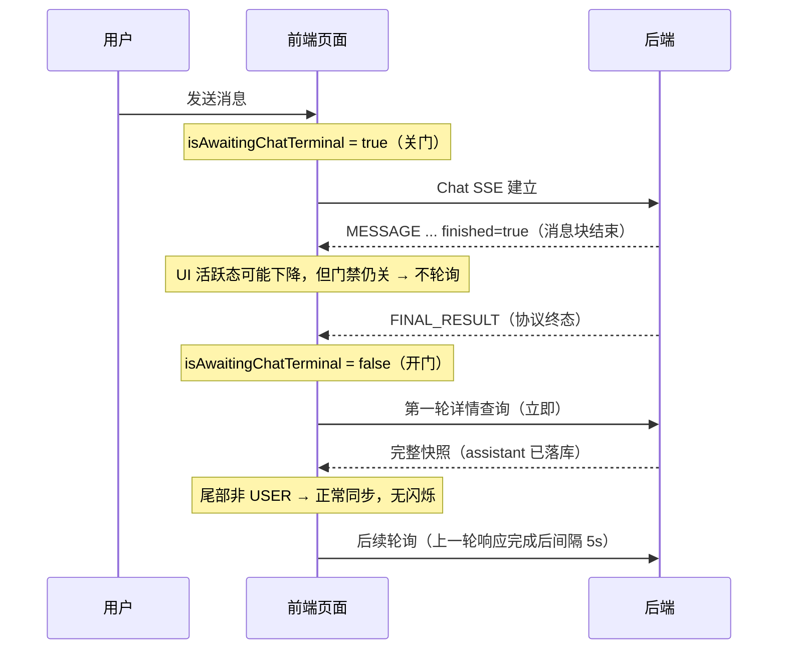

# 会话终态轮询闪烁修复 · 提测报告

> 提测日期：2026-08-17 提测分支：`fix/chat-terminal-polling-flash` 提测提交：`fa0096725 fix(chat): gate history polling on terminal events`（配套文档 `c710ab296`）变更规模：16 个文件，+1189 / -57 行问题等级：体验缺陷（P2，非功能阻断、无数据损坏）本报告为该问题唯一存档文档；更早的问题分析与修复总结已删除，完整内容可从提交 `fa0096725` / `c710ab296` 的 git 历史找回。

---

## 1. 问题现象（用户可见症状）

会话回复**即将结束时**，页面偶发以下症状，通常叠加出现：

| 症状 | 表现 |
| --- | --- |
| 页面闪烁 | 最后几条消息整块重新渲染，肉眼可见闪动 |
| 消息节点身份跳变 | DOM 属性 `data-message-id` 在会话结束后发生变化 |
| 输出重复展示 | 页面同时出现多条 assistant 输出（同一回答被拆成两段并列展示） |
| 触发时机 | 多发生在长回答、工具调用密集、快速连续多轮发送的收尾阶段 |

不涉及：消息内容丢失、会话数据错乱、后端任务状态错误。刷新页面后显示恢复正常。

## 2. 根因（为什么会出现）

问题由**两个条件叠加**产生，缺一不可：

**条件一：轮询放行依赖了错误的信号。** 会话详情轮询（每 5 秒拉取一次完整会话快照）的启用条件原来是「本地不再流式」。而后端协议中，`MESSAGE finished=true` 只表示**一个消息块**输出结束，此时本地流式活跃态 `isConversationActive` 就可能已经降为 `false`——但本轮 Chat 的协议终态 `FINAL_RESULT` **尚未到达**。轮询因此被提前放行：

```text
MESSAGE finished=true / isConversationActive=false  ≠  本轮 Chat 已收到 FINAL_RESULT
```

**条件二：提前拉到的历史快照不完整，且被整段覆盖到页面。** `FINAL_RESULT` 前后端尚未完成 assistant 消息落库，此时拉到的历史快照最后一条还是 `USER`。这份不完整快照被同步覆盖到主消息列表后，React 对末尾消息重新协调（旧 SSE 内存消息节点被拆除、换成快照节点），即表现为闪烁与 `data-message-id` 跳变。

**版本定位**：`c6869aec4`（2026-07-12）正常，`22a769ca2`（2026-08-15）异常；对直接父子提交做页面 A/B，确认 `30fb00730`（"修复历史会话轮询时最新消息未能实时同步更新"）是首个引入"完整快照写回导致末尾消息节点替换"的异常提交。

## 3. 修复方案（改了什么）

采用**协议事件门禁**，不引入固定等待时间。后端已确认契约：前端收到 `FINAL_RESULT` 后再拉历史，最近一条 assistant 必然可读。四项修改按职责如下：

### 3.1 核心修复一：新增协议终态状态 `isAwaitingChatTerminal`

在两个会话 model（`src/models/conversationInfo.ts`、`src/models/conversationAgent.ts`）新增独立状态，与 UI 活跃态 `isConversationActive` 分离：

| 时机                                       | 状态值                          |
| ------------------------------------------ | ------------------------------- |
| 本地发起 Chat 发送                         | `true`                          |
| 普通 `MESSAGE finished=true`（消息块结束） | 保持 `true`（**不再放行轮询**） |
| 收到 `FINAL_RESULT` 或协议 `ERROR`         | `false`                         |
| SSE `onError`（新鲜连接）                  | `false`                         |
| onClose 兜底（含异常关闭）                 | `false`                         |
| 用户主动停止（abort → 延迟 onClose）       | `false`                         |
| 切换会话 / 离开页面（resetInit）           | `false`                         |

### 3.2 核心修复二：轮询门禁加入终态条件

`useConversationStreamResume.ts` 中定时轮询与 `visibilitychange` 恢复查询统一要求：

```text
存在 conversationId
且 本地没有流式输出（原有）
且 本轮 Chat 已收到协议终态（新增）
且 没有 sub 流接管（原有）
且 存在 resumeStream 能力（原有）
```

切后台再切回（`visibilitychange`）同样受此约束，不会绕过门禁；另为可见性恢复查询增加**在途去重锁**，同一时刻最多一个详情请求在飞，杜绝乱序回包覆盖。

### 3.3 核心修复三：丢弃 USER 尾不完整快照（第二道防线）

详情接口返回后，若历史消息**最后一条是 `USER`**，判定 assistant 尚未落库完成：不调用快照消费者、不用该 `messageList` 覆盖页面消息，保留当前 SSE 内存消息，等下一轮（5 秒后）再取完整数据。即使门禁被意外绕过，这道防线也保证不完整快照不会砸到页面。

### 3.4 辅助修复：稳定消息 DOM 身份

`ChatView/index.tsx` 中 `data-message-id` 改用与 React key 相同的 `clientRenderKey`，服务端补齐真实 ID 时 DOM 身份不再跳变；服务端真实 ID 移入独立的 `data-server-message-id` 属性供排查核对。此项是展示稳定性增强，不承担终态前轮询的防覆盖职责。

### 3.5 状态透传与诊断设施

- `isAwaitingChatTerminal` 经 `UnifiedChatSession` 组件透传至全部四类会话入口（见 §4 影响范围）。
- 新增集中式临时诊断模块 `src/utils/conversationPollingDiagnostics.ts`，开发环境输出 `[DEBUG-chat-poll-before-final]` 系列日志（门禁阻塞原因、请求触发源、快照消费/丢弃决策等），生产环境静默。问题稳定后可整体删除。

## 4. 修复原理（为什么有效）

修复后的时序对比：



有效性归结为三点：

1. **消灭了竞态窗口**：`FINAL_RESULT` 到达前详情请求一律不发（自动化验收实测连续多轮发送中 `FINAL_RESULT` 前详情请求数为 0），提前消费不完整快照的路径被整段切断。
2. **依赖后端契约而非等待时间**：不加固定 sleep，不引入"修好了但响应变慢"的副作用；首轮查询在 `FINAL_RESULT` 后立即发出，终态展示不受延迟影响。
3. **纵深防御**：即使未来某条路径意外放行轮询，USER 尾快照丢弃 + 在途去重锁仍能拦截不完整/乱序数据，症状不会完整回归。

## 5. 影响范围

### 5.1 受影响入口（`isAwaitingChatTerminal` 已透传到位）

| 入口 | 文件 |
| --- | --- |
| 普通 Chat 页面 | `src/pages/Chat/index.tsx` |
| Conversation Agent 会话面板 | `src/pages/ConversationAgent/AgentConversationChatPanel/index.tsx` + `hooks/useConversationAgentChatSession.ts` |
| 智能体预览与调试 | `src/pages/EditAgent/PreviewAndDebug/index.tsx` |
| 插件 Chat 会话 | `src/pages/SpacePluginTool/components/PluginChatSession/index.tsx` |
| （共同底层） | `UnifiedChatSession/index.tsx`、`types.ts`、`hooks/useConversationStreamResume.ts`、两个会话 model |

### 5.2 行为变化（测试关注点）

| 行为 | 修复前 | 修复后 |
| --- | --- | --- |
| 详情轮询启动时机 | 本地流式态下降即启动（可能早于 `FINAL_RESULT`） | `FINAL_RESULT`/`ERROR` 到达后才启动 |
| 不完整历史快照（USER 尾） | 覆盖页面消息 → 闪烁 | 丢弃，保留 SSE 内存消息 |
| 切后台再切回 | 可并发多个详情请求 | 受终态门禁约束 + 单请求在途锁 |
| `data-message-id` | 会话结束后可能变化 | 稳定不变（改用 clientRenderKey） |

### 5.3 明确不受影响

- 消息发送、流式渲染、停止任务、重新生成等交互流程；
- sub 流式恢复（刷新页面续接执行中会话）逻辑：原有 `isResumeSubscribed` 停轮询策略不变；
- 侧栏最近使用/会话记录的任务终态补偿同步：仍每轮观察终态即补发；
- 会话内容与后端数据：本修复纯前端时序控制，不改任何请求报文与数据结构。

## 6. 测试建议（重点场景）

| # | 场景 | 操作要点 | 预期 |
| --- | --- | --- | --- |
| 1 | 基本回归：长回答收尾 | 触发生成 3000 字以上长回答，观察结束瞬间 | 无闪烁、末尾消息不重挂、无重复输出 |
| 2 | 工具调用密集会话 | 多工具轮次 + 长文本混合，观察每轮收尾 | 同上 |
| 3 | 快速连续多轮发送 | 上一轮将结束时立即发下一轮，连续 3-5 轮 | 无闪烁；新一轮不被误停（过期连接保护） |
| 4 | 用户主动停止 | 流式输出中途点停止 | 消息落 Stopped 态；停止后 ~5s 内详情轮询恢复（DevTools Network 可见） |
| 5 | 切后台再切回 | 回复结束瞬间切走标签页再切回 | 无闪烁；无并发重复的会话详情请求 |
| 6 | 错误终态 | 构造模型报错/网络中断 | 正常展示错误；错误后轮询正常恢复 |
| 7 | 刷新页面续接 | 执行中刷新页面，sub 恢复流式后自然结束 | 结束收尾无闪烁（sub 接管路径不受影响） |
| 8 | 四个入口全覆盖 | 上述 1/3/4 至少在每个入口各过一遍 | 行为一致 |
| 9 | 会话结束后状态同步 | 任务结束后观察侧栏"最近使用" | 终态（完成/失败）正常同步，不卡"执行中" |
| 10 | DOM 身份抽查 | 结束前后对比末尾消息的 `data-message-id` | 保持不变；真实 ID 在 `data-server-message-id` |

开发环境可在 Console 过滤 `[DEBUG-chat-poll-before-final]` 直接观察门禁决策：`FINAL_RESULT` 前应看到 `chat-terminal-pending` 阻塞日志，之后出现首轮 `poll-request`。

## 7. 已知边界与风险

1. **`conversationAgent.ts` onClose 兜底缺错误保护（建议后续对齐）**：`src/models/conversationAgent.ts:970-976` 对终态兜底接口使用裸 `await`，若该请求 reject，其后的 `setIsAwaitingChatTerminal(false)` 不会执行，Agent 会话面板的轮询会保持阻塞，直到用户下次发送或切换会话（resetInit 自愈）。普通 Chat 主路径 `conversationInfo.ts:1661-1673` 已用 `.catch().finally()` 正确保护，无此问题。触发条件苛刻（终态兜底接口恰好网络失败 + 仅影响 Agent 面板 + 可自愈），不阻塞提测，建议合入前一行对齐修复。
2. **诊断日志为临时设施**：仅开发环境输出，生产静默；计划稳定一个发布周期后删除，届时业务门禁、USER 尾保护与测试不受影响。
3. **依赖后端落库契约**：`FINAL_RESULT` 后 assistant 必可读是本方案的前提。若后端未来调整该时序契约，需重新对齐前后端时序，而不是加固定等待。

## 8. 自测与验证情况

- **单元测试**：新增/补充 `tests/useConversationStreamResume.test.ts`、`tests/conversationInfoModel.test.ts`，覆盖门禁保持、USER 尾丢弃、可见性去重、终态解除等；本机实跑两文件 38/38 通过（提交时相关用例共 71 个通过）。
- **生命周期路径核查**（本次评审逐条确认）：`FINAL_RESULT`/`ERROR` 解除、新鲜 onClose/onError 解除、用户停止（abort → 延迟 500ms onClose → 兜底解除）、resetInit 解除、高频发送时旧连接延迟 onClose 不会误放行新一轮（两个 model 的过期连接保护均在解除逻辑之前 early-return）。
- **页面自动化验收**：连续多轮发送中 `FINAL_RESULT` 前详情请求数为 0；首轮请求发生在 `FINAL_RESULT` 后；后续轮询间隔约 5s；`data-message-id` 稳定。
- **人工验收**：已在实际页面手动验证，闪烁与多输出异常不再出现。

## 9. 回滚方案

单提交回滚 `fa0096725` 即可完整还原（配套文档提交不影响运行）。回滚后问题症状回归为原有偶发闪烁，无其他副作用。若仅需回退局部，`isAwaitingChatTerminal` 状态与门禁条件是核心开关，USER 尾保护与 DOM 身份稳定可独立保留。
