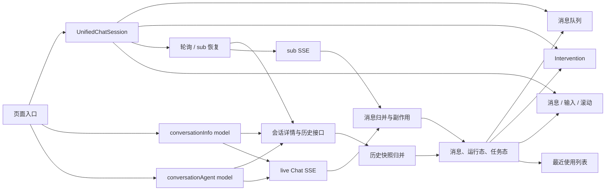

# 会话业务逻辑基线（重构前不可丢失行为）

> 梳理日期：2026-08-16  
> 起始代码基线：`fix/chat-terminal-polling-flash` / `c710ab296`  
> 重构分支：`refactor/conversation-runtime`  
> 用途：作为会话重构前的业务合同、回归清单和评审依据  
> 原则：本文先描述当前行为；存在冲突的地方标记为“待确认”，不得在重构中自行选择

## 1. 范围

本轮梳理覆盖持久化 Agent 会话的完整前端生命周期：

- 会话创建、查询、历史分页与清空；
- 本地发送、乐观消息、live Chat SSE；
- PROCESSING、MESSAGE、FINAL_RESULT、ERROR 事件；
- 停止、网络错误、连接关闭与过期连接；
- taskStatus 同步、会话详情轮询、sub 流恢复；
- 历史快照与本地流式消息归并；
- 多页签、页面可见性恢复、最近使用列表同步；
- ACP 权限审批、MCP Ask、OpenUI action；
- 消息队列、自动消费、滚动与输入区展示；
- 普通 Chat、ConversationAgent、EditAgent 预览、Plugin Chat 等入口差异。

暂不把以下独立协议直接并入同一运行时，但重构时应通过 Adapter 复用公共能力：

- `ChatTemp` 临时会话；
- AppDev 自有 SSE 会话；
- `assistantOptimize` 等非持久化对话。

## 2. 领域词汇

| 名称 | 含义 | 当前来源 |
| --- | --- | --- |
| 会话 | 持久化的 `ConversationInfo`，由 `conversationId` 标识 | 会话详情接口 |
| 轮次 | 一条 USER 消息及其后续一个或多个 ASSISTANT 输出 | 本地发送 + SSE + 落库历史 |
| live 流 | 当前页面主动调用 `/conversation/chat` 建立的 SSE | `handleConversation` |
| sub 流 | 刷新、多页签或外部执行时，通过 `/chat/sub/:id` 恢复的 SSE | `useResumeStreamHandlers` |
| 协议终态 | `FINAL_RESULT` 或协议 `ERROR`；异常传输另走失败收尾 | Chat SSE |
| UI 活跃态 | 消息或 processing 是否仍在 Loading、Incomplete、EXECUTING | `isConversationActive` / `isSessionStreamBusy` |
| 任务状态 | CREATE、EXECUTING、COMPLETE、CANCEL、FAILED | `ConversationInfo.taskStatus` |
| 乐观消息 | 发送瞬间由前端 UUID 创建、尚未落库的 USER/ASSISTANT | `appendOutgoingConversationMessages` |
| 历史快照 | 会话详情接口返回的 `taskStatus + messageList` | `fetchConversationSnapshot` |
| Intervention | ACP Permission 或 MCP Ask 等需要用户响应的执行中断 | AgentIntervention |
| 最近使用 | 侧栏或会话记录中的会话摘要及执行状态 | conversationHistory + eventBus |

## 3. 当前系统参与者



## 4. 不能合并为一个布尔值的状态维度

当前缺陷的重要来源，是多个状态维度被交叉替代。重构后仍必须保留语义区分，但应由一个运行时统一计算。

| 维度 | 当前表示 | 合法含义 |
| --- | --- | --- |
| 服务端任务生命周期 | `taskStatus` | 后端任务是否 CREATE、EXECUTING 或终态 |
| live 协议生命周期 | `isAwaitingChatTerminal` | 本地发送后是否仍未收到协议终态 |
| 页面流式活跃 | `isConversationActive` | 本地 UI 是否仍认为消息/工具在流式处理 |
| 消息生命周期 | `message.status` | 单条消息 Loading、Incomplete、Complete、Error、Stopped |
| 工具生命周期 | `processingList[].status` | 单个执行步骤 EXECUTING、FINISHED、FAILED |
| sub 生命周期 | `isResumeSubscribed` + refs | 是否由恢复流接管输出 |
| 队列生命周期 | queued/sending/paused/awaiting | 下一条消息能否发送 |
| Intervention 生命周期 | pending/submitting/submitted/failed | 是否等待用户处理 |
| 视图生命周期 | loading/scroll/preview | 页面加载与展示，不代表协议状态 |

必须保持的关键不变量：

1. `MESSAGE finished=true` 不等于协议终态。
2. `isConversationActive=false` 不等于任务终态。
3. `taskStatus=EXECUTING` 不等于当前页面一定存在 live 流。
4. sub 已接管时不能继续轮询详情。
5. live 正在输出时不能重复订阅 sub。
6. 协议终态到达前，当前轮次不能消费历史消息快照。
7. 消息 Error 与任务 FAILED 需要同时收敛，否则停止按钮和队列可能卡住。
8. 用户停止是 CANCEL 语义，传输/协议错误是 FAILED 语义。

## 5. 外部接口合同

| 操作 | 方法与路径 | 前端用途 |
| --- | --- | --- |
| 查询会话 | `POST /api/agent/conversation/:id` | 会话信息、taskStatus、最近一段 messageList |
| 历史分页 | `POST /api/agent/conversation/message/list` | 按最早 message index 向前加载 |
| 创建会话 | `POST /api/agent/conversation/create` | 清空后创建并跳转新会话 |
| live Chat | `POST /api/agent/conversation/chat` SSE | 本地发送及实时结果 |
| sub 恢复 | `/api/agent/conversation/chat/sub/:id` SSE | 恢复正在执行会话的输出 |
| 停止 | `POST /api/agent/conversation/chat/stop/:requestId` | 主动终止当前任务 |
| 建议 | `POST /api/agent/conversation/chat/suggest` | 本轮结束后的建议问题 |
| 更新主题 | `POST /api/agent/conversation/update` | 首次发送后更新会话主题 |
| ACP 回执 | `POST /api/agent/conversation/chat/permission-request/response` | 权限选择结果 |

后端已确认的终态读取合同：前端收到 `FINAL_RESULT` 后新发起会话详情查询，应能获取本轮最近一条 assistant 消息。因此当前实现不增加固定 1000ms 保护窗口。

## 6. 完整业务流程

### 6.1 进入或切换会话

1. 页面调用会话详情接口。
2. 合并 `taskStatus`：如果接口仍返回 EXECUTING，但本地消息 finalResult 或既有状态已经是终态，不能倒退覆盖。
3. hydrate 历史中的 MCP Ask 状态。
4. 用 `preserveOptimisticMessageTail` 保留尚未落库的本地轮次。
5. 初始化 agent 配置、变量、建议问题、手动组件、当前会话 ID。
6. 同步 processing 列表及 UI 活跃态。
7. 首屏消息存在时允许再触发一次历史分页确认。
8. 在渲染异步撑高期间持续置底。
9. 若会话为 EXECUTING 且本地没有 live 流，进入轮询/sub 恢复判断。

### 6.2 加载更多历史

1. 仅 conversationId 有效、当前有消息、`isMoreMessage=true` 且未在 loading 时触发。
2. 使用当前第一条消息的 `index` 查询更早数据，页大小为 10。
3. 历史消息 prepend 到列表头部。
4. hydrate MCP Ask，并基于合并后上下文识别已回复表单。
5. 返回少于 10 条时标记没有更多历史。
6. DOM 完成后按新增高度修正 `scrollTop`，用户视口不能跳动。

### 6.3 本地发送

1. 校验必填变量；未满足时只触发表单校验，不发送。
2. 队列判断：streamActive 或 taskStatus EXECUTING 时入队，否则直接发送。
3. 真正发送前中断旧 live/sub、副作用与旧建议。
4. 设置 `isAwaitingChatTerminal=true`。
5. 乐观设置 `isConversationActive=true`，并启动 3 秒活跃保活。
6. 最近使用列表乐观写入 EXECUTING。
7. 生成 UUID USER 消息和 UUID ASSISTANT Loading 占位，并设置稳定 `clientRenderKey`。
8. 附件转换为 Chat 参数，快照发送时的 skillIds、modelId、agentMode。
9. 创建性能生命周期并建立 live SSE。

### 6.4 SSE 事件归并

| 输入 | 消息变化 | 会话变化 | 其它副作用 |
| --- | --- | --- | --- |
| PROCESSING | 按 executeId upsert；消息 Loading；结束 THINK | 保持活跃 | 页面预览、外链、卡片、桌面、文件树 |
| MESSAGE THINK | 追加 think；Incomplete；按 finished 更新 thinkingFinished | 保持活跃 | 自动滚动 |
| MESSAGE QUESTION | 追加 text；finished 时 status=null | 不能解除终态等待 | 建议问题写入 |
| MESSAGE CHAT | 追加 text；finished 时 Complete | 不能解除终态等待 | 自动滚动 |
| 多段 MESSAGE 新 id | 在当前占位前插入或形成多条 assistant | 保持当前轮次 | 必须避免错误合并 |
| FINAL_RESULT | reconcile 最终消息；Complete；写 finalResult/requestId | 解析 COMPLETE/CANCEL/FAILED；解除终态等待 | 建议、文件/Git、task-result、冲突提示、延迟 Ask 补偿 |
| ERROR | 当前 assistant Error | taskStatus 立即 FAILED；解除终态等待 | 最近使用同步 FAILED |
| heartbeat/未知 | 不写消息 | 不产生终态 | 不影响 Intervention |

所有 SSE patch 最后都会再次 reconcile ACP Permission 状态。

### 6.5 FINAL_RESULT 的附加业务

FINAL_RESULT 不是只负责结束消息，还承载以下业务：

- `reconcileFinalMessageState` 补齐 final execute result、ACP 和遗留 processing；
- 成功时本地直接写 `taskStatus=COMPLETE`，避免后端落库延迟；
- 失败时只接受结构化 taskStatus、status、stop_reason、reason，不依赖文案猜测；
- 开启 suggest 时查询下一轮建议；
- TaskAgent 刷新文件树与 Git 列表；
- 解析 `<task-result><file>` 并打开或刷新目标文件；
- 识别“正在执行任务”冲突并弹出停止确认；
- 用户主动取消且没有输出时，可删除空 assistant；
- FINAL_RESULT 只包含 Event markdown、缺少结构化 Ask 时，按 250/750/1500ms 静默补偿读取；补偿只补 MCP Ask，不整体替换消息列表。

这些行为在抽取运行时后必须由明确的 effect 事件承接，不能遗漏在旧 model 中。

### 6.6 正常关闭、异常关闭和过期连接

#### 当前连接正常关闭

1. 清除 3 秒活跃保活。
2. 最后一条 Loading/Incomplete 置 Stopped。
3. 所有遗留 processing EXECUTING 置 FAILED。
4. 立即释放 UI 活跃态，不等待详情接口。
5. FINAL_RESULT 已解析明确终态时不重复查；否则拉取 taskStatus 兜底。
6. 刷新最近使用列表。
7. 完成绩效埋点。

#### 网络或 SSE 异常

1. 展示网络超时提示。
2. 当前 assistant 置 Error。
3. 当前消息 processing EXECUTING 置 FAILED。
4. 当前会话 taskStatus 置 FAILED。
5. 最近使用列表同步 FAILED。
6. 解除终态等待和 UI 活跃态。

#### 过期连接回调

高频连续发送时，旧连接 abort 后的 `onClose/onError` 可能晚于新连接。旧回调只能清理它自己的 assistant 与 processing，不能：

- 关闭新一轮活跃态；
- 改新一轮 taskStatus；
- 弹错误提示；
- 触发全局终态同步；
- 使消息队列提前消费。

### 6.7 用户主动停止

1. 立即 abort live 和 sub。
2. UI 活跃态立即降为 false。
3. 末条 Loading/Incomplete 置 Stopped，结束 thinking。
4. 所有 processing EXECUTING 置 FAILED。
5. 使用当前 requestId 调 stop 接口。
6. 消息队列进入 userPaused，停止后不能自动发送下一条。
7. 用户再次主动发送或“立即发送”时解除暂停。

待确认：当前 `runStopConversation` 本身没有显式写 `isAwaitingChatTerminal=false` 或 taskStatus=CANCEL，主要依赖 abort 后关闭回调/后端同步。重构前应以实际 stop 事件序列补齐合同测试。

### 6.8 会话详情轮询

轮询 ready 条件：

```text
conversationId 存在
&& 本地 live 不活跃
&& 不再等待本轮 Chat 协议终态
&& sub 未订阅
&& resumeStream 已注入
```

行为：

- 标签隐藏时暂停；重新可见时可立即检查，但不能绕过终态门禁；
- 同一可见性请求只允许一个在途实例；
- 本地发送开始时提升 generation，取消轮询并丢弃旧 generation 回包；
- 快照尾部为 USER 时，不消费 messageList；
- 终态快照同步当前会话与最近使用 taskStatus；
- EXECUTING 快照本身不写回 taskStatus，而用于判断是否订阅 sub；
- 后续轮询从上一轮响应完成后间隔约 5 秒。

### 6.9 sub 流恢复

1. 首次进入 EXECUTING 或轮询发现 EXECUTING。
2. live 活跃、sub 已存在、本地 live 刚结束冷却期内均不订阅。
3. 先标记 sub 已接管并停止轮询。
4. 优先复用轮询完整快照；没有时 reload 历史。
5. 等历史中出现可承接的新 USER；按 150/300/600/900/1200/1800ms 重试。
6. 历史仍未就绪时放弃 sub，恢复轮询。
7. 创建全新 assistant 占位，不复用旧 Incomplete。
8. sub 若重放 USER，将 USER 插到 assistant 占位前，不拼入 assistant。
9. sub chunk 复用 live 的消息归并逻辑。
10. ERROR 主动断开 sub；关闭后从消息 finalResult 解析终态，失败再查详情。
11. 存活不足 3 秒按失败计数做 2 秒起步、30 秒封顶的指数退避。
12. 切会话或卸载时终止旧 sub；旧回调不能写新会话。

### 6.10 历史快照归并

归并必须同时满足“服务端数据补齐”和“本地展示稳定”：

- 空快照不清空当前列表；
- 详情只返回最近窗口时，保留用户已加载的更早历史；
- 按稳定服务端 ID upsert；
- 无 ID 开场白按语义去重；
- 乐观 USER 未落库时保留整轮；
- USER 已落库、assistant 未落库时保留 assistant 占位；
- USER 和 assistant 都落库后移除乐观副本；
- 服务端字符串数字 ID、32 位 hex ID 均视为 persisted，不当成 UUID；
- 迁移 `clientRenderKey`，保持 React/DOM 身份稳定；
- 本地已终态消息的 text、think、processing、finalResult 等展示字段不能被重复轮询改写；
- 无变化时返回原数组引用，避免无意义渲染。

### 6.11 taskStatus 合同

| 场景 | 结果 |
| --- | --- |
| FINAL_RESULT success=true | COMPLETE |
| 结构化终态字段 | 对应 COMPLETE/CANCEL/FAILED |
| success=false 但没有结构化终态 | 不猜测；onClose 查询兜底 |
| SSE ERROR / 网络错误 | FAILED |
| 用户主动停止 | CANCEL（需要补齐端到端合同） |
| 历史接口返回 EXECUTING，但本地 finalResult 已终态 | 保留本地终态 |
| 历史接口返回 EXECUTING，但既有状态已终态 | 不倒退 |
| conversationId 不匹配 | 禁止写入 |
| taskStatus 未变化 | 保持原对象引用 |

### 6.12 最近使用和多页签

- 本地发送时乐观把对应会话标记为 EXECUTING；
- sub 接管时标记 EXECUTING；
- COMPLETE/CANCEL/FAILED 通过事件总线幂等补丁到列表；
- 主题首次更新后刷新列表；
- stream close 可触发静默列表刷新；
- 多页签另一页面发送后，本页轮询发现 EXECUTING，必须先补 USER 再恢复 assistant；
- 页面可见性恢复请求必须受 generation、conversationId、live、terminal 和 in-flight 保护。

### 6.13 Intervention

- ACP Permission 与 MCP Ask 是两种不同协议，不可用同一关闭规则；
- 全消息列表收集 pending/submitting 项并按时间 FIFO；
- 只有队首可交互，其余 aria-hidden；
- pending Intervention 禁用普通输入、暂停队列并隐藏队列面板；
- Intervention resume 必须走 rawSend，绕过普通队列；
- ACP 已执行完成、已有 resume 或后端返回 already resolved 时幂等标 submitted；
- MCP Ask 通过历史 hydrate 与 resume 消息配对恢复状态；
- 同标题多次 Ask 必须按 requestId、轮次或邻近关系区分；
- Intervention 完成后恢复队列消费。

### 6.14 消息队列

- 空闲发送直接走 Chat；忙碌时入队；
- 忙碌定义包含流式消息、processing EXECUTING 和 taskStatus EXECUTING；
- 入队时保存附件、skillIds、modelId、agentMode 快照；
- 消费必须等待 live、后台任务、Intervention 全部解除；
- 两次消费从上一轮阻塞解除时起至少间隔配置值；
- 队首发出后必须经历 active→idle 完整周期，避免活跃空窗双发；
- 5 秒看门狗防止 send 未启动导致永久卡住；
- “立即发送”只调整队列优先状态，不停止当前任务；
- 支持编辑、删除、清空、拖拽排序；
- 切换会话清空内存队列和调度状态；持久化队列按会话 ID 隔离并具有 TTL。

待确认的业务冲突：

- 当前实现明确允许末条 Error 后继续消费；
- `tests/messageQueue.test.ts` 和 `tests/messageQueueIntervention.test.ts` 仍要求末条 Error 暂停消费；
- 修复文档又说明 Error 不应永久阻断，用户主动停止才暂停。

该语义必须由产品/业务确认并更新合同测试，重构阶段不得自行选择。

### 6.15 展示与输入

- 未填齐必填变量时禁用发送；
- pending Intervention 时禁用普通输入；
- taskStatus EXECUTING 且末条没有流式状态时展示“智能体正在执行”；
- 活跃或队列非空时不展示本轮 suggest；
- TaskAgent 有消息时展示 ConversationStatus；
- agent 配置允许时展示 agentMode 选择；
- 自动滚动不能打断用户主动上滑；
- 发送、流式结束、初始加载、历史 prepend 都有各自滚动校正；
- DOM `data-message-id` 使用稳定 clientRenderKey，真实服务端 ID 放 `data-server-message-id`。

## 7. 页面入口差异

| 入口 | 状态源 | 关键差异 |
| --- | --- | --- |
| 普通 Chat | `conversationInfo` | 完整文件树、桌面、主题、历史、suggest、最近使用 |
| EditAgent PreviewAndDebug | `conversationInfo` | 调试模式、Agent 配置编辑联动 |
| Plugin Chat | `conversationInfo` | Plugin 页面外观与配置，复用主要运行时 |
| ConversationAgent 预览 Tab | `conversationAgent` | 状态隔离，避免与左侧主 Chat 串扰；部分页面副作用缺失 |
| ConversationAgent 其它区域 | 两个 model 并存 | 最容易发生取错状态源或 action 的位置 |
| Skill 详情等 | `conversationInfo` | 直接读取 model 的若干展示/操作字段 |

隔离需求是真实业务需求，但不等于复制一整份 model。目标应是同一运行时工厂创建多个隔离实例，再通过不同 Adapter 注入能力。

## 8. 当前代码职责地图

| 文件/Module | 当前职责 | 主要风险 |
| --- | --- | --- |
| `models/conversationInfo.ts` | 会话数据、SSE reducer、终态、历史、文件/桌面、滚动、主题、suggest | 约 2100 行，多领域副作用集中 |
| `models/conversationAgent.ts` | 隔离会话的近似复制 | 约 1300 行，与主 model 漂移 |
| `models/conversationInfoMessageList.ts` | 乐观消息与快照归并 | 规则密集，属于关键业务核心 |
| `useConversationStreamResume.ts` | 轮询、历史等待、sub 编排、退避、可见性 | 约 840 行，多状态机叠加 |
| `useResumeStreamHandlers.ts` | sub 连接、占位与 USER 重放 | 与 live transport/reducer 强耦合 |
| `conversationTaskStatusSync.ts` | 终态解析、详情查询、eventBus 同步 | 状态与消息快照职责混合 |
| `UnifiedChatSession` | UI、滚动、轮询、队列、Intervention、输入 | Props 接口约 180 行，调用方知识过多 |
| `useUnifiedChatQueue` | 选择全局/隔离状态源后接队列 | 默认依赖全局 model，Adapter 语义隐式 |
| AgentIntervention | 协议解析、hydrate、队列和回执 | 规则复杂但已有较好纯函数测试 |
| `eventBus` | 列表状态、刷新、跨模块消息 | 非类型化、因果链难追踪 |

## 9. 重构前回归合同

以下编号应成为测试、验收日志和迁移 PR 的共同语言。

### A. 加载与历史

- `CONV-LOAD-001`：首次加载正确初始化会话、agent、变量和消息。
- `CONV-LOAD-002`：空历史显示开场白建议。
- `CONV-LOAD-003`：详情 reload 不冲掉未落库乐观轮次。
- `CONV-LOAD-004`：历史 prepend 后视口位置不跳。
- `CONV-LOAD-005`：详情窗口不删除已加载的更早历史。
- `CONV-LOAD-006`：切换会话不沿用旧会话终态、消息或异步回包。

### B. 发送与 live SSE

- `CONV-LIVE-001`：发送立即追加 USER + ASSISTANT Loading。
- `CONV-LIVE-002`：发送立即进入活跃态和终态等待态。
- `CONV-LIVE-003`：THINK、QUESTION、CHAT 分片按各自状态追加。
- `CONV-LIVE-004`：PROCESSING 按 executeId 更新不重复。
- `CONV-LIVE-005`：工作流多输出不会错误合并成一条。
- `CONV-LIVE-006`：FINAL_RESULT 写 finalResult/requestId 并正确落终态。
- `CONV-LIVE-007`：普通 MESSAGE finished 不解除终态等待。
- `CONV-LIVE-008`：高频发送时旧 onClose 不污染新轮次。
- `CONV-LIVE-009`：高频发送时旧 onError 不污染新轮次。

### C. 终态与异常

- `CONV-END-001`：success=true 直接 COMPLETE。
- `CONV-END-002`：结构化 CANCEL/FAILED 正确解析。
- `CONV-END-003`：未知失败不按文案猜测，走详情兜底。
- `CONV-END-004`：ERROR/onError 同时关闭消息、processing、taskStatus。
- `CONV-END-005`：onClose 不等待接口即可释放输入态。
- `CONV-END-006`：终态不能被迟到 EXECUTING 快照倒退。
- `CONV-END-007`：用户停止暂停队列并保持 CANCEL 语义。

### D. 轮询与恢复

- `CONV-RESUME-001`：FINAL_RESULT/ERROR 前详情请求数为 0。
- `CONV-RESUME-002`：终态后允许第一轮查询，不额外固定延迟。
- `CONV-RESUME-003`：后续轮询从上一响应后间隔 5 秒。
- `CONV-RESUME-004`：USER 尾快照不覆盖 SSE assistant。
- `CONV-RESUME-005`：发送开始取消轮询并丢弃旧 generation 回包。
- `CONV-RESUME-006`：visibility 恢复不绕门禁、不并发重复请求。
- `CONV-RESUME-007`：轮询发现 EXECUTING 后补 USER 再订阅 sub。
- `CONV-RESUME-008`：sub 不复用历史 Incomplete 占位。
- `CONV-RESUME-009`：sub ERROR 恢复轮询并执行退避。
- `CONV-RESUME-010`：切会话后的旧 sub 回调不写新会话。

### E. 消息一致性

- `CONV-MSG-001`：客户端 UUID 与服务端 ID 归并不重复。
- `CONV-MSG-002`：字符串数字和 32 位 hex 服务端 ID 不误判为乐观消息。
- `CONV-MSG-003`：USER 与 assistant 分批落库时保留正确占位。
- `CONV-MSG-004`：已终态本地展示不被轮询内容差异覆盖。
- `CONV-MSG-005`：相同快照保持数组引用不变。
- `CONV-MSG-006`：稳定 data-message-id 不因落库变化。

### F. 队列与 Intervention

- `CONV-QUEUE-001`：忙碌入队，空闲直发。
- `CONV-QUEUE-002`：消费回放附件、skill、model、agentMode。
- `CONV-QUEUE-003`：后台 EXECUTING、流式、Intervention 任一存在均阻止消费。
- `CONV-QUEUE-004`：消费之间满足最小间隔并经历完整 active→idle。
- `CONV-QUEUE-005`：停止后暂停；用户重新参与后恢复。
- `CONV-QUEUE-006`：Error 后是否继续消费按待确认合同执行。
- `CONV-INT-001`：ACP/MCP Ask 跨消息 FIFO，一次只处理一个。
- `CONV-INT-002`：resume rawSend 绕过队列。
- `CONV-INT-003`：刷新/sub 后已处理 Intervention 不重开。
- `CONV-INT-004`：同标题多次 Ask 不错误配对。

### G. 页面副作用

- `CONV-UI-001`：TaskAgent PROCESSING 正确打开页面/链接/桌面。
- `CONV-UI-002`：FINAL_RESULT 刷新文件树和 Git，定位 task-result 文件。
- `CONV-UI-003`：延迟落库 Ask 可静默补齐且不重挂消息。
- `CONV-UI-004`：suggest 仅在空闲且队列为空时显示。
- `CONV-UI-005`：用户上滑时流式更新不强制抢回底部。
- `CONV-UI-006`：普通 Chat 和隔离预览实例状态不串扰。

## 10. 当前基线测试结果

执行 9 个核心测试文件，共 168 个用例：

```text
164 passed
4 failed
```

失败分类：

1. `conversationTaskStatusSync` 两项：测试 eventBus mock 没有 `emit`，实现已经增加最近使用同步，测试装置未同步。
2. 消息队列两项：测试要求末条 Error 阻止消费，实现要求 Error 不永久阻止，属于业务合同冲突。

结论：当前不能把“现有全部测试通过”当作重构起点。阶段 0 必须先修复测试装置并确认 Error 后队列语义，使基线变为全绿。

## 11. 已发现但本阶段不修改的漂移

- `conversationInfo` 与 `conversationAgent` 的 onClose 终态查询策略不同；
- `conversationInfo.handleClearSideEffect` 中存在重复的 RAF 取消与 `abortResumeStream` 调用；
- `UnifiedChatSessionProps.queueMinConsumeInterval` 注释写默认 500ms，实际 Hook 默认 1200ms；
- 历史分页注释仍写“少于 20”，实际页大小为 10；
- 队列 Error 行为在实现、测试和历史文档之间不一致；
- `UnifiedChatSession` 部分 Adapter 默认回退到全局 `conversationInfo`，隔离实例若漏传 override 会串状态；
- eventBus 的 payload 有 `message`/`msg` 历史兼容分支，缺乏类型约束；
- 临时轮询诊断日志仍在业务调用点，稳定后应独立删除。

这些项目需要各自建立合同测试后再修，不应夹在结构迁移中改变。
