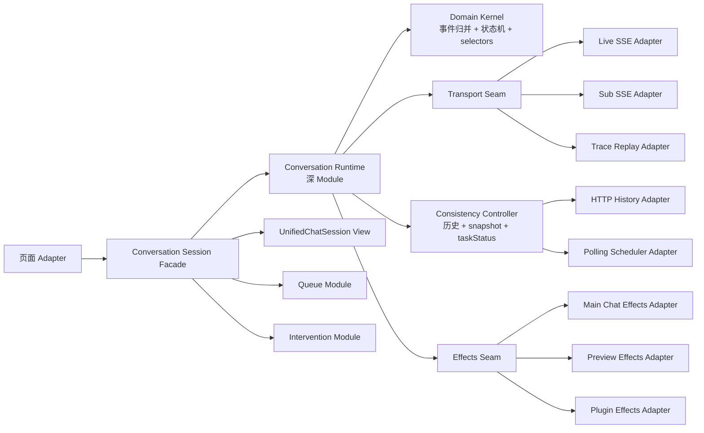

# 会话模块完整重构方案

> 日期：2026-08-16  
> 输入基线：[conversation-business-logic-baseline.md](./conversation-business-logic-baseline.md)  
> 当前阶段：渐进迁移中（Phase 0-3 已建立合同与核心 Module，Phase 4 Runtime Factory 纵切进行中）  
> 最高约束：任何业务逻辑丢失、时序改变或入口能力退化都不可接受

## 0. 实施进度（2026-08-16）

| 阶段 | 状态 | 已落地内容 |
| --- | --- | --- |
| Phase 0 合同冻结 | 已完成 | 业务基线、Trace、错误/停止/队列/多输出与主-隔离 parity 测试 |
| Phase 1 Domain Kernel | 已完成 | taskStatus、消息清理、PROCESSING/MESSAGE/FINAL/ERROR reducer、selectors |
| Phase 2 连接所有权 | 已完成 | 通用 run Controller；live/sub 旧 message、close、error 回调隔离 |
| Phase 3 历史一致性 | 核心策略已完成 | snapshot generation/visibility 单飞/USER 尾拒绝、历史 USER 等待、5 秒冷却、sub 退避、终态 fallback |
| Phase 4 Runtime Factory | 核心纵切已完成 | 主/隔离 model 已创建独立 Runtime 实例；Runtime 已拥有输出身份、live/sub 连接所有权；resumeController 已迁入 runtime/；双实例合同测试覆盖投影一致与交叉隔离 |
| Phase 5 Effects Adapter | 进行中（第 1-5 片已切 live） | recent/taskStatus、suggest.fetch、topic.update、page/card/desktop 与 file/Git/task-result：ConversationEffect + 主/隔离双 Adapter + Runtime.effects 分发已切 live，旧直调路径已删除；perf/scroll 仍由旧 model 执行 |
| Phase 6 React Interface | 未开始 | `UnifiedChatSession` 仍使用兼容 Props；轮询编排仍在 Resume Hook |
| Phase 7 清理固化 | 未开始 | 双 model 外壳、兼容导出与临时诊断仍保留 |

当前迁移保持旧 model 对外 Interface 不变。Phase 3 的策略已经集中，但 snapshot 的最终写权限仍通过兼容回调进入 model；该部分将在 Runtime 接管 message state 后删除，不能提前机械搬移。

### 0.1 最新纵切记录（2026-08-16）

- Phase 5 第五片（file/Git/task-result）完成 shadow→live 闭环：新增 `preview.file.refresh`（throttled=ToolCall 节流 / immediate=FINAL_RESULT 立即）与 `taskResult.settle`（保序组合体：立即刷树 → 按需 Git 刷新 → task-result 文件选中并打开预览 → 未命中发兜底正文重拉 trigger）。时序依赖（文件选中依赖树刷新完成）使其不按 §5.5 清单拆成独立 git.refresh/taskResult.file.open——保序优先，为清单的工程化取舍（已在 effect 类型注释记录）。切 live 后删除 setTimeout 段旧执行体与 ToolCall 旧刷新直调；三个刷新/打开句柄经 ref 转发。隔离入口无文件树/Git/task-result（Preview Adapter 忽略）。
- Phase 5 第四片（page/card/desktop）完成 shadow→live 闭环：新增 `preview.page.open` / `preview.link.open` / `card.result.apply`（LIST 过滤空对象/单卡、append 由调用点以 requestId 判定）/ `desktop.open`；主 model Runtime 创建移至全部 Adapter 依赖声明之后（消除 setState/openDesktopView 的 TDZ，ref 转发仅用于跨 render 变化句柄）。双入口子集：主 Chat 全量，隔离 Preview 执行 page/link（无卡片/桌面状态）。切 live 后删除两 model 的 showPagePreview/window.open/setCardList 卡片块/openDesktopView 直调及 BindCardStyleEnum 等无用 import。isEmptyObject 在 Adapter 内联（utils/common 经 i18nRuntime 引入 umi 传递依赖，会破坏 vitest 可导入性）。
- Phase 5 第三片（topic.update）完成 shadow→live 闭环：`topic.update` 携带发起时会话信息快照（保持「以快照为基底合并主题」的原覆盖语义）；mainChat Adapter 注入 updateTopic（ref 转发）/setConversationInfo/needUpdateTopicRef/getTopicContext（侧栏模式与历史句柄 render 期刷新），执行体含成功写回快照、列表/历史双分支刷新、失败回滚「仅一次」标记。gate 留在调用点；dispatch 置于旧调用之前——shadow 下两路互不干扰，切 live 后 Adapter 先置标记、旧路径 gate 自动不通过（天然防双发）。切 live 后删除 `updateTopicOnce` 整函数与 model 内全部 eventBus 直发（主 model 不再 import eventBus/EVENT_TYPE）。隔离入口无主题更新（Preview Adapter 忽略）。
- Phase 5 第二片（suggest.fetch）完成 shadow→live 闭环：`ConversationEffect` 新增 `suggest.fetch`；dispatcher 支持 `shadowEffectTypes` 分片 shadow 通道（live runtime 中新迁移类型只记录不执行，防止与旧路径双发）；双 Adapter 注入 `fetchSuggest`（model 的 useRequest 句柄经 `runChatSuggestRef` render 期刷新转发，防 stale 闭包）。隔离入口的 suggest 代际记录（pendingSuggestGenerationRef）留在调用点、属 model ref 语义。shadow 对照（Adapter 转发单测 + model 计划断言）通过后切 live，删除两处旧 `runChatSuggest` 直调。
- Phase 5 第一片（recent/taskStatus）切换执行权：两个 model 的 `effectDispatchMode` 由 shadow 切 live，删除 6 处旧 eventBus 直调（主 4：发送乐观标记 / ERROR / onError / onClose 列表刷新；隔离 2：ERROR / onError），并清理 `emitConversationListTaskStatus` 无用 import。model 级对照测试改为断言「计划 effect 序列 == Adapter 实际发射序列」，发射行为与切换前逐条一致（218 条会话测试全绿）。
- Phase 5 第一片（recent/taskStatus）shadow observation 起步：`runtime/effectDispatcher.ts` 定义 `ConversationEffect` 子集（`recent.status.patch`（可选乐观 context）/`recent.list.refresh`）与 shadow/live 双模式 dispatcher（默认 shadow 只记录 + 诊断日志 `conversationEffectsDiagnostics`）；`adapters/mainChatEffectsAdapter`（全量：乐观标记/终态补丁/列表刷新）与 `adapters/previewEffectsAdapter`（隔离子集：仅终态补丁）构成两个真实 Adapter；Runtime 组合为 `runtime.effects`。shadow 阶段测试已证明「计划 effect 序列 == 旧路径实际发射序列」后切换。
- 双实例合同测试补全（Phase 4 第 6 项）：在投影一致性（同 Trace）之外新增交叉隔离合同——主/隔离实例对不同会话同时发送，消息与 requestId 互不串扰；停止隔离实例只中断自己的 live 连接、消息终态只作用于自己，主实例连接与 Loading 态不受影响。活跃态因「发送后 3s 保活」窗口不作跨实例断言（冻结合同，未顺手改）。
- `useResumeStreamHandlers` 从 `src/hooks/` 迁入 `runtime/resumeController.ts`（对齐 §4 目标目录）并去 React 化：纯闭包工厂 `createResumeController`，无 useState/useRef/useCallback；「事件回调读最新 handleChangeMessageList」合同改由 `setHandler` 显式承接（model 每 render 刷新闭包）。主/隔离 model 惰性创建各自 Controller 实例，对外 `resumeConversationStream`/`abortResumeStream` 行为不变。
- Runtime 新增 `resumeConnection`（`resumeConnectionController.ts`，语义化 Adapter 镜像 live）：sub 恢复流的 runId/abort 所有权从 hook 实例迁入 Runtime 实例，与 live 连接同生命周期；删除内部自建 `ConnectionRunController` 与 `resetResumeMessageState` 兼容 dep。
- 合同测试：新增同一实例内 live 与 resume 槽位互不干扰（abort live 不杀 sub、abort sub 不杀 live）、不同 Runtime 实例的 sub 连接所有权隔离；`tests/useResumeStreamHandlers.test.ts` 更名 `tests/resumeController.test.ts`，去掉 renderHook/act（Controller 可脱离 React 直接构造），rerender 场景改为 `setHandler` 断言。
- 已知预存失败（非本轮引入）：`tests/messageQueueDisabled.test.ts` 2 例在干净 HEAD 上同样失败，待单独排查。

## 1. 执行结论

当前最需要的不是把大文件机械拆小，而是建立一个深的“会话运行时 Module”，让消息事件、协议生命周期、任务状态、历史一致性、live/sub 所有权和派生 UI 状态集中在一个可测试的 Interface 后面。

推荐顺序：

1. 先冻结业务合同与运行 Trace；
2. 抽取纯 Domain Kernel，保持旧 model 仍为状态所有者；
3. 抽取连接所有权和历史一致性 Controller；
4. 用 Runtime Factory 替代两份 model 复制；
5. 最后收窄 `UnifiedChatSession` Interface 和迁移页面副作用。

禁止大爆炸式替换。每一阶段都必须能单独发布、对照、回滚。

## 2. 架构诊断

### 2.1 会话 model 是宽而浅的 Module

`conversationInfo.ts` 同时实现：

- 数据查询与分页；
- live SSE 连接所有权；
- SSE 事件归并；
- 消息身份与乐观更新；
- taskStatus 解析与补偿；
- sub 恢复入口；
- UI 滚动；
- 卡片、页面、桌面、文件树、Git；
- 主题、建议和性能埋点。

调用方从 model 暴露的大量 state、ref、setter 和 action 中自行组合行为。Interface 几乎和 Implementation 一样宽，Module 缺少 Depth；问题修复需要跨多个调用方同步修改，Locality 很低。

### 2.2 两份 model 复制导致语义漂移

`conversationAgent.ts` 为了隔离状态复制了主 model 的大量实现。隔离是有效需求，但复制不是有效 Seam。当前已经出现：

- onClose 查询策略不同；
- 主 model 有页面/文件/主题副作用，隔离 model 没有；
- 同一 SSE 修复必须改两次；
- 新增状态必须逐层双份透传；
- 测试重点集中在主 model，隔离 model 容易漂移。

删除测试：如果删除 `conversationAgent.ts`，复杂度不会消失，而会重新出现在隔离入口中；说明应该保留“隔离实例”能力，但把复制的 Implementation 收进 Runtime Factory。

### 2.3 一个业务事实被多处重新推导

“当前能否发送/轮询/订阅/消费队列/显示停止按钮”分别读取：

- `isConversationActive`；
- `isSessionStreamBusy(messageList)`；
- `taskStatus===EXECUTING`；
- `isAwaitingChatTerminal`；
- `isResumeSubscribed`；
- `hasPendingIntervention`；
- 多个 ref 与 timer。

这些推导散落在 model、UnifiedChatSession、Queue 和 Resume Hook 中。Interface 泄漏的是状态组合规则，调用方必须理解内部时序才能正确使用。

### 2.4 live、sub、poll 都能写同一消息列表

三个异步来源竞争写入：

```text
live SSE ─┐
sub SSE ──┼──> messageList
snapshot ─┘
```

当前通过 conversationId、generation、abort ref、terminal gate、snapshot reconcile 等局部守卫保证正确性。守卫本身是必要业务，但分散在不同 Module 中，连接所有权与消息写权限没有集中表达。

### 2.5 UnifiedChatSession Interface 过宽

`UnifiedChatSessionProps` 约 180 行，调用方需要了解：

- 哪个 active 是 UI active，哪个是 local stream；
- 哪些 action 来自哪个 model；
- 隔离入口何时必须覆盖全局默认；
- resume、queue、Intervention 之间的组合关系；
- 近百个配置和回调。

这是典型浅 Module：复用表面上集中，知识却泄漏给所有调用方。

### 2.6 eventBus 是隐式 Seam

最近使用状态、列表刷新、跨模块消息通过字符串事件连接。当前同时存在：

- payload 兼容 `message` 与 `msg`；
- 列表状态既会拉取也会被本地补丁；
- 事件缺少因果 ID、source 和 generation；
- 测试 mock 容易漏掉新增方法。

eventBus 已经是 Seam，但 Interface 没有类型和业务语义，导致影响范围不可见。

## 3. 目标架构



目标不是创造更多公共 Interface，而是把复杂行为藏到少数深 Module 中：

- 外部只使用 Session Facade；
- Runtime 统一拥有会话状态和异步代际；
- Kernel 只处理确定性状态转换；
- Transport、Consistency、Effects 是实际变化点，才建立 Seam；
- Queue 和 Intervention 保持独立 Module，只消费 Runtime selectors，不重新解释原始状态。

## 4. 目标目录建议

```text
src/features/conversation/
├── domain/
│   ├── types.ts
│   ├── initialState.ts
│   ├── reduceConversationEvent.ts
│   ├── reduceConversationCommand.ts
│   ├── selectors.ts
│   ├── messageIdentity.ts
│   ├── messageSnapshotReconciler.ts
│   ├── taskStatus.ts
│   └── terminalPolicy.ts
├── runtime/
│   ├── createConversationRuntime.ts
│   ├── useConversationRuntime.ts
│   ├── liveConnectionController.ts
│   ├── resumeController.ts
│   ├── consistencyController.ts
│   ├── effectDispatcher.ts
│   └── trace.ts
├── adapters/
│   ├── agentConversationHttpAdapter.ts
│   ├── agentConversationSseAdapter.ts
│   ├── recentConversationAdapter.ts
│   ├── mainChatEffectsAdapter.ts
│   ├── previewEffectsAdapter.ts
│   └── pluginEffectsAdapter.ts
├── react/
│   ├── ConversationSessionProvider.tsx
│   ├── useConversationSession.ts
│   └── createConversationSessionModel.ts
└── testing/
    ├── conversationTraceHarness.ts
    ├── fakeTransportAdapter.ts
    ├── scenarioBuilders.ts
    └── contractAssertions.ts
```

命名可以在实施前调整；职责划分和依赖方向不能反转。

## 5. 深 Module 设计

### 5.1 Conversation Domain Kernel

职责：把输入事件转换为新的领域状态和待执行 effect，不直接访问 React、DOM、网络、eventBus、localStorage 或 timer。

建议 Interface：

```ts
type ConversationEvent =
  | { type: 'send.requested'; payload: SendPayload }
  | { type: 'live.opened'; runId: string }
  | { type: 'sse.received'; runId: string; event: NormalizedSseEvent }
  | { type: 'live.closed'; runId: string; reason: CloseReason }
  | { type: 'live.failed'; runId: string; error: ConversationError }
  | { type: 'snapshot.received'; generation: number; snapshot: Snapshot }
  | { type: 'stop.requested'; runId: string }
  | { type: 'conversation.changed'; conversationId: number };

interface ReduceResult {
  state: ConversationRuntimeState;
  effects: ConversationEffect[];
}

function reduceConversationEvent(
  state: ConversationRuntimeState,
  event: ConversationEvent,
): ReduceResult;
```

Kernel 吸收：

- PROCESSING/MESSAGE/FINAL_RESULT/ERROR 归并；
- 乐观轮次创建；
- stale runId/generation 丢弃；
- taskStatus 合法转换；
- 消息与 processing 结束策略；
- `isAwaitingChatTerminal` 的转换；
- 可发送、可轮询、可恢复、队列阻塞等 selectors。

收益：Interface 是统一事件输入，测试可以重放完整 Trace；Implementation 复杂，但调用方不再理解所有状态组合，Depth、Leverage 和 Locality 同时提高。

### 5.2 Conversation Runtime

职责：一个会话实例的唯一状态所有者，串行化命令、事件和 effect；拥有 runId、generation 和连接句柄。

建议对页面只暴露：

```ts
interface ConversationSession {
  readonly state: ConversationSessionView;
  send(input: SendInput): void;
  stop(): Promise<void>;
  load(conversationId: number): Promise<void>;
  loadMore(): Promise<void>;
  clear(): Promise<void>;
  respond(intervention: InterventionResponse): Promise<void>;
  dispose(): void;
}
```

注意：这是页面 Facade，不代表所有内部能力都塞进单个文件。内部 Controller 仍可组合，但不是调用方 Interface 的一部分。

运行时实例必须支持：

- 主 Chat 实例；
- ConversationAgent 隔离实例；
- EditAgent/Plugin 配置不同但行为一致的实例；
- 测试 Trace Replay 实例。

### 5.3 Transport Seam

职责：统一 live/sub 的连接生命周期和事件规范化，保证 error/close 恰好一次。

```ts
interface ConversationTransport {
  openLive(input: LiveInput, sink: EventSink): ConnectionHandle;
  openResume(input: ResumeInput, sink: EventSink): ConnectionHandle;
}
```

Adapter：

- 生产 SSE Adapter；
- Trace Replay Adapter；
- 如确有需要，再增加临时会话 Adapter。

所有回调必须携带 `runId`，Runtime 根据所有权决定是否接收，取代对可变 abort ref 的隐式身份比较。

### 5.4 Consistency Controller

职责：所有持久化快照读取、轮询、历史等待、snapshot 归并和 taskStatus 补偿集中在一个 Module。

它应隐藏：

- poll ready 条件；
- terminal gate；
- visibility in-flight；
- 5 秒响应后计时；
- generation；
- USER 尾快照拒绝；
- sub 前历史 USER 等待；
- 终态不倒退规则；
- 最近窗口与完整本地历史归并。

外部只看到规范化事件：

```text
snapshot.accepted
snapshot.rejected(reason)
resume.requested
terminal.confirmed
```

这样轮询不会再直接调用页面的 `onConversationSnapshot`，消息写权限回到 Runtime。

### 5.5 Effects Seam

当前 PROCESSING/FINAL_RESULT 直接操作页面、文件、桌面、Git、卡片、topic、suggest 和 recent list。Domain Kernel 只产生 effect 描述，Adapter 决定如何执行。

```ts
type ConversationEffect =
  | { type: 'recent.status.patch'; status: TaskStatus }
  | { type: 'topic.update'; firstMessage: string }
  | { type: 'suggest.fetch'; params: SuggestInput }
  | { type: 'preview.page.open'; data: PagePreview }
  | { type: 'preview.file.refresh'; mode: 'normal' | 'immediate' }
  | { type: 'git.refresh' }
  | { type: 'taskResult.file.open'; fileId: string }
  | { type: 'conflict.confirmStop' }
  | { type: 'perf.event'; event: PerfEvent };
```

实际 Adapter 至少有：

- Main Chat：完整执行全部副作用；
- ConversationAgent Preview：执行隔离允许的子集；
- Plugin：执行 Plugin 允许的子集。

两个以上真实 Adapter 证明这个 Seam 不是假设性抽象。

### 5.6 Session View 与 selectors

页面不再自行组合原始字段，Runtime 提供语义化 selectors：

```ts
interface ConversationSessionView {
  conversation?: ConversationInfo;
  messages: MessageInfo[];
  phase: 'idle' | 'sending' | 'streaming' | 'awaiting-terminal' | 'resuming';
  taskStatus?: TaskStatus;
  canSendNow: boolean;
  shouldEnqueue: boolean;
  canPollSnapshot: boolean;
  shouldShowStop: boolean;
  shouldShowTaskWait: boolean;
  shouldShowSuggest: boolean;
  activeInterventions: InterventionQueueItem[];
}
```

selector 是 Interface 的一部分，必须由合同测试验证；页面禁止再次用原始字段推导同一语义。

## 6. 保留现有 Module 的策略

### 6.1 消息一致性 Module

`conversationInfoMessageList.ts` 已有大量纯函数测试，属于可深化而不是推倒重写的资产。

处理方式：

1. 原样迁入 `domain/messageSnapshotReconciler.ts`；
2. 先保持所有导出函数和测试不变；
3. Runtime 迁移完成后再收窄外部 Interface，只保留 `createOptimisticRound` 与 `mergeSnapshot`；
4. 内部 helper 不再由 model 直接调用。

### 6.2 Intervention Module

Intervention 已有协议解析、hydrate、reconcile 和 UI 测试。保留为独立深 Module：

- Domain Kernel 负责把 SSE 事件交给它并保存结果；
- Runtime selector 读取是否 pending；
- Queue 只读取统一 `isConsumeBlocked`；
- UI 不再绕过 Runtime 自行选择全局或隔离 handler。

### 6.3 Queue Module

保留队列存储与调度，但替换输入：

```text
当前：多个 raw boolean + messageList
目标：runtime.selectors.queueGate
```

Queue 不再调用 `isSessionStreamBusy`，不再推导 taskStatus，也不默认读取全局 model。这样消息运行规则只存在一处。

### 6.4 UnifiedChatSession View

最终只负责展示和用户动作，不启动轮询、不选择状态源、不拥有业务 timer。

建议收窄为三个对象：

```ts
interface UnifiedChatSessionProps {
  session: ConversationSessionView;
  actions: ConversationSessionActions;
  presentation: ConversationPresentation;
}
```

这是最终形态，不能第一阶段直接改，否则会同时波及所有入口。

## 7. 迁移计划

### Phase 0：冻结合同（阻断阶段）

目标：重构前基线全绿，所有争议有明确决策。

工作：

1. 把业务基线中的 `CONV-*` 编号映射到测试。
2. 修复 `conversationTaskStatusSync` eventBus mock。
3. 确认 Error 后消息队列是否继续消费，统一实现、测试和文档。
4. 补用户停止的终态等待、CANCEL、队列暂停 Trace。
5. 补 `conversationAgent` 与主 model 的行为对照测试。
6. 保存真实页面 Trace：普通成功、长回答、工具调用、多个输出、ERROR、stop、Ask、ACP、多页签恢复、visibility。
7. 核心测试必须 100% 通过后才进入 Phase 1。

交付物：行为矩阵、Trace fixtures、全绿测试报告。

### Phase 1：抽取 Domain Kernel

目标：不改变状态所有权，只把确定性业务规则收进纯函数。

顺序：

1. 迁移 taskStatus 解析；
2. 迁移消息 finalize/stop/error 清理；
3. 迁移 SSE event reducer；
4. 迁移 selectors；
5. 旧 model 调用新 Kernel，但仍保留原 state 和 effects。

验证：同一输入 Trace 同时运行旧实现与 Kernel，比较 messageList、taskStatus、终态等待和 effects。

回滚：单文件调用切回旧 helper，不影响页面 Interface。

### Phase 2：统一连接所有权

目标：live/sub 的 runId、abort、close/error exactly-once 集中管理。

工作：

1. 为现有 SSE 封装生产 Transport Adapter；
2. 每次 live/sub 分配 runId；
3. Runtime/旧 model 只接受当前 runId 事件；
4. 删除 model 内重复 stale onClose/onError 分支前，先做双轨日志对比；
5. 保留现有 500ms close 行为与所有错误合同。

验证：高频连续发送、stop 后新发、旧连接晚回调、sub 切会话。

### Phase 3：集中历史一致性

目标：poll、visibility、history wait、snapshot merge、taskStatus fallback 归入 Consistency Controller。

工作：

1. 保持现有轮询时间和门禁原样迁移；
2. 统一 scheduled 与 visibility 两个请求入口；
3. 统一 snapshot outcome 类型；
4. snapshot 只能 dispatch 给 Runtime，禁止页面回调直接写消息；
5. sub 触发改为 Controller 事件；
6. 删除 `conversationTaskStatusSync` 中混合的网络和 eventBus 副作用，仅保留 domain policy 或 Adapter。

验证：终态前请求为 0、USER 尾拒绝、5 秒节奏、generation、sub 退避、多页签 USER 等待。

### Phase 4：建立 Runtime Factory，消除双 model 复制

目标：用相同 Implementation 创建隔离实例。

工作：

1. 创建 `createConversationRuntime(config)`；
2. 主 model 作为兼容 Adapter，返回原字段形状；
3. conversationAgent model 改为创建第二个 runtime 实例；
4. 按入口注入 Effects Adapter；
5. 两个旧 model 对外 Interface 暂时不变；
6. 对所有公共 action 做主/隔离实例合同测试。

验证：普通 Chat 与 Preview 同时打开、同时发送、停止、Intervention、sub，不串 conversationId、requestId、abort、queue、agentMode。

### Phase 5：迁移副作用

目标：把文件、桌面、卡片、主题、suggest、recent list、perf 从 model 中迁入 Effects Adapter。

每类 effect 单独一个 PR：

1. recent/taskStatus；
2. topic/suggest；
3. page/card/desktop；
4. file/Git/task-result；
5. perf/scroll notification。

每次迁移采用 shadow observation：旧路径执行，新路径只记录计划 effect；一致后切换执行权，再删除旧路径。

### Phase 6：收窄 React Interface

目标：页面只消费 Session View 与 Actions。

工作：

1. 新增 Facade Props，同时兼容旧 Props；
2. 逐个迁移 Chat、PreviewAndDebug、Plugin、ConversationAgent；
3. 删除 `useUnifiedChatQueue` 对全局 model 的默认读取；
4. Intervention handler 由 Facade 提供；
5. 轮询从 View 完全移出；
6. 所有入口迁移后删除旧 Props。

### Phase 7：清理与固化

1. 删除 `conversationAgent` 复制 Implementation，仅保留实例声明；
2. 删除旧 reducer、重复 selector、重复 timer 和 eventBus 兼容 payload；
3. 删除临时终态轮询诊断模块；
4. 更新领域文档和 ADR；
5. 为 Runtime Interface 设置依赖规则，禁止页面导入内部 domain/runtime 文件。

## 8. 每阶段安全门

每个 Phase 必须同时满足：

- 当前阶段对应 `CONV-*` 合同测试全绿；
- 全量现有会话测试无新增失败；
- Trace Replay 的最终状态和 effect 序列一致；
- 普通 Chat 与隔离 Preview 双实例验证通过；
- 没有新增固定延迟解决时序问题；
- 没有通过扩大 `any` 或忽略 lint 隐藏迁移错误；
- 可以通过单个 feature flag 或兼容 Adapter 回退；
- PR 只迁移一种职责，不同时修复未经确认的历史行为。

## 9. Trace 回归机制

### 9.1 Trace 格式

```ts
interface ConversationTraceEntry {
  seq: number;
  at: number;
  source: 'user' | 'live' | 'sub' | 'snapshot' | 'timer' | 'visibility';
  conversationId: number;
  runId?: string;
  generation?: number;
  event: unknown;
  expected?: {
    phase?: string;
    taskStatus?: TaskStatus;
    messageDigest?: string;
    effects?: string[];
  };
}
```

生产日志需要脱敏，仅保留消息长度、角色、状态、ID 关系和事件类型，不保存用户正文。

### 9.2 必备场景 Trace

| Trace | 场景                | 关键断言                                   |
| ----- | ------------------- | ------------------------------------------ |
| T01   | 普通成功            | FINAL_RESULT 前无 snapshot；最终 COMPLETE  |
| T02   | MESSAGE 先 finished | terminal gate 保持关闭轮询                 |
| T03   | 多 assistant 输出   | 不合并、不重复、身份稳定                   |
| T04   | 工具调用            | processing upsert、结束态正确              |
| T05   | ERROR               | 消息 Error、processing FAILED、task FAILED |
| T06   | 网络 reject         | error/close exactly-once                   |
| T07   | 用户 stop           | Stopped、CANCEL、queue paused              |
| T08   | 高频连续发送        | 旧回调不污染新 runId                       |
| T09   | snapshot USER 尾    | snapshot rejected                          |
| T10   | 分批落库            | 乐观 USER/assistant 正确迁移               |
| T11   | 多页签 sub          | 先 USER 后 assistant                       |
| T12   | sub 秒关            | 指数退避且轮询恢复                         |
| T13   | visibility          | 不并发、不绕 terminal gate                 |
| T14   | MCP Ask             | pending、resume、hydrate 正确              |
| T15   | ACP                 | FIFO、提交、历史恢复正确                   |
| T16   | 队列                | 阻塞解除后按间隔逐条发送                   |
| T17   | TaskAgent 文件      | FINAL_RESULT effects 完整                  |
| T18   | 双实例              | 主 Chat 与 Preview 无状态串扰              |

### 9.3 对照方式

在 Phase 1 ～ 4 使用双轨：

```text
同一 Trace
  ├─ 旧实现 -> old state/effects
  └─ 新 Runtime -> new state/effects

比较：
  message digest
  taskStatus
  phase/selectors
  effect 类型与顺序
  请求次数与发起时机
```

差异必须满足以下之一：

1. 修复了已明确批准的业务缺陷；
2. 仅为无业务影响的日志或对象引用差异；
3. 否则阻断合并。

## 10. 测试分层

| 层次 | 测试 Surface | 覆盖内容 |
| --- | --- | --- |
| Domain | `reduceConversationEvent` | 每个 SSE/命令的纯状态转换 |
| Consistency | Controller Interface | 轮询、generation、USER 尾、sub 等待/退避 |
| Transport | Transport Interface | open/message/error/close/abort exactly-once |
| Runtime | Session Interface + Trace | 跨事件完整时序与 effects |
| Adapter | 各页面 Effects Adapter | 文件、桌面、topic、recent 等副作用 |
| React | Session View + Actions | 展示、输入、队列、Intervention |
| Browser | 真实页面 | 闪烁、DOM 身份、滚动、多窗口 |

Interface 就是测试 Surface。禁止为了测试继续导出 Runtime 内部 helper；纯 helper 只由其所属 Module 的测试覆盖。

## 11. 风险与控制

| 风险 | 级别 | 控制措施 |
| --- | --- | --- |
| 漏掉 FINAL_RESULT 附带的文件/Ask/冲突副作用 | 高 | effect 清单 + Trace T14/T17 + shadow observation |
| 主/隔离实例再次串状态 | 高 | Factory 实例 ID + 双实例合同测试 |
| 轮询时序回归 | 高 | 请求发起 Trace + terminal gate 断言 |
| 消息归并改变 DOM 身份 | 高 | message digest + data-message-id browser probe |
| Error/stop 语义被重构顺手改变 | 高 | Phase 0 先决策并冻结合同 |
| eventBus 迁移漏列表更新 | 中 | Recent Adapter 双写/对照日志 |
| Props 迁移影响多个入口 | 中 | 新旧 Interface 并存，逐入口切换 |
| 抽象过多形成浅 Module | 中 | deletion test；没有第二个 Adapter 不建公共 Seam |
| 重构周期过长形成两套永久并存 | 中 | 每 Phase 有删除清单和截止版本 |

## 12. PR 拆分建议

每个 PR 应是可独立验证的 tracer slice：

1. `test(conversation): freeze runtime behavior contracts`
2. `refactor(conversation): extract terminal and message reducers`
3. `refactor(conversation): centralize runtime selectors`
4. `refactor(conversation): own live connections by run id`
5. `refactor(conversation): own resume connections by run id`
6. `refactor(conversation): centralize snapshot consistency`
7. `refactor(conversation): create isolated runtime factory`
8. `refactor(conversation): adapt main conversation model`
9. `refactor(conversation): adapt preview conversation model`
10. `refactor(conversation): move recent and topic effects`
11. `refactor(conversation): move task agent effects`
12. `refactor(conversation): narrow unified session interface`
13. `chore(conversation): remove legacy runtime paths`

任何 PR 不应同时包含“结构迁移 + 新功能 + 未批准行为修复”。

## 13. 可量化完成标准

- `conversationInfo.ts` 不再拥有 SSE reducer、轮询、消息归并和页面副作用；
- `conversationAgent.ts` 不再复制实现，只创建隔离 Runtime；
- 页面不再自行组合 active/task/terminal/sub 判断；
- `UnifiedChatSession` 不再启动网络请求或读取全局 model；
- 所有消息写入经过 Runtime；
- live/sub/snapshot 都携带 runId 或 generation；
- 阶段 0 确立的 `CONV-*` 合同全绿；
- 18 条 Trace 在旧实现与新 Runtime 之间一致；
- 浏览器连续发送、长回答、工具调用、多输出、多页签、stop/error/Intervention 无回归；
- 删除旧路径后，复杂度没有重新散落到页面 Adapter。

## 14. 首要推荐

第一项不是拆 `conversationInfo.ts`，而是完成 Phase 0：把现有行为清单转为可执行合同与 Trace Harness，并解决当前 4 个测试失败所揭示的语义漂移。

理由：没有全绿、无歧义的基线，任何“更整洁”的重构都无法证明没有丢业务；先建立可重放的 Interface 测试，后续每次深 ening 才有可靠安全网。
