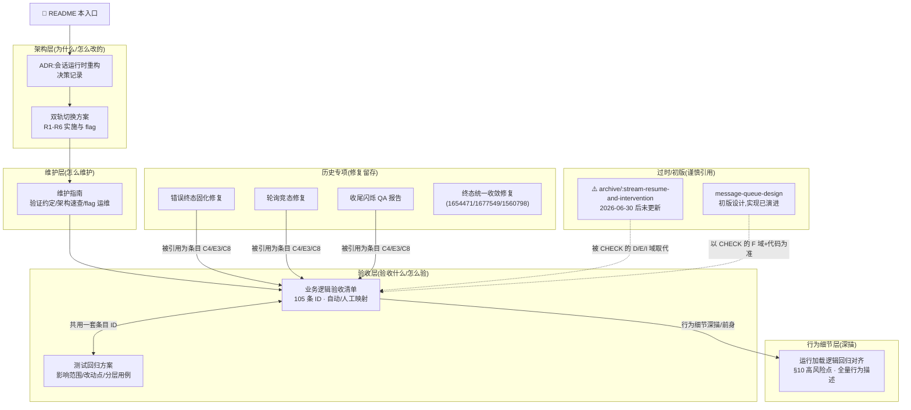

# 会话模块文档入口(总索引)

> 所有会话模块(`src/models/conversation*`、`src/features/conversation/**`、`UnifiedChatSession/**`、`MessageQueue/**`、`AgentIntervention/**`、`src/pages/Chat/**`)的文档集中在本目录,从这里找。基线:commit `cf5ab966c`(2026-08-17,`refactor/conversation-dual-track`)。**改代码后该更新哪篇文档,见 §4。**

```text
docs/conversation/
├── README.md      ← 本入口(总索引)
├── adr/           架构决策记录
├── archive/       已过时文档(仅历史参考)
└── *.md           方案 / 维护 / 验收 / 行为细节 / 专项修复
```

## 1. 文档地图



## 2. 按角色阅读路径

| 你是谁 / 要做什么 | 阅读顺序 |
| --- | --- |
| **新成员接手会话模块** | 本入口 → [维护指南](./conversation-maintenance-guide.md) §2 架构速查 → [ADR](./adr/conversation-runtime-refactor.md) → [回归对齐文档](./agent-session-runtime-regression.md)(行为全貌)→ [验收清单](./conversation-business-logic-checklist.md)通读一遍建立 ID 心智 |
| **日常改 bug / 加功能** | [维护指南](./conversation-maintenance-guide.md)(怎么跑两网)→ [验收清单](./conversation-business-logic-checklist.md)定位相关条目 → 改完按 §4 回写文档 |
| **测试同学提测回归** | [测试回归方案](./conversation-regression-test-plan.md)(含改动点/影响范围/P0 冒烟)→ 深挖某域时看 [验收清单](./conversation-business-logic-checklist.md) 对应域 |
| **nuwax-mobile 同步开发** | [回归对齐文档](./agent-session-runtime-regression.md) + 专项修复三篇(错误终态/轮询竞态/收尾闪烁,均含 mobile 追齐指引)→ 现行行为以 [验收清单](./conversation-business-logic-checklist.md) 为准 |
| **排障(线上/测试问题)** | [回归对齐文档](./agent-session-runtime-regression.md) §10 高风险点 → [验收清单](./conversation-business-logic-checklist.md) §3 已知边界 → 诊断日志见维护指南 §5 |
| **查双线 flag / 切默认** | [维护指南](./conversation-maintenance-guide.md) §4(切默认检查单) |

## 3. 全量文档清单与状态

| 文档 | 层 | 状态 | 一句话定位 | 更新时机 |
| --- | --- | --- | --- | --- |
| [README.md](./README.md)(本页) | 入口 | 🟢 现行 | 总索引、阅读路径、更新约定 | 新增/退役文档、关系变化 |
| [adr/conversation-runtime-refactor.md](./adr/conversation-runtime-refactor.md) | 架构 | 🟢 现行 | 双轨重构决策记录:为什么必须重构(背景/必要性)、两阶段方案、实施过程、风险与应对 | 架构决策变化时新增 ADR 并更新本表 |
| [conversation-dual-track-plan.md](./conversation-dual-track-plan.md) | 架构 | 🟢 现行 | 双轨实施方案:R1-R6 完成态、flag 机制、五入口接线、已知边界 | 切默认/删旧线等里程碑时更新状态 |
| [conversation-maintenance-guide.md](./conversation-maintenance-guide.md) | 维护 | 🟢 现行 | 日常维护:两网验证约定、架构速查、常见任务、flag 运维 | 维护流程/验证命令/约定变化时 |
| [conversation-business-logic-checklist.md](./conversation-business-logic-checklist.md) | 验收 | 🟢 现行 | **行为底稿**:105 条稳定 ID,自动/人工验收映射、负责人/状态 | 每次验收后回填状态;行为变更同步条目 |
| [conversation-regression-test-plan.md](./conversation-regression-test-plan.md) | 验收 | 🟢 现行 | **提测回归方案**:改动点、影响范围、P0/P1/P2 用例、出口标准 | 每次提测更新基线 commit 与改动点表 |
| [agent-session-runtime-regression.md](./agent-session-runtime-regression.md) | 细节 | 🟢 现行 | 会话运行加载逻辑全量对齐(加载/发送/SSE/队列/审批/恢复/终态,§10 高风险点) | 协议或链路行为变化时 |
| [conversation-error-taskstatus-stuck-fix.md](./conversation-error-taskstatus-stuck-fix.md) | 专项 | 🟢 留存 | 错误时 taskStatus 固化 EXECUTING 的根因与修复(mobile 追齐用) | 修复合入后一次性留存 |
| [poll-send-race-stale-snapshot-fix.md](./poll-send-race-stale-snapshot-fix.md) | 专项 | 🟢 留存 | 轮询与发消息竞态:generation 丢弃在途旧快照 | 同上 |
| [chat-terminal-polling-flash-qa-report.md](./chat-terminal-polling-flash-qa-report.md) | 专项 | 🟢 留存 | 收尾闪烁修复提测报告(含 §6 十项人工场景 = 清单 C8) | 同上 |
| [conversation-terminal-finalizer-fix.md](./conversation-terminal-finalizer-fix.md) | 专项 | 🟢 留存 | 终态经任一路径到达统一收敛 + sub 占位收尾/网络错误对齐(断网卡死三案例) | 同上 |
| [archive/conversation-stream-resume-and-intervention.md](./archive/conversation-stream-resume-and-intervention.md) | 专项 | 🔴 **已过时(已入 archive)** | sub 恢复与审批交互初版梳理(2026-06-30);轮询条件/agentMode 缓存/恢复节律均与现状不符,以清单 D/E/I 域为准 | 已归档,不再维护 |
| [message-queue-design.md](./message-queue-design.md) | 专项 | 🟡 初版已演进 | 消息队列最初设计稿;实现已大幅演进(立即发送不 stop/防双发/参数快照),以清单 F 域+代码为准 | 同上 |

**相邻域(不在本入口范围,但常被一起提到)**:`../ch/SSE-Implementation-Guide.md`(SSE 基础协议实现指南)、`../openui-*.md`(OpenUI 预览域)、AppDev 相关文档。

## 4. 更新约定(改完代码,动哪篇)

| 你改了什么 | 必须更新 | 建议更新 |
| --- | --- | --- |
| 会话路径任何代码(合入前) | 无文档,但必跑两网(CLAUDE.md 约定) | — |
| 行为变化(协议事件/交互语义/时序) | [验收清单](./conversation-business-logic-checklist.md) 对应条目 + [回归对齐文档](./agent-session-runtime-regression.md) | [回归方案](./conversation-regression-test-plan.md) 用例 |
| 新增/修改自动验收(合同网/E2E) | [验收清单](./conversation-business-logic-checklist.md)「自动验收」列与 §1 资产事实 | — |
| 提测 | [回归方案](./conversation-regression-test-plan.md) §1 改动点表 + 基线 commit | 验收清单各域状态列复位 |
| 修了一个值得留存的 bug | 新建专项文档(命名 `conversation-xxx-fix.md`),加入本页 §3 表 | 验收清单加条目并互链 |
| 双线里程碑(切默认/删旧线) | [双轨方案](./conversation-dual-track-plan.md) + [ADR](./adr/conversation-runtime-refactor.md) + [维护指南](./conversation-maintenance-guide.md) §4 | 全量文档基线刷新 |
| 文档新增/退役/关系变化 | 本入口 §1 图 + §3 表 | 相关文档头部入口链接 |

## 5. 新增文档约定

1. 命名:会话域一律 `conversation-` 前缀(kebab-case);修复类 `conversation-<问题>-fix.md`;决策进本目录 `adr/`。
2. 头部三件套:基线 commit + 日期、状态(🟢 现行/🔴 过时/🟡 初版)、一句话定位,并回链本入口 README。
3. 过时即标 🔴 横幅并指明「以哪篇的哪部分为准」,不删文件(历史参考价值);确认无人引用后移入本目录 `archive/`。

## 变更记录

- 2026-08-17:会话域文档统一收拢进 `docs/conversation/`(入口改为目录 README),过时文档移入 `archive/`;ADR 补充背景/必要性、实施过程、风险与应对章节。
- 2026-08-17:首版入口(原 `conversation-docs-index.md`),收录 12 篇会话域文档(含过时 1 篇、初版 1 篇)。
