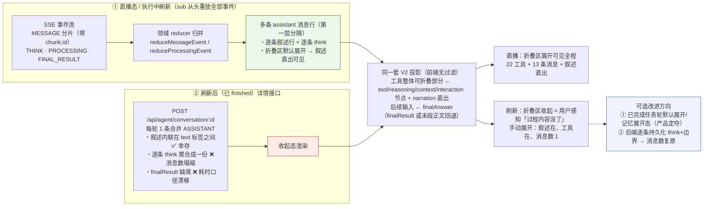

# 过程内容渲染机制：工具整体可折叠部分 + 后续输入（会话中 vs 历史回放）

> 主题：任务智能体执行过程的「分隔显示」是怎么做的——为什么直播时能看到过程内容（逐条叙述 + 折叠区展开），页面刷新后只剩最终一条回答。结论速览（2026-09-18 真实环境复现后修正）：单轮消息块 = 「工具整体可折叠部分」（WorkTraceDisclosure）+「后续输入」（FinalAnswerBlock 最终回答）。**中间叙述文本并没有丢**——后端合并落库时把它内联保留在 text 的 process 标签之间，刷新后手动展开折叠区即可看到。用户感知的「消失」= ① 直播中折叠区默认展开、终态/刷新后自动收起（主因，产品语义）；② 指标「N 条消息」塌缩成 1（每条消息的独立 think 未逐条持久化）；③`finalResult` 不在详情回包 → 终态耗时走回退口径（12 秒 →5 秒、2 分 3 秒 →1 分 30 秒）。关联排查：完成瞬间闪「智能体正在执行，请稍等」已修（sessionView 加 phase=idle 门禁），真实运行验证 0 次闪现。

## 现象（真实复现，会话 1693344）

|  | 直播中 | 完成瞬间 | 刷新后 |
| --- | --- | --- | --- |
| 折叠区状态 | **自动展开**（工作中 00:XX 秒表） | **瞬间自动收起** | 保持收起 |
| 中间叙述（直出正文） | 可见 | 随折叠区收起而隐藏 | 收起态不可见；**手动展开后完整可见** |
| 轨迹头部 | 工作中 00:12（锚定用户消息计时） | 1 次工具调用 · 1 条消息 · 已工作 12 秒 | 1 次工具调用 · 1 条消息 · **已工作 5 秒**（口径切换） |

## 〇、单轮消息块解剖（渲染产物）

```
┌ 标题栏：头像 + 智能体名 + RunOver（运行完毕/耗时状态）
├ ① 工具整体可折叠部分 —— WorkTraceDisclosure
│   ・收起态：指标行「N 次工具调用 · N 条消息 · 已工作 X」+ 箭头
│     （TraceMetrics；工具数/消息数来自投影 metrics，秒表运行态逐秒跳动）
│   ・展开态（运行中默认展开，结束自动收起：defaultTraceExpanded = turn.running）：
│     ・思考行 / 工具行 ProcessNodeRow：图标 + title + 摘要 summary
│       （摘要 = node.summary 首行摘要；交互行为 interaction.answerSummary || node.summary）
│     ・连续工具组 ToolGroupDisclosure（二层折叠，运行中的组默认展开）
│     ・narration 中间叙述：NarrationText 正文直出（不是折叠行，原位穿插在工具行之间）
│     ・「显示 N 项已隐藏」入口（渲染偏好 hidden 的节点）
└ ② 后续输入 —— FinalAnswerBlock：最终回答正文常显（turn.finalAnswer.text）
```

| 用户口径 | 代码对应物 |
| --- | --- |
| 工具整体可折叠部分 | `presentation-v2/react/WorkTraceDisclosure.tsx`（收起=指标行，展开=节点行/工具组/直出叙述） |
| 折叠行上的摘要 | `ProcessNodeRow.tsx:329-333` `summaryText`（`node.summary`；交互行 `answerSummary \|\| node.summary`） |
| 中间叙述直出 | `WorkTraceDisclosure.tsx:36-56` `NarrationText`（narration 节点正文直出，非折叠行） |
| 后续输入 | `FinalAnswerBlock`（`turn.finalAnswer.text`，source=finalResult / messageText） |

## 一、会话中（直播态）渲染逻辑

折叠区与后续输入都由投影实时驱动（`projectConversation`），数据来自 SSE 事件归并出的消息列表：

### 1.1 工具整体可折叠部分怎么「长出来」

直播态的分隔信号是 **SSE 事件流边界**，领域层 reducer 归并进消息列表：

- **思考行**：THINK 分片把 `<markdown-custom-think>` 内联标签写入 text、`thinkBlocks` 逐块累积（`domain/reduceMessageEvent.ts:80-100`）→ 投影切出 think 段 → `reasoning` 节点行。
- **工具行 / 工具组**：每个 PROCESSING 事件把 `<markdown-custom-process executeId=.. type=.. status=.. name=..>` 标签**追加写进当前消息 text**（`domain/reduceProcessingEvent.ts:34-69`，经 `renderProcessingBlock` adapter，插件在 `plugins/ds-markdown-process`），同时 `processingList` upsert → 投影切出 process 段 → `tool/plan/subagent` 节点（executeId 去重、丢纯 Event 段、相邻 Plan 去冗余，`projectConversation.ts:142-172`），连续工具合成可折叠工具组。
- **叙述直出**：MESSAGE 分片带输出 id（`chunk.id`），新 id + `finished=true` 时以 `replaceCount=0` 追加**新消息行**（`reduceMessageEvent.ts:109-121`）→ 投影把非最终回答的正文段标成 `narration` 节点（:473-486）→ 展开态里 `NarrationText` 原位直出正文。
- **指标行**：工具数 = tool/subagent 节点 executeId 去重；消息数 = reasoning+context+completed-interaction 节点数（narration 不计）；耗时运行态锚定用户消息时间逐秒跳动（`projectConversation.ts:522-563`、`WorkTraceDisclosure.tsx:58-74`）。

### 1.2 后续输入怎么流式

运行态最终回答取**末条消息末尾的正文段**流式直出（`answerRef` running 分支，`projectConversation.ts:333-347`）；FINAL_RESULT 到达后切换为 `finalResult.outputText`，与正文段做同源去重（归一空白后双向 includes，:300-311）避免重复。

### 1.3 折叠状态机

运行中默认展开（过程可见），终态自动收起只剩指标行（`TurnBlock` 里 `manualExpanded` 回 undefined，`ConversationRendererV2.tsx:104-110`）；用户手动展开/收起的选择保存在 disclosure 层，子树卸载不丢。**这就是「刷新后过程内容消失」感知的主因：直播可见 = 展开态红利，刷新后回到收起态默认值。**

## 二、通过历史会话消息渲染逻辑（刷新后回放）

### 2.1 加载链路

```
页面挂载/切会话
  └─ useConversationRuntimeSession: session.load(conversationId)        react/useConversationRuntimeSession.ts:230
       └─ runtimeLineHttp.loadConversation = apiAgentConversation(id)   react/runtimeLineHttp.ts:35
            = POST /api/agent/conversation/{id}（详情接口，返回 messageList）
       └─ store.replaceFromHistory()（仅裁本地乐观尾，不过滤服务端记录）  runtime/createConversationRuntimeSession.ts:349-368
       └─ 同一套 V2 投影 → 组装折叠区与后续输入
上滑分页/搜索才走 POST /api/agent/conversation/message/list（分页接口）   react/runtimeLineHttp.ts:36
```

加载 →hydrate→store→ 投影全链无 role/type 丢弃逻辑（渲染侧唯一过滤是「无 id 开场白」，`ChatContentArea/index.tsx:109-121`）。

### 2.2 详情回包的真实形态（2026-09-18 testagent 实测）

抓真实回包 `POST /api/agent/conversation/1693344`（大学毕业论文 PPT 开发，含 22 工具轮）：

- **每轮只有一条合并 ASSISTANT**：叙述正文**内联保留**在 text 里、夹在 process 标签之间（如「项目文件齐全，开始跑完整流水线。\n<div><markdown-custom-process …」），22 个工具 = 22 个标签 + `componentExecutedList` 22 条；每轮各自的 think 聚合成该条记录的一份 `think`（12093 字符一个 blob）。
- **`finalResult` 一律缺席**（所有 ASSISTANT 记录 `finalResult=false`）→ 刷新后最终回答走「末段正文」回退、耗时走节点时间回退（12 秒 →5 秒的口径来源）。
- `messageList` 只回**最近 10 条**（实测新增一轮后最早一轮被挤出）；更早消息靠上滑分页接口补。

### 2.3 刷新后两部分各自还原到什么程度

| 区块 | 刷新后 | 原因 |
| --- | --- | --- |
| 折叠区·工具行/组 | ✅ 22 个照常 | 工具以内嵌标签形式**幸存在合并 text 里**（第二层分隔信号），详情由 `componentExecutedList` 三层合并补齐（`collectProcessingByKey:101-130`） |
| 折叠区·narration 直出叙述 | ✅ 文本幸存，**手动展开可见**（实测 22 工具轮展开出 7 条完整叙述） | 叙述内联在合并 text 的标签之间；但「逐条消息行」边界消失，且默认收起——这就是用户感知的「过程内容没了」 |
| 折叠区·指标行消息数 | ❌ 13→1 塌缩 | 每条消息独立的 think 未逐条持久化，聚合 blob 只补 1 个 reasoning 节点（:395-413） |
| 折叠区·耗时 | ⚠️ 口径漂移（2 分 3 秒 →1 分 26 秒） | `finalResult` 不在详情回包，终态耗时走节点时间回退 |
| 后续输入（最终回答） | ✅ 照常 | 终态回退取最后一个非空正文段（`finalResult.outputText` 缺席时走 messageText 源） |

### 2.4 对照实验（执行中刷新）

执行中刷新（taskStatus=EXECUTING）走 sub 恢复订阅 `GET /api/agent/conversation/chat/sub/{id}`，服务端**从头重放全部 SSE 事件**（`runtime/resumeController.ts:166-169,317`），经与直播完全相同的 reducer 重建出逐条消息行（含逐条思考、展开态）——直播形态完整还原。finished 后刷新只有合并落库面。

## 三、两路径对比图



## 四、结论与处置（已定案并实施）

**产品决策（2026-09-18）**：耗时口径漂移定为小问题不处理；不做记忆展开态、不做历史轮全局默认展开；采用**方案 ②「叙述直出与折叠解耦」**——收起只收工具/思考行，narration 按原位顺序恒直出。

**已实施**（`WorkTraceDisclosure.tsx`）：

- 展开体渲染条件 `expanded` → `expanded || hasNarration`；
- 收起态 map 中工具组/节点行 `return null`（保持懒挂载卸载），narration 照常渲染；「显示 N 项已隐藏」入口仅在展开态出现；
- 效果：直播 / 完成瞬间 / 刷新后三态叙述展示对齐，「运行转完成自动收起」的设计保留（收的只是工具/思考）。

**验证**（真实运行 + 刷新，会话 1693344）：

- 历史会话刷新后：10 个轨迹全部收起（现状逻辑不变），23 条叙述直出可见，`data-node-kind` 行 0 挂载（懒挂载保留）；
- 新任务轮完成瞬间：`expanded true→false` 同帧 **narration 1→1 保持可见**（修复前 1→0 消失）；
- 刷新后最后一轮收起态下「第一步：开始检查」直出可见；
- 质量门：渲染器测试 53 绿 + `test:conversation` 802 绿（连跑两次稳定）；新增用例「终态收起态叙述仍按原位直出（与折叠解耦），展开后工具/思考行才挂载」冻结行为。

**遗留（后端，低优）**：逐条 think 边界未持久化 → 指标「N 条消息」塌缩成 1；`finalResult` 不在详情回包 → 耗时口径漂移；`messageList` 只回最近 10 条。均为数据面问题，不影响叙述可见性。

## 附：复现记录（2026-09-18，会话 1693344 真实运行）

任务：「请先输出一句『第一步：开始检查』，然后等待 5 秒，再输出一句『第二步：检查完成』，最后输出『全部完成』并结束任务」。

| 时刻 | 采样（600ms 粒度 DOM 关键帧） |
| --- | --- |
| 直播 06:54:47 | `工作中 00:00`，**expanded=true**（自动展开） |
| 直播 06:54:51 | **narration「第一步：开始检查」直出可见**，展开态保持 |
| 完成瞬间 06:54:58 | 同帧：`expanded true→false`、**narration 从 DOM 消失**（随折叠体卸载）、指标切「1 次工具调用 · 1 条消息 · 已工作 5 秒」（直播锚 10 秒 → 终态 5 秒） |
| 刷新后 | 收起态：折叠条 + 最终回答（「第一步：开始检查」不可见） |
| 手动展开 | 思考行 + **「第一步：开始检查」直出** + 「运行了命令 sleep 5」工具行 +「第二步：检查完成」全部在 |

落库形态：最新轮 1 条合并 ASSISTANT（`textNoTags = "第一步：开始检查\n\n第二步：检查完成\n\n全部完成\n\n三步已按顺序执行完毕…"`，1 个工具标签，think 聚合 175 字符，`finalResult` 缺席）。截图：`/tmp/issue1_refreshed_collapsed.png`（收起态）、`/tmp/issue1_refreshed_expanded.png`（展开态）。

## 附：关键代码索引

| 关注点 | 位置 |
| --- | --- |
| 单轮块组装（折叠区 + 后续输入 + 运行完自动收起） | `presentation-v2/react/ConversationRendererV2.tsx:87-173`（TurnBlock） |
| 工具整体可折叠部分（指标行 + 展开体） | `presentation-v2/react/WorkTraceDisclosure.tsx:132-333` |
| 折叠行摘要 summaryText | `presentation-v2/react/ProcessNodeRow.tsx:329-369` |
| narration 正文直出 | `presentation-v2/react/WorkTraceDisclosure.tsx:36-56`（NarrationText） |
| 后续输入（最终回答块） | `presentation-v2/react/FinalAnswerBlock.tsx` |
| 运行中默认展开 | `presentation-v2/renderPreferences.ts:133-141`（defaultTraceExpanded） |
| 叙述换行（新输出 id finished → 新消息行） | `domain/reduceMessageEvent.ts:109-121` |
| 工具标签写入 text + processingList upsert | `domain/reduceProcessingEvent.ts:34-69` |
| 思考内联标签 + thinkBlocks 累积 | `domain/reduceMessageEvent.ts:80-100` |
| text 词法切段（process/think/text/unknown） | `presentation-v2/parseMessageSegments.ts:96-165` |
| 段 → 轨迹节点 / narration 原位穿插 | `presentation-v2/projectConversation.ts:415-487` |
| 最终回答挑选与同源去重 | `projectConversation.ts:300-363` |
| 工具详情三层合并 | `projectConversation.ts:101-130` |
| 轨迹指标口径 | `projectConversation.ts:522-563` |
| 历史加载入口（详情接口） | `react/runtimeLineHttp.ts:35`、`react/useConversationRuntimeSession.ts:230` |
| sub 从头重放（执行中刷新可重建全量） | `runtime/resumeController.ts:166-169,317` |
| process/think 标签插件 | `plugins/ds-markdown-process/index.ts`、`plugins/ds-markdown-think/index.ts` |
