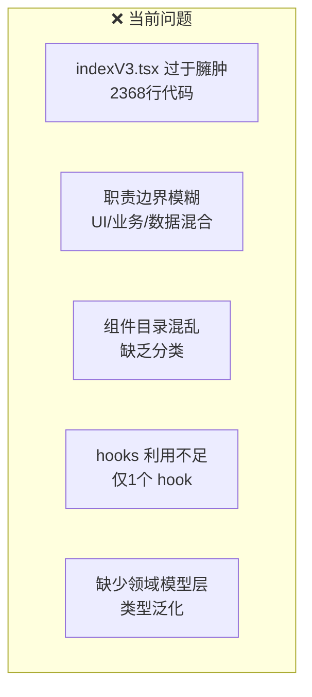
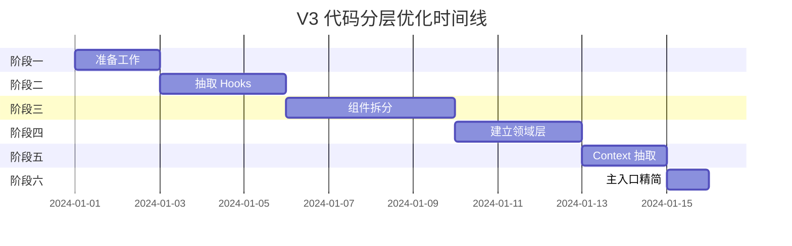

# V3 工作流编辑器代码分层优化计划

## 一、当前代码结构分析

### 1.1 现有目录结构

```
v3/
├── indexV3.tsx              # 主入口（2368行 - 过于庞大）
├── GraphContainerV3.tsx     # 画布容器（547行）
├── HeaderV3.tsx             # 头部组件
├── ParamsV3.tsx             # 参数面板
├── ControlPanelV3.tsx       # 控制面板
├── ErrorListV3.tsx          # 错误列表
├── component/               # 组件目录（21个文件，职责混杂）
│   ├── graph.tsx            # 画布初始化（1012行）
│   ├── eventHandlers.tsx    # 事件处理
│   ├── nodeItem.tsx         # 节点配置表单
│   ├── commonNode.tsx       # 通用节点
│   ├── complexNode.tsx      # 复杂节点
│   ├── condition.tsx        # 条件节点
│   └── ...
├── hooks/                   # Hooks（仅1个文件）
│   └── useWorkflowDataV3.ts
├── services/                # 服务层（仅1个文件）
│   └── workflowProxyV3.ts   # 数据代理（1114行 - 较大）
├── types/                   # 类型定义（仅1个文件）
│   └── index.ts
└── utils/                   # 工具函数
    └── variableReferenceV3.ts
```

### 1.2 主要问题



| 问题 | 描述 | 影响 |
| --- | --- | --- |
| **文件过大** | `indexV3.tsx` 2368 行，包含 50+函数 | 难以阅读和维护 |
| **职责混乱** | 同一文件混合 UI 渲染、业务逻辑、状态管理 | 修改风险高 |
| **组件分类缺失** | `component/` 目录下节点、表单、工具混在一起 | 找代码困难 |
| **Hooks 不足** | 大量状态逻辑在主组件，未抽取为 hooks | 复用性差 |
| **缺少领域层** | 没有明确的领域模型和业务规则层 | 业务逻辑分散 |

---

## 二、优化目标

### 2.1 分层架构

```
┌─────────────────────────────────────────────────────────────┐
│                     表现层 (Presentation)                    │
│  ┌─────────────────────────────────────────────────────┐   │
│  │  页面组件: WorkflowPage, Header, Sidebar            │   │
│  └─────────────────────────────────────────────────────┘   │
│  ┌─────────────────────────────────────────────────────┐   │
│  │  UI组件: NodePanel, EdgeRenderer, Toolbar           │   │
│  └─────────────────────────────────────────────────────┘   │
├─────────────────────────────────────────────────────────────┤
│                     应用层 (Application)                     │
│  ┌─────────────────────────────────────────────────────┐   │
│  │  Hooks: useWorkflow, useNode, useEdge, useHistory   │   │
│  └─────────────────────────────────────────────────────┘   │
│  ┌─────────────────────────────────────────────────────┐   │
│  │  状态管理: WorkflowContext, SelectionContext        │   │
│  └─────────────────────────────────────────────────────┘   │
├─────────────────────────────────────────────────────────────┤
│                     领域层 (Domain)                          │
│  ┌─────────────────────────────────────────────────────┐   │
│  │  领域模型: Node, Edge, Port, Branch                 │   │
│  └─────────────────────────────────────────────────────┘   │
│  ┌─────────────────────────────────────────────────────┐   │
│  │  业务规则: ConnectionValidator, NodeFactory         │   │
│  └─────────────────────────────────────────────────────┘   │
├─────────────────────────────────────────────────────────────┤
│                     基础设施层 (Infrastructure)              │
│  ┌─────────────────────────────────────────────────────┐   │
│  │  服务: WorkflowProxy (API通信、数据持久化)          │   │
│  └─────────────────────────────────────────────────────┘   │
│  ┌─────────────────────────────────────────────────────┐   │
│  │  图形引擎: X6Adapter (X6封装、事件桥接)             │   │
│  └─────────────────────────────────────────────────────┘   │
└─────────────────────────────────────────────────────────────┘
```

### 2.2 核心原则

1. **单一职责**: 每个模块只负责一种功能
2. **依赖倒置**: 上层不直接依赖下层实现，通过接口交互
3. **开闭原则**: 对扩展开放，对修改封闭
4. **最小知识**: 模块间最小化依赖

---

## 三、优化后目录结构

```
v3/
├── index.tsx                    # 主入口（精简版，<200行）
├── WorkflowPage.tsx             # 页面布局组件
│
├── components/                  # UI组件层
│   ├── layout/                  # 布局组件
│   │   ├── Header.tsx
│   │   ├── Sidebar.tsx
│   │   ├── ControlPanel.tsx
│   │   └── ErrorList.tsx
│   │
│   ├── graph/                   # 画布相关组件
│   │   ├── GraphContainer.tsx   # 画布容器
│   │   ├── GraphToolbar.tsx     # 画布工具栏
│   │   └── MiniMap.tsx          # 小地图
│   │
│   ├── nodes/                   # 节点组件
│   │   ├── BaseNode.tsx         # 基础节点渲染
│   │   ├── ConditionNode.tsx    # 条件节点
│   │   ├── LoopNode.tsx         # 循环节点
│   │   └── ...
│   │
│   ├── panels/                  # 面板组件
│   │   ├── NodeConfigPanel/     # 节点配置面板
│   │   │   ├── index.tsx
│   │   │   ├── StartNodeForm.tsx
│   │   │   ├── EndNodeForm.tsx
│   │   │   └── ...
│   │   ├── ParamsPanel.tsx      # 参数面板
│   │   └── Stencil.tsx          # 节点模板面板
│   │
│   └── common/                  # 通用UI组件
│       ├── RunResult.tsx
│       └── ExceptionItem.tsx
│
├── hooks/                       # 应用层 Hooks
│   ├── useWorkflow.ts           # 工作流全局状态
│   ├── useNode.ts               # 节点操作
│   ├── useEdge.ts               # 边操作
│   ├── useSelection.ts          # 选择状态
│   ├── useHistory.ts            # 撤销/重做
│   ├── useVariableReference.ts  # 变量引用
│   └── useGraphEvents.ts        # 画布事件
│
├── contexts/                    # 状态上下文
│   ├── WorkflowContext.tsx      # 工作流上下文
│   ├── SelectionContext.tsx     # 选择上下文
│   └── FormContext.tsx          # 表单上下文
│
├── domain/                      # 领域层
│   ├── models/                  # 领域模型
│   │   ├── Node.ts              # 节点模型
│   │   ├── Edge.ts              # 边模型
│   │   ├── Port.ts              # 端口模型
│   │   └── Branch.ts            # 分支模型
│   │
│   ├── validators/              # 业务验证
│   │   ├── ConnectionValidator.ts
│   │   └── NodeValidator.ts
│   │
│   └── factories/               # 工厂
│       ├── NodeFactory.ts       # 节点工厂
│       └── EdgeFactory.ts       # 边工厂
│
├── services/                    # 基础设施层
│   ├── WorkflowProxy.ts         # 数据代理（重构版）
│   ├── ApiService.ts            # API通信
│   └── StorageService.ts        # 本地存储
│
├── adapters/                    # 外部适配器
│   ├── X6Adapter/               # X6 引擎封装
│   │   ├── index.ts
│   │   ├── GraphManager.ts      # 画布管理
│   │   ├── EventBridge.ts       # 事件桥接
│   │   ├── NodeRenderer.ts      # 节点渲染
│   │   └── EdgeRenderer.ts      # 边渲染
│   │
│   └── FormAdapter.ts           # 表单适配器
│
├── types/                       # 类型定义
│   ├── index.ts                 # 导出入口
│   ├── node.ts                  # 节点类型
│   ├── edge.ts                  # 边类型
│   ├── events.ts                # 事件类型
│   └── api.ts                   # API类型
│
├── utils/                       # 工具函数
│   ├── nodeUtils.ts             # 节点工具
│   ├── edgeUtils.ts             # 边工具
│   ├── portUtils.ts             # 端口工具
│   └── variableReference.ts     # 变量引用
│
├── constants/                   # 常量定义
│   ├── nodeTypes.ts
│   ├── portTypes.ts
│   └── config.ts
│
└── styles/                      # 样式文件
    ├── index.less
    ├── nodes.less
    └── panels.less
```

---

## 四、重构步骤计划

### 阶段一：准备工作（1-2 天）

| 任务 | 描述                                   | 优先级 |
| ---- | -------------------------------------- | ------ |
| 1.1  | 创建新目录结构                         | P0     |
| 1.2  | 建立类型体系，将 `types/index.ts` 拆分 | P0     |
| 1.3  | 添加 ESLint 规则限制文件行数           | P1     |

### 阶段二：抽取 Hooks（2-3 天）

| 任务 | 从                     | 抽取到                    | 行数估计 |
| ---- | ---------------------- | ------------------------- | -------- |
| 2.1  | `indexV3.tsx` 节点操作 | `hooks/useNode.ts`        | ~300 行  |
| 2.2  | `indexV3.tsx` 边操作   | `hooks/useEdge.ts`        | ~200 行  |
| 2.3  | `indexV3.tsx` 选择状态 | `hooks/useSelection.ts`   | ~100 行  |
| 2.4  | `indexV3.tsx` 历史记录 | `hooks/useHistory.ts`     | ~150 行  |
| 2.5  | `indexV3.tsx` 画布事件 | `hooks/useGraphEvents.ts` | ~200 行  |

**示例 - useNode.ts:**

```typescript
// hooks/useNode.ts
export function useNode(workflowProxy: WorkflowProxy) {
  // 从 indexV3.tsx 抽取的节点相关逻辑
  const addNode = useCallback(async (nodeData: ChildNode) => { ... }, []);
  const updateNode = useCallback(async (nodeData: ChildNode) => { ... }, []);
  const deleteNode = useCallback(async (nodeId: number) => { ... }, []);
  const copyNode = useCallback(async (nodeId: number) => { ... }, []);

  return { addNode, updateNode, deleteNode, copyNode };
}
```

### 阶段三：组件拆分（3-4 天）

| 任务 | 描述                                                  |
| ---- | ----------------------------------------------------- |
| 3.1  | 将 `component/nodeItem.tsx` 拆分为独立表单组件        |
| 3.2  | 将 `component/graph.tsx` 重构为 `adapters/X6Adapter/` |
| 3.3  | 创建 `components/nodes/` 目录，按节点类型分文件       |
| 3.4  | 创建 `components/panels/NodeConfigPanel/` 目录        |

### 阶段四：建立领域层（2-3 天）

| 任务 | 描述                                   |
| ---- | -------------------------------------- |
| 4.1  | 创建 `domain/models/` 领域模型         |
| 4.2  | 创建 `domain/validators/` 业务验证     |
| 4.3  | 创建 `domain/factories/` 工厂类        |
| 4.4  | 重构 `workflowProxyV3.ts` 使用领域模型 |

**示例 - 领域模型:**

```typescript
// domain/models/Node.ts
export class WorkflowNode {
  readonly id: number;
  readonly type: NodeTypeEnum;
  private _nextNodeIds: number[] = [];
  private _branches: Map<string, Branch> = new Map();

  constructor(data: ChildNode) { ... }

  // 业务方法
  addConnection(targetId: number, branchUuid?: string): void { ... }
  removeConnection(targetId: number, branchUuid?: string): void { ... }
  isSpecialNode(): boolean { ... }
  getBranches(): Branch[] { ... }
}
```

### 阶段五：Context 抽取（1-2 天）

| 任务 | 描述                                      |
| ---- | ----------------------------------------- |
| 5.1  | 创建 `WorkflowContext` 管理全局工作流状态 |
| 5.2  | 创建 `SelectionContext` 管理选择状态      |
| 5.3  | 重构组件使用 Context 而非 props drilling  |

### 阶段六：主入口精简（1 天）

| 任务 | 描述                                 |
| ---- | ------------------------------------ |
| 6.1  | 将 `indexV3.tsx` 精简至 <200 行      |
| 6.2  | 主入口只负责组合各层，不包含业务逻辑 |

---

## 五、重构示例

### 5.1 重构前 (indexV3.tsx 片段)

```typescript
// 当前：2368行的庞大组件
const Workflow = () => {
  // 50+ useState
  const [info, setInfo] = useState<IgetDetails>();
  const [zoom, setZoom] = useState(1);
  const [selectedNode, setSelectedNode] = useState<ChildNode>();
  // ... 更多 state

  // 50+ 函数定义
  const handleNodeAdd = async () => {
    /* 100行逻辑 */
  };
  const handleEdgeAdd = async () => {
    /* 80行逻辑 */
  };
  // ... 更多函数

  // 庞大的 JSX
  return <div>{/* 500+ 行 JSX */}</div>;
};
```

### 5.2 重构后 (index.tsx)

```typescript
// 重构后：<200行的精简入口
const WorkflowPage = () => {
  return (
    <WorkflowProvider>
      <SelectionProvider>
        <div className="workflow-container">
          <Header />
          <div className="workflow-main">
            <Stencil />
            <GraphContainer />
            <NodeConfigPanel />
          </div>
          <ErrorList />
        </div>
      </SelectionProvider>
    </WorkflowProvider>
  );
};
```

---

## 六、验收标准

| 指标           | 当前 | 目标 |
| -------------- | ---- | ---- |
| 主入口行数     | 2368 | <200 |
| 单文件最大行数 | 2368 | <500 |
| Hooks 数量     | 1    | 7+   |
| 组件目录层级   | 1    | 3    |
| 测试覆盖率     | 0%   | >60% |

---

## 七、风险与应对

| 风险             | 影响 | 应对策略                       |
| ---------------- | ---- | ------------------------------ |
| 重构期间功能回归 | 高   | 分阶段重构，每阶段确保功能正常 |
| 团队不熟悉新架构 | 中   | 编写架构文档和示例代码         |
| 重构时间超预期   | 中   | 设置优先级，核心路径优先       |

---

## 八、时间线



**预计总工期：10-15 工作日**

---

## 九、后续维护建议

1. **代码审查规则**

   - 单文件不超过 500 行
   - 新功能必须遵循分层架构
   - 抽取复用逻辑为 Hook 或工具函数

2. **文档维护**

   - 更新架构图保持与代码同步
   - 新增模块需补充 README

3. **测试策略**
   - Domain 层 100% 单元测试覆盖
   - Hooks 层关键路径测试
   - E2E 测试核心工作流
