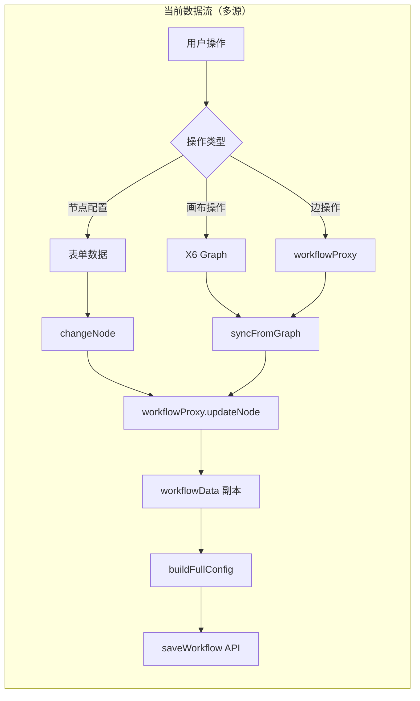
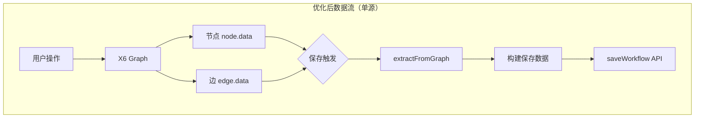

# 工作流全量保存更新优化方案

## 一、问题背景

### 1.1 当前架构的数据流



### 1.2 核心问题

| 问题         | 描述                                  | 影响         |
| ------------ | ------------------------------------- | ------------ |
| **多数据源** | X6 Graph + workflowProxy 各自维护数据 | 数据不一致   |
| **同步延迟** | syncFromGraph 依赖定时器触发          | 可能丢失变更 |
| **逻辑分散** | 节点配置、边操作、位置更新分别处理    | 难以维护     |
| **重复计算** | nextNodeIds 在多处计算和维护          | 不一致风险   |

---

## 二、优化目标

### 2.1 核心原则

> **X6 画布数据 = 唯一真相来源（Single Source of Truth）**



### 2.2 优化原则

1. **单一数据源**: 所有数据变更直接更新到 X6 节点/边的 data 属性
2. **保存时提取**: 保存时从画布直接提取完整数据，不依赖缓存副本
3. **消除同步**: 不再需要 syncFromGraph，因为画布就是唯一数据源
4. **简化代理层**: workflowProxy 仅负责 API 通信和数据格式转换

---

## 三、详细方案

### 3.1 数据模型调整

**当前模型问题：**

```typescript
// workflowProxy 维护独立副本
class WorkflowProxyV3 {
  private workflowData: WorkflowDataV3 | null = null; // ❌ 独立副本
  private workflowInfo: IgetDetails | null = null;

  // 每次操作都需要同步
  addNode(node) {
    this.workflowData.nodes.push(node);
  }
  syncFromGraph(nodes, edges) {
    /* 复杂同步逻辑 */
  }
}
```

**优化后模型：**

```typescript
// 新的代理层，不维护数据副本
class WorkflowSaveService {
  private workflowMeta: WorkflowMeta; // 仅保存元数据（id, name, 等）

  // 保存时直接从画布提取
  async save(graph: Graph): Promise<boolean> {
    const data = this.extractFromGraph(graph);
    return await this.sendToBackend(data);
  }

  // 从画布提取完整数据
  private extractFromGraph(graph: Graph): IgetDetails {
    const nodes = graph.getNodes().map((node) => node.getData());
    const edges = graph.getEdges().map((edge) => ({
      source: edge.getSourceCellId(),
      target: edge.getTargetCellId(),
      sourcePort: edge.getSourcePortId(),
      targetPort: edge.getTargetPortId(),
    }));

    // 从边数据计算 nextNodeIds（保存时计算，非实时维护）
    const nodesWithConnections = this.computeConnections(nodes, edges);

    return this.buildSavePayload(nodesWithConnections);
  }
}
```

### 3.2 操作流程调整

#### A. 节点配置变更

**当前流程（复杂）：**

```
表单变更 → changeNode() → workflowProxy.updateNode()
         → graphRef.graphUpdateNode() → 需要保持两边一致
```

**优化后流程（直接）：**

```
表单变更 → graphRef.graphUpdateNode(nodeId, newData)
         → 完成（数据直接在画布节点上）
```

```typescript
// 优化后的节点更新
const updateNodeConfig = (nodeId: string, config: Partial<NodeConfig>) => {
  const node = graph.getCellById(nodeId);
  if (node?.isNode()) {
    const currentData = node.getData();
    node.updateData({
      ...currentData,
      nodeConfig: { ...currentData.nodeConfig, ...config },
    });
    // 触发自动保存（防抖）
    debouncedSave();
  }
};
```

#### B. 边操作

**当前流程（复杂）：**

```
创建边 → workflowProxy.addEdge() → 更新源节点 nextNodeIds
       → 特殊端口需要更新 conditionBranchConfigs 等
```

**优化后流程（延迟计算）：**

```
创建边 → X6 添加边 → 完成
保存时 → extractFromGraph() → 从边数据计算所有 nextNodeIds
```

```typescript
// 保存时计算连接关系
private computeConnections(nodes: ChildNode[], edges: EdgeV3[]): ChildNode[] {
  const nodeMap = new Map(nodes.map(n => [n.id, cloneDeep(n)]));

  // 清空所有 nextNodeIds（将从边重新计算）
  nodeMap.forEach(node => {
    node.nextNodeIds = [];
    // 清空分支 nextNodeIds
    this.clearBranchNextNodeIds(node);
  });

  // 从边数据重建连接关系
  edges.forEach(edge => {
    const sourceNode = nodeMap.get(Number(edge.source));
    if (!sourceNode) return;

    const targetId = Number(edge.target);
    const portInfo = this.parseSourcePort(edge.sourcePort, sourceNode);

    this.addConnectionToNode(sourceNode, targetId, portInfo);
  });

  return Array.from(nodeMap.values());
}
```

### 3.3 新的保存架构

```typescript
// services/WorkflowSaveService.ts

interface WorkflowMeta {
  id: number;
  name: string;
  description: string;
  teamId: number;
  // ... 其他元数据，不包含节点/边
}

class WorkflowSaveService {
  private meta: WorkflowMeta | null = null;
  private isDirty = false;

  // 初始化：仅保存元数据
  initialize(details: IgetDetails) {
    this.meta = {
      id: details.id,
      name: details.name,
      description: details.description,
      teamId: details.teamId,
      // ...
    };
  }

  // 标记有变更
  markDirty() {
    this.isDirty = true;
  }

  // 全量保存
  async save(graph: Graph): Promise<SaveResult> {
    if (!this.meta || !this.isDirty) return { success: true };

    const payload = this.buildPayload(graph);
    const result = await api.saveWorkflow(payload);

    if (result.success) {
      this.isDirty = false;
    }
    return result;
  }

  // 从画布构建保存数据
  private buildPayload(graph: Graph): IgetDetails {
    // 1. 提取所有节点
    const rawNodes = graph.getNodes().map((n) => {
      const data = n.getData() as ChildNode;
      const position = n.getPosition();
      const size = n.getSize();

      return {
        ...data,
        nodeConfig: {
          ...data.nodeConfig,
          extension: {
            x: position.x,
            y: position.y,
            width: size.width,
            height: size.height,
          },
        },
      };
    });

    // 2. 提取所有边
    const edges = graph.getEdges().map((e) => ({
      source: e.getSourceCellId(),
      target: e.getTargetCellId(),
      sourcePort: e.getSourcePortId(),
      targetPort: e.getTargetPortId(),
    }));

    // 3. 从边计算连接关系
    const nodes = this.computeConnections(rawNodes, edges);

    // 4. 组装完整数据
    return {
      ...this.meta,
      nodes,
      startNode: nodes.find((n) => n.type === 'Start'),
      endNode: nodes.find((n) => n.type === 'End'),
      modified: new Date().toISOString(),
    };
  }
}
```

### 3.4 事件监听简化

```typescript
// hooks/useAutoSave.ts

export function useAutoSave(
  graph: Graph | null,
  saveService: WorkflowSaveService,
) {
  const debouncedSave = useMemo(
    () => debounce(() => saveService.save(graph!), 2000),
    [graph, saveService],
  );

  useEffect(() => {
    if (!graph) return;

    // 监听所有变更事件
    const markDirty = () => {
      saveService.markDirty();
      debouncedSave();
    };

    // 节点变更
    graph.on('node:added', markDirty);
    graph.on('node:removed', markDirty);
    graph.on('node:changed', markDirty);
    graph.on('node:moved', markDirty);

    // 边变更
    graph.on('edge:added', markDirty);
    graph.on('edge:removed', markDirty);
    graph.on('edge:connected', markDirty);

    return () => {
      graph.off('node:added', markDirty);
      // ... 移除所有监听
    };
  }, [graph, saveService, debouncedSave]);
}
```

---

## 四、迁移步骤

### 阶段一：准备工作（1 天）

| 任务 | 描述                                                       |
| ---- | ---------------------------------------------------------- |
| 1.1  | 创建 `WorkflowSaveService` 类                              |
| 1.2  | 实现 `extractFromGraph` 方法                               |
| 1.3  | 实现 `computeConnections` 方法（复用现有 parseSourcePort） |

### 阶段二：并行运行（2 天）

| 任务 | 描述                           |
| ---- | ------------------------------ |
| 2.1  | 新旧保存逻辑并行运行，对比结果 |
| 2.2  | 记录差异日志，修复不一致       |
| 2.3  | 确保新逻辑结果与旧逻辑完全一致 |

### 阶段三：切换（1 天）

| 任务 | 描述                                            |
| ---- | ----------------------------------------------- |
| 3.1  | 切换到新保存逻辑                                |
| 3.2  | 移除 workflowProxy 的 updateNode/addEdge 等方法 |
| 3.3  | 保留 workflowProxy 仅用于初始化加载             |

### 阶段四：清理（1 天）

| 任务 | 描述                              |
| ---- | --------------------------------- |
| 4.1  | 移除 syncFromGraph 相关代码       |
| 4.2  | 简化 indexV3.tsx 中的数据同步逻辑 |
| 4.3  | 更新文档                          |

---

## 五、关键代码变更

### 5.1 需要移除的逻辑

```typescript
// 以下逻辑将被移除或大幅简化

// workflowProxyV3.ts
-addEdge() - // 不再需要维护边数据
  deleteEdge() - // 不再需要维护边数据
  syncFromGraph() - // 不再需要同步
  // indexV3.tsx
  nodeChangeEdge() - // 简化为仅操作画布
  updateNodeNextIds逻辑 - // 保存时计算
  syncFromGraph调用; // 移除
```

### 5.2 需要新增的逻辑

```typescript
// 新增 services/WorkflowSaveService.ts
+extractFromGraph() +
  computeConnections() +
  buildPayload() +
  // 新增 hooks/useAutoSave.ts
  useAutoSave();
```

---

## 六、优缺点分析

### 优点

| 优点          | 说明                         |
| ------------- | ---------------------------- |
| ✅ 单一数据源 | 消除数据不一致风险           |
| ✅ 简化逻辑   | 不再需要维护多份数据副本     |
| ✅ 易于调试   | 数据都在画布上，F12 即可查看 |
| ✅ 减少代码   | workflowProxy 大幅精简       |

### 潜在风险

| 风险              | 应对策略                           |
| ----------------- | ---------------------------------- |
| ⚠️ 保存时计算开销 | 仅在保存时计算，用户无感知         |
| ⚠️ 撤销/重做支持  | X6 自带 History 插件，数据自动恢复 |
| ⚠️ 大型工作流性能 | 可增量计算变更节点                 |

---

## 七、验证方案

### 7.1 功能验证

- [ ] 添加节点后保存，刷新页面验证数据正确
- [ ] 删除节点后保存，刷新页面验证数据正确
- [ ] 添加边后保存，刷新页面验证连接正确
- [ ] 删除边后保存，刷新页面验证连接正确
- [ ] 条件节点分支连线，验证 conditionBranchConfigs.nextNodeIds 正确
- [ ] 异常处理连线，验证 exceptionHandleNodeIds 正确
- [ ] 撤销/重做后保存，验证数据正确

### 7.2 回归测试

- [ ] 现有工作流能正常加载
- [ ] 现有工作流能正常运行
- [ ] 发布功能正常

---

## 八、总结

| 维度        | 当前                       | 优化后               |
| ----------- | -------------------------- | -------------------- |
| 数据源      | 多源（Proxy + Graph）      | 单源（Graph）        |
| 同步逻辑    | 复杂（需要 syncFromGraph） | 无需同步             |
| 保存逻辑    | 维护副本 → 构建 → 发送     | 提取 → 构建 → 发送   |
| 代码量      | workflowProxy 1100+ 行     | 新服务 ~300 行       |
| nextNodeIds | 实时维护，多处逻辑         | 保存时计算，单点逻辑 |
