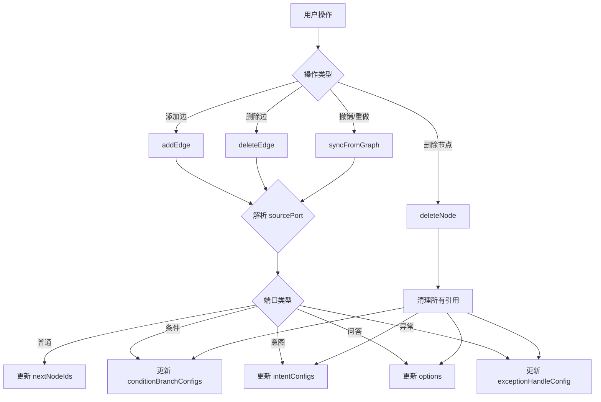

# 特殊端口连线处理 - 实现总结

## 概述

本次修改为 V3 工作流编辑器添加了对特殊节点端口连线关系的完整支持，确保条件节点、意图识别节点、问答节点和异常处理端口的连线关系能够被正确管理和持久化。

## 问题背景

在 V3 版本中，`workflowProxyV3.ts` 的边处理逻辑过于简单，只考虑了普通节点的 `nextNodeIds`，没有处理以下特殊情况：

| 节点类型 | 端口格式 | 存储位置 |
| --- | --- | --- |
| 普通节点 | `{nodeId}-out` | `nextNodeIds` |
| 条件分支 | `{nodeId}-{uuid}-out` | `conditionBranchConfigs[uuid].nextNodeIds` |
| 意图识别 | `{nodeId}-{uuid}-out` | `intentConfigs[uuid].nextNodeIds` |
| 问答选项 | `{nodeId}-{uuid}-out` | `options[uuid].nextNodeIds` |
| 异常处理 | `{nodeId}-exception-out` | `exceptionHandleConfig.exceptionHandleNodeIds` |

## 修改的文件

### 1. [workflowProxyV3.ts](./services/workflowProxyV3.ts)

**新增类型定义：**

```typescript
// 特殊端口类型枚举
export enum SpecialPortType {
  Normal = 'normal',
  Condition = 'condition',
  Intent = 'intent',
  QAOption = 'qa_option',
  Exception = 'exception',
  Loop = 'loop',
}

// 扩展的边接口
export interface EdgeV3 extends Edge {
  sourcePort?: string;
  targetPort?: string;
}
```

**新增辅助方法：**

- `parseSourcePort(sourcePort, sourceNode)` - 解析端口 ID，返回端口类型和 UUID
- `updateSpecialNodeConnection(sourceNode, portInfo, targetNodeId, action)` - 更新特殊节点的分支配置

**重构的核心方法：**

render_diffs(./services/workflowProxyV3.ts)

---

### 2. [useWorkflowDataV3.ts](./hooks/useWorkflowDataV3.ts)

更新了 Hook 接口以支持 `sourcePort` 参数：

```typescript
// 边操作接口更新
addEdge: (edge: Edge & { sourcePort?: string; targetPort?: string }) =>
  ProxyResult;
deleteEdge: (source: string, target: string, sourcePort?: string) =>
  ProxyResult;
```

render_diffs(./hooks/useWorkflowDataV3.ts)

---

### 3. [indexV3.tsx](./indexV3.tsx)

更新了 `syncFromGraph` 调用时的边映射，提取 `sourcePort` 和 `targetPort`：

```typescript
const edges = graph.getEdges().map((e) => {
  const source = e.getSource() as any;
  const target = e.getTarget() as any;
  return {
    id: e.id,
    source: source?.cell || source,
    target: target?.cell || target,
    sourcePort: source?.port || undefined, // 新增
    targetPort: target?.port || undefined, // 新增
    zIndex: e.getZIndex(),
  };
});
```

render_diffs(./indexV3.tsx)

## 工作流程



## 验证结果

- ✅ TypeScript 编译通过
- ✅ 项目构建成功 (`npm run build:dev`)
- ✅ 所有类型接口一致

## 后续建议

1. **添加单元测试** - 为 `parseSourcePort` 和 `updateSpecialNodeConnection` 添加测试用例
2. **添加调试日志** - 在生产环境中可以考虑移除或降级调试日志
3. **性能优化** - 对于大型工作流，考虑优化 `syncFromGraph` 的性能
