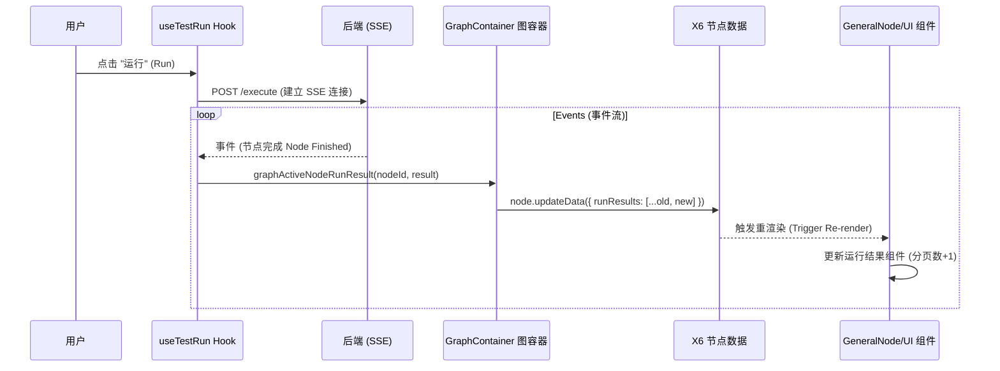

# 试运行与节点展示逻辑分析 (V3)

本文档概述了 V3 工作流编辑器中试运行（Trial Run）功能的当前实现方式，以及结果如何在节点图上进行可视化展示。

## 1. 概述 (Overview)

试运行功能允许用户执行整个工作流或特定节点，并实时查看执行结果。该架构将执行逻辑（Hooks）与可视化逻辑（Graph/Nodes）进行了分离。

## 2. 执行流程 (Data Layer)

### 2.1 触发运行 (Triggering the Run)

核心逻辑位于 `src/pages/Antv-X6/v3/hooks/useTestRun.ts`。

- **Hook**: `useTestRun`
- **入口点 (Entry Points)**:
  - `runTest('Start')`: 启动完整的工作流运行。
  - `nodeTestRun(params)`: 启动单个节点的运行。
- **传输 (Transport)**: 使用 **Server-Sent Events (SSE)** 通过 `createSSEConnection` 进行流式响应。

### 2.2 处理事件 (Processing Events)

SSE 的 `onMessage` 回调函数处理传入的执行事件：

1.  **节点完成 (Node Completion)**: 当 `data.data.nodeId` 存在时，表示一个节点已完成执行。
2.  **构建结果 (Result Construction)**:
    ```typescript
    const runResult: RunResultItem = {
      requestId: data.requestId,
      options: {
        ...data.data.result,
        nodeId: data.data.nodeId,
        nodeName: data.data.nodeName,
      },
      status: data.data.status, // 例如：'FINISHED', 'FAILED'
    };
    ```
3.  **图更新 (Graph Update)**: 调用 `graphRef.current?.graphActiveNodeRunResult(...)` 将结果推送到图中。

## 3. 图更新逻辑 (Intermediate Layer)

`GraphContainer` 充当 React 状态与 X6 Graph 实例之间的桥梁。

- **文件**: `src/pages/Antv-X6/v3/components/graph/GraphContainer.tsx`
- **方法**: `graphActiveNodeRunResult(id, runResult)`

### 关键机制 (Key Mechanisms):

1.  **定位节点 (Locate Node)**: 通过 ID 找到 X6 节点。
2.  **更新数据 (Update Data)**: 更新节点的业务数据 (`data.runResults`)。
    - **追加模式 (Append Mode)**: 它将新的 `runResult` _追加_ 到现有的 `runResults` 数组中。
    - **过滤 (Filtering)**: 移除任何之前的 'EXECUTING'（执行中）状态项，以防止状态卡死。
    - **聚焦 (Focus)**: 设置 `isFocus: true` 以高亮显示正在运行的节点。
    ```typescript
    node.updateData({
      isFocus: true, // 聚焦当前节点
      runResults: [
        // 保留非执行中的历史结果，移除旧的执行中状态
        ...(beforeData.runResults || []).filter(
          (item) => item.status !== EXECUTING,
        ),
        runResult, // 追加最新的运行结果
      ],
    });
    ```

## 4. 渲染逻辑 (View Layer)

可视化展示由注册到 X6 的自定义 React 节点组件处理。

- **注册表 (Registry)**: `src/pages/Antv-X6/v3/component/registerCustomNodes.tsx`

### 4.1 节点组件 (Node Components)

主要由两种节点类型处理渲染：

1.  **GeneralNode**: 用于标准节点（问答 QA、条件 Condition 等）。
2.  **LoopNode**: 用于循环容器。

### 4.2 运行结果渲染 (Run Result Rendering)

在 `GeneralNode` 和 `LoopNode` 内部：

1.  **数据获取**: `const runResults = data.runResults || [];`
2.  **可见性检查 (Visibility Check)**:
    - 循环开始/结束 (Loop Start/End) 节点 _隐藏_ 结果 (`showRunResult = false`)。
    - 其他节点如果 `runResults.length > 0` 则显示结果。
3.  **组件**: `<NodeRunResult data={runResults} />`

### 4.3 结果面板 (`runResult.tsx`)

`NodeRunResult` (包装器) 和 `RunResult` (UI) 组件处理详细展示：

- **分页 (Pagination)**: 由于循环会多次执行节点，`runResults` 是一个数组。组件提供分页功能 (1, 2, 3...) 以查看每次迭代的结果。
- **状态指示器 (Status Indicators)**: 成功、失败或运行中的图标。
- **内容 (Content)**: 以 JSON 块的形式显示 `inputParams`（输入参数）和 `outputResult`（输出结果）。
- **变量 (Variables)**: 如果适用，显示 `batchVariables`（批处理变量）。

## 5. 流程总结 (Summary Flow)


